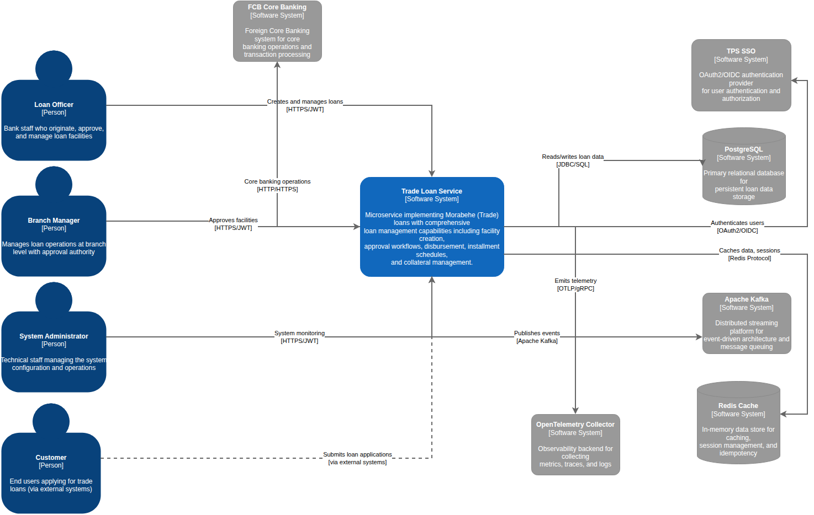

# Nova Trade Loan System - C4 Architecture Documentation

This directory contains C4 model diagrams for the Nova Trade Loan microservice system, providing a comprehensive view of the software architecture at different levels of abstraction.

## System Overview

The Nova Trade Loan System is a sophisticated microservices-based loan management platform built using Domain-Driven Design (DDD) principles, Hexagonal Architecture, and CQRS patterns. The system manages Nova (Trade) loans with full lifecycle support including facility management, loan arrangements, disbursements, and repayments.

### Technology Stack
- **Runtime**: Java 25 with Spring Boot 4
- **Architecture**: Domain-Driven Design with Hexagonal Architecture
- **Messaging**: Apache Kafka for event-driven processing
- **Database**: PostgreSQL with JPA/Hibernate
- **Cache**: Redis for performance optimization
- **Containerization**: Docker and Kubernetes
- **API**: REST with OpenAPI 3.0 documentation
- **Authentication**: OAuth 2.0 with TPS SSO integration

## C4 Model Levels

### Level 1 - System Context


**File**: `L1-system-context.drawio`

The System Context diagram shows the Trade Loan Service as a black box in its environment, illustrating relationships with users and external systems.

#### Key Elements:
- **Users**: Loan Officers, Branch Managers, System Administrators, Customers
- **External Systems**:
  - TPS SSO (OAuth2/OIDC authentication at https://sso.tps.ir)
  - PostgreSQL Database (primary data storage via JDBC/SQL)
  - Apache Kafka (event streaming platform for trade loan events)
  - Redis Cache (caching and session management)
  - FCB Core Banking (foreign core banking system integration)
  - Account Service (external account validation and management)
  - Customer Service (customer data management and validation)
  - Deposit Service (deposit account operations)
  - Loan Service (loan operations and collateral management)
  - OpenTelemetry Collector (observability backend for metrics and tracing)
  - Kubernetes Discovery (service discovery and configuration management)

#### Interactions:
- **User Authentication**: All users authenticate via TPS SSO using OAuth2/OIDC with JWT tokens
- **API Communication**: Users interact via REST APIs over HTTPS with JWT authentication
- **Data Persistence**: Database operations via JDBC/SQL with PostgreSQL
- **Event Streaming**: Asynchronous communication via Apache Kafka for trade loan events
- **External Integrations**: Service-to-service communication via REST APIs
- **Caching**: Redis for performance optimization and session management
- **Observability**: OpenTelemetry for metrics, tracing, and monitoring

### Level 2 - Container Diagram


**File**: `L2-containers.drawio`

The Container diagram zooms into the software system boundary, showing the high-level technology choices and how the containers communicate.

#### Key Containers:

##### Nova Trade Loan Application
- **Technology**: Spring Boot 3.5.5, Java 25
- **Description**: Main microservice implementing DDD with Hexagonal Architecture
- **Port**: 8080

##### Internal Components:
- **REST API**: Spring WebFlux with OpenAPI 3.0 documentation
- **Message Consumer**: Spring Kafka for event-driven processing
- **Domain Layer**: Pure Java domain logic with DDD entities
- **Application Service**: Use case orchestration and transaction management

##### Infrastructure Components:
- **PostgreSQL Database**: Primary data store (Port 5432)
- **Apache Kafka**: Event streaming platform (Ports 9092, 9093, 9094)
- **Redis Cache**: In-memory cache for session management (Port 6379)

##### Deployment Platforms:
- **Docker Container**: Development environment with docker-compose
- **Kubernetes**: Production orchestration with Helm charts

##### External Integrations:
- **TPS SSO**: OAuth2 authentication provider
- **FCB Core Banking**: Financial transaction processing
- **Formula Engine**: Interest and penalty calculations

### Level 3 - Component Diagram


**File**: `L3-nova-app-components.drawio`

The Component diagram provides a detailed view of the internal architecture of the Nova Trade Loan Application container.

#### Architectural Layers:

##### 1. Presentation Layer
- **REST Controllers**:
  - Command Controllers for facility lifecycle and loan arrangements
  - Query Controllers for lookups, searches, and reporting
- **Message Consumers**: Kafka event processors for asynchronous workflows

##### 2. Application Layer
- **Document Factory**: Manages document creation and article generation
- **Transaction Service**: Handles payment processing, disbursements, and settlements
- **CQRS Dispatcher**: Implements Command/Query separation with event sourcing

##### 3. Domain Layer
- **Nova Loan Domain**: Trade-specific domain models (NovaLoanType)
- **Base Loan Domain**: Shared kernel with common entities (BaseLoanFacility)

##### 4. Infrastructure Layer
- **Repository Implementations**: JPA repositories for data persistence
- **External Clients**:
  - FCB Banking Client for core banking integration
  - Formula Engine Client for financial calculations

##### 5. Platform Layer
- **Spring Boot Container**: Application context and bean management
- **Main Application**: Bootstrap and configuration entry point

## Deployment Architecture

### Docker Environment
The system includes a comprehensive `docker-compose.yml` configuration with:
- PostgreSQL 18.0-alpine with health checks
- Apache Kafka 7.9.4 with SASL authentication
- Redis 8.2.2-alpine with password protection
- Kafdrop for Kafka management UI

### Kubernetes Environment
Production deployment uses:
- Rolling update strategy with zero-downtime deployment
- Pod anti-affinity for high availability
- Resource limits and health probes
- ConfigMaps and Secrets for configuration management
- Topology spread constraints for multi-zone deployment

## Key Architectural Patterns

### Domain-Driven Design (DDD)
- **Aggregates**: BaseLoanFacility, BaseLoanArrangement as aggregate roots
- **Entities**: Strongly-typed identities with generic type safety
- **Value Objects**: Immutable Money, InterestPolicy, PenaltyPolicy
- **Domain Services**: DocumentFactory, ArticleSpecFactory
- **Repositories**: Abstract persistence behind domain interfaces

### Hexagonal Architecture
- **Core**: Domain and application layers with no external dependencies
- **Ports**: Interfaces defining contracts for input/output
- **Adapters**: Implementations of ports for specific technologies
- **Dependency Direction**: Adapters depend on ports, not vice versa

### CQRS Pattern
- **Commands**: Write operations that change system state
- **Queries**: Read operations for data retrieval
- **Dispatcher**: Centralized command/query handling
- **Event Sourcing**: Domain events for audit and replay capabilities

## Security Architecture

### Authentication & Authorization
- **OAuth 2.0**: Standard authentication framework
- **OpenID Connect**: Identity layer on top of OAuth2
- **TPS SSO**: Enterprise single sign-on integration
- **JWT Tokens**: Stateless authentication with access/refresh tokens

### API Security
- **Role-Based Access Control**: Fine-grained permissions
- **Rate Limiting**: Redis-based request throttling
- **Input Validation**: Comprehensive request validation
- **HTTPS Encryption**: TLS 1.3 for all communications

## Integration Patterns

### External System Integration
- **REST APIs**: Synchronous communication with FCB and Formula Engine
- **Event Streaming**: Asynchronous communication via Kafka
- **Circuit Breaker**: Resilience patterns for external dependencies
- **Retry Mechanisms**: Configurable retry policies with backoff

### Data Synchronization
- **Eventual Consistency**: Domain events for cross-service synchronization
- **Idempotency**: Duplicate request handling for reliable processing
- **Compensation**: Saga pattern for distributed transactions

## Performance Considerations

### Scalability
- **Horizontal Scaling**: Stateless application design
- **Database Optimization**: Connection pooling and query optimization
- **Caching Strategy**: Redis for frequently accessed data
- **Async Processing**: Kafka for non-blocking operations

### Observability
- **Metrics**: Prometheus integration for performance monitoring
- **Tracing**: OpenTelemetry for distributed tracing
- **Logging**: Structured logging with correlation IDs
- **Health Checks**: Comprehensive liveness and readiness probes

## Quality Assurance

### Testing Strategy
- **Unit Tests**: Domain logic isolation with 80%+ coverage
- **Integration Tests**: Adapter and repository testing
- **Architecture Tests**: ArchUnit for structural compliance
- **Contract Tests**: API integration validation

### Code Quality
- **Static Analysis**: SpotBugs, ErrorProne, SonarQube
- **Code Style**: Checkstyle with enforced standards
- **Security Scanning**: OWASP dependency checking
- **Documentation**: OpenAPI for API specifications

## Development Workflow

### Local Development
```bash
# Build and test
mvn clean verify

# Run with Docker Compose
cd container && docker-compose up -d

# Access services
# API: http://localhost:8080
# Kafdrop: http://localhost:9000
```

### Kubernetes Deployment
```bash
# Deploy to Kubernetes
kubectl apply -f container/k8s/base/

# Monitor deployment
kubectl get pods -l app=trade-loan-service
kubectl logs -f deployment/trade-loan-service
```

## Evolution Roadmap

### Planned Enhancements
- **Event Sourcing**: Full implementation for audit and replay
- **GraphQL API**: Alternative to REST for complex queries
- **Microservice Mesh**: Service mesh integration (Istio)
- **Serverless Components**: Function-based architecture for specific use cases
- **Advanced Analytics**: Real-time data processing and ML integration

## Architecture Decision Records

For detailed architectural decisions and trade-offs, refer to the ADRs in the `../adr/` directory:
- [ADR-0001]: Project initialization and technology choices
- [ADR-0002]: Nova implementation patterns

## Viewing the Diagrams

### Online Editor
1. Open any `.drawio` file in [diagrams.net](https://app.diagrams.net)
2. Edit and customize as needed
3. Export to PNG, SVG, or PDF formats

### Desktop Application
1. Download [draw.io desktop app](https://github.com/jgraph/drawio-desktop/releases)
2. Open the `.drawio` files locally
3. Edit and export as needed

### Command Line Export
```bash
# Export all diagrams to PNG
for file in *.drawio; do
  npx -y @hediet/drawio-cli export "$file" --output .
done
```

## File Structure

```
documents/c4/
├── README.md                          # This comprehensive documentation
├── L1-system-context.drawio           # System Context diagram
├── L1-system-context.png              # Exported PNG image
├── L2-containers.drawio               # Container diagram
├── L2-containers.png                  # Exported PNG image
├── L3-nova-app-components.drawio      # Component diagram
└── L3-nova-app-components.png         # Exported PNG image
```

## Contributing to Architecture Documentation

When making architectural changes:
1. Update the relevant C4 diagrams
2. Create or update ADRs for significant decisions
3. Verify diagram consistency with implementation
4. Update this README to reflect changes
5. Ensure all exports are updated

## Contact

For questions about the architecture or documentation:
- **Project Repository**: [Bitbucket](https://bitbucket.dotin.ir/projects/core/repos/trade-loan)

---

*Last updated: December 2025*
*Architecture version: v1.0*