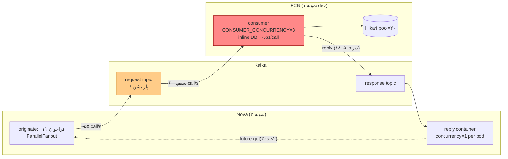

# RB-0002. دسترس‌پذیری Kafka در مسیر Nova ↔ FCB (Request/Reply Throughput)

* **وضعیت**: فعال (راستی‌آزماییِ زیر بار در انتظارِ repartition تاپیک درخواست)
* **تاریخ**: 2026-05-28
* **نویسندگان**: تیم معماری Nova
* **دسته‌بندی**: پیام‌رسانی / ظرفیت / هم‌زمانی (Messaging / Capacity / Concurrency)
* **تیکت‌های مرتبط**: [LN-59412](https://jira.dotin.ir/browse/LN-59412) (راستی‌آزماییِ آن توسط این مشکل مسدود شد)، [LN-59410](https://jira.dotin.ir/browse/LN-59410) (تغییرِ سمتِ FCB)

> این Runbook مکملِ [RB-0001](RB-0001.nova-db-connection-pool-sizing.md) است نه جایگزینِ آن. RB-0001 مخصوصِ
> گرسنگیِ استخر اتصالِ دیتابیس (DB pool) است؛ این Runbook مخصوصِ گلوگاهِ توانِ عبورِ (throughput) مسیرِ
> request/reply کافکا بینِ Nova و FCB است. این دو علتِ مستقل‌اند و علائمِ متفاوتی در APM دارند.

## زمینه (Context)

گامِ `originate` در Nova در همان قدمِ نخست حدود **۱۱ فراخوانِ همگامِ request/reply کافکا به FCB** صادر می‌کند
(حدود ۱۰ اعتبارسنجی به‌صورتِ موازی از طریقِ `ParallelFanout`، سپس ۱ تا ۲ بارگذاریِ اطلاعاتِ مشتری). اگر این مسیر
زیر بار نتواند پاسخ‌ها را به‌موقع برگرداند، هر journey تا سقفِ تایم‌اوتِ کلاینت (۶۰ ثانیه در k6) معلق می‌ماند و
پیش از رسیدن به submit/approve/disburse شکست می‌خورد.

نکتهٔ کلیدی: **تاپیک‌ها، بروکر و احرازِ هویت سالم‌اند** — یک journey منفرد بدونِ مشکل کار می‌کند؛ فقط *زیر بار*
می‌شکند. این امضای کلاسیکِ «در N=۱ سالم، در N بالا فروپاشی» است و یک گلوگاهِ توانِ عبور را نشان می‌دهد، نه نقصِ
قرارداد/نام‌تاپیک/احراز هویت.

## علائم (Symptoms)

مشاهده‌شده در اجرای nova-loadlab `20260528T091842Z-9b894f8d` (پروفایلِ `load`، RPS هدف ۵)، پنجرهٔ UTC
`2026-05-28T09:18:44Z` → `09:29:13Z`، `originate` ×۲۸۵۰ با ۱۰۰٪ شکست. فینگرپرینت‌ها در APM
(`logs-apm.error-default`, `service.name=nova-service`):

```
org.springframework.kafka.requestreply.KafkaReplyTimeoutException: Reply timed out   ← ~42,928 بار
  (پیچیده در java.util.concurrent.ExecutionException)
java.util.concurrent.TimeoutException                                                ← ~12,066 بار
```

- ارسال‌ها (publish) **سریع‌اند**: `...request.queue.v1 send` با p95 ≈ ۱۱۵ms — مشکل در سمتِ ارسال نیست.
- در `traces-apm-default`، تراکنشِ `originate` (POST `/v1/loan-facilities`) با p50 ≈ **۶۱ ثانیه** و min ≈ **۶۰.۵
  ثانیه** (هر درخواست از سقفِ ۶۰ ثانیه‌ایِ کلاینت رد می‌شود). پاسخ‌ها به‌صورتِ سریالی و با تأخیرِ **۱۸ تا ۵۰
  ثانیه** می‌رسند، نه هم‌زمان.
- گِیجِ سلامتِ FCB: `fcb.kafka.partitions.healthy = fcb.kafka.partitions.known = 6` (۱۰۰٪ سالم) — تاپیک/پارتیشن
  مشکل ندارد.
- **هیچ** خطای `KafkaException`، `KAFKA_BROKER_UNAVAILABLE`، `401`/JWKS، یا `SQLTransientConnectionException`
  وجود ندارد. این فقط تایم‌اوتِ همبسته‌سازیِ پاسخ (reply correlation) است.

## علت ریشه‌ای (Root Cause) — سقفِ توانِ عبورِ مصرف‌کنندهٔ FCB

FCB تاپیکِ درخواستِ `corridor.core.loan.nova.fcb-integration.request.queue.v1` را تنها با
**`CONSUMER_CONCURRENCY=3`** رشتهٔ مصرف‌کننده می‌خواند (کلیدِ ZooKeeper در
`nova-fcb-zk-config/zk/.../nova-fcb-integration-consumer.properties`)، و هر رشته یک رفت‌وبرگشتِ همگامِ Hibernate/فاساد
به هستهٔ قدیمی را **به‌صورتِ inline روی همان رشتهٔ مصرف‌کننده** اجرا می‌کند (`NovaFcbIntegrationConsumer`).
هم‌زمانیِ مؤثر علاوه‌براین با تعدادِ پارتیشن‌های تاپیکِ درخواست محدود می‌شود — spring-kafka مقدارِ `concurrency` را
به تعدادِ پارتیشن‌ها کلَمپ می‌کند (تأییدشده با context7).



**محاسبه:**

- زمانِ سرویسِ هر فراخوانِ FCB در حالتِ بی‌بار ≈ **۰.۵ ثانیه** (`fcb.kafka.reply.match.duration`، پنجرهٔ
  کم‌بار).
- سقفِ توانِ عبور = ۳ رشته × (۱ ÷ ۰.۵s) = **~۶ فراخوان بر ثانیه**.
- تقاضا در RPS=۵ = ۵ originate/s × ~۱۱ فراخوان = **~۵۵ فراخوان بر ثانیه**.

ریختنِ ۵۵/s در لوله‌ای با ظرفیتِ ۶/s ⇒ انباشتِ بی‌کران روی پارتیشن‌های درخواست ⇒ پاسخ‌ها ۱۸ تا ۵۰ ثانیه دیر
می‌رسند ⇒ futureهای پاسخ در Nova به تایم‌اوتِ پاسخ (`nova.fcb.kafka.default-timeout: 30s`، با ضریبِ بودجهٔ retry
۲.۰ ≈ ۶۰ ثانیه) می‌خورند ⇒ `KafkaReplyTimeoutException`.

**عواملی که رد شدند (مقصر نیستند):**

- **reply container سمتِ Nova با `concurrency=1`** روی یک پارتیشنِ پین‌شده per pod (`FcbKafkaConfig`): همبسته‌سازیِ
  پاسخ یک lookup در یک map است (میکروثانیه)؛ یک رشته ده‌ها هزار پیام در ثانیه را تخلیه می‌کند. گلوگاه نیست.
- **سمتِ خروجیِ Nova سالم است:** هر درخواست با UUIDِ یکتا کلید می‌خورد و روی پارتیشن‌های درخواست پخش می‌شود
  (`FcbKafkaClient`)، و اعتبارسنجی‌ها موازی fan-out می‌شوند (`FacilityValidator`).
- **رگولاتورِ backpressure سمتِ FCB** (`NovaConsumerBackpressureRegulator`، توقف در ۱۲ پیامِ در پرواز) در
  concurrency=۳ **خفته است** — با پردازشِ inline، تعدادِ در پرواز هرگز از تعدادِ رشته‌ها فراتر نمی‌رود. فقط
  *پس از* افزایشِ concurrency اهمیت پیدا می‌کند.

## مدلِ اندازه‌گیری (Sizing Model) — قانون Little

```
هم‌زمانیِ موردنیاز (تعدادِ پردازشگرهای موازیِ FCB)  ≥  نرخِ ورودِ فراخوان (call/s)  ×  زمانِ سرویسِ هر فراخوان (s)
```

- **سقفِ گروهِ مصرف‌کننده = تعدادِ پارتیشن‌های تاپیکِ درخواست.** مجموعِ رشته‌های مصرف‌کننده روی همهٔ نمونه‌های FCB
  هرگز از تعدادِ پارتیشن‌ها فراتر نمی‌رود (هر پارتیشن یک مصرف‌کننده در گروه). پس بالا بردنِ `CONSUMER_CONCURRENCY`
  بدونِ بالا بردنِ پارتیشن‌ها بی‌اثر است.
- **سقفِ هر نمونه = استخرِ اتصالِ FCB.** هر فراخوانِ در پرواز با پردازشِ inline یک اتصالِ DB را برای ~۰.۵ ثانیه
  نگه می‌دارد. استخرِ Hikariِ FCB **۲۰** اتصال است و بینِ *همهٔ* کارهای FCB مشترک است؛ پس
  `CONSUMER_CONCURRENCY` per نمونه واقع‌بینانه به ~**۱۲** محدود می‌شود (۸ اتصال برای بقیهٔ FCB رزرو می‌ماند).
  استخرِ DBِ FCB یک infra config است و **قابلِ ویرایش نیست** (قاعدهٔ workspace).

> **محدودیتِ صادقانه:** نمونهٔ تکِ dev نمی‌تواند RPS=۵ را نگه دارد. با ۰.۵s در هر فراخوان و سقفِ استخرِ ۲۰،
> بیشینهٔ توانِ تکِ نمونه ≈ ۱۲ × (۱÷۰.۵s) = **۲۴ call/s ≈ RPS ~۲.۲ originate**. RPS=۵ نیازمندِ FCBِ چند-نمونه‌ای
> (production) است؛ افزودنِ نمونه، توان را به‌صورتِ خطی بالا می‌برد تا سقفِ پارتیشن.

## فهرستِ تأمینِ ظرفیت (Provisioning)

| محیط          | نمونهٔ FCB | تاخیرِ هر فراخوان | تقاضا (call/s) | پردازشگرِ موازیِ لازم | پارتیشنِ درخواست | `CONSUMER_CONCURRENCY` |
|---------------|-----------|------------------|----------------|----------------------|------------------|------------------------|
| dev (فعلی)    | ۱         | ~۰.۵s            | ~۲۴ (RPS ~۲.۲) | ۱۲                   | ≥ ۱۲ (پیشنهاد ۳۲) | **۱۲** (از ۳)          |
| production    | N         | ~۰.۵s            | RPS × ۱۱       | RPS × ۱۱ × ۰.۵       | ۳۲               | ⌊۳۲ ÷ N⌋ و ≤ ۱۸        |

**قاعدهٔ انسجام:** `N × CONSUMER_CONCURRENCY ≤ تعدادِ پارتیشن` (سقفِ گروه) **و** هر مقدار ≤ ~۱۸ (هِدرومِ استخرِ
DB). مثال: ۲ نمونه → ۱۶ هرکدام؛ ۳ نمونه → ۱۰ هرکدام. `CONSUMER_CONCURRENCY` یک مقدار به‌ازای هر محیط است (هدفِ ZK
مجزا per محیط).

## رفعِ واقعی (Fix) — سه تغییرِ هماهنگ روی هر دو سمتِ قرارداد

هیچ‌کدام کدِ اپلیکیشنِ Nova را لمس نمی‌کند؛ مسیرهای خروجی/پاسخِ Nova از پیش درست‌اند.

۱. **repartition تاپیکِ درخواست ۶ → ۳۲** (عملیاتِ بروکر — توسطِ اپراتور). چون پیام‌ها با UUIDِ تصادفی کلید
   می‌خورند هیچ تضمینِ ترتیبی نمی‌شکند؛ عملیاتِ آنلاینِ امن.
   ```
   kafka-topics --bootstrap-server <broker> --alter \
     --topic corridor.core.loan.nova.fcb-integration.request.queue.v1 --partitions 32
   ```
   **پیش از آن، تعدادِ پارتیشنِ هر دو تاپیک را روی بروکر تأیید کنید** (مقدارِ «۶» در APM کشفِ Nova است، نه مرجع).
   **محافظ:** تعدادِ پارتیشنِ تاپیکِ پاسخ باید ≥ `reply-topic-partitions` در Nova باشد تا
   `FcbReplyPartitionResolver` پارتیشنِ ناموجود انتخاب نکند.

۲. **افزایشِ `CONSUMER_CONCURRENCY` (پیکربندیِ ZK — `nova-fcb-zk-config`)** از ۳ به **۱۲** (dev). per محیط طبقِ
   جدولِ بالا. سپس sync به ZK و **ری‌استارتِ نمونه‌های FCB** (concurrency در زمانِ راه‌اندازی ثابت می‌شود).

۳. **تنظیمِ آستانه‌های backpressure (دیفِ کد-تنها، داخلِ پکیجِ یکپارچه‌سازیِ Nova در FCB)**: آستانه‌های پیش‌فرض
   در `NovaConsumerBackpressureRegulator` از ۱۲/۶ به **۲۴/۱۲** تا با concurrencyِ بالاتر، throttleِ نابه‌جا رخ
   ندهد (با پردازشِ inline، تعدادِ در پرواز ≈ تعدادِ رشته‌ها؛ پس high باید > concurrency بماند).

> **بدونِ تغییر (طبقِ تصمیمِ تیم):** `nova.dispatcher.command.max-concurrent` روی **۰** (خاموش) می‌ماند. این رفع
> مستقیماً علتِ ریشه‌ایِ throughput را هدف می‌گیرد، نه admission cap. فعال‌سازیِ cap پس از یک اجرای پاکِ بار
> بازنگری می‌شود.

## راستی‌آزمایی (Verification)

۱. **بازسازیِ Nova از `develop`** (buildِ در حالِ اجرا `f990a5d8` پیش از LN-59412 است؛ فرزندِ `9aba1dbf` مرزِ
   تراکنشِ FCB را جابه‌جا می‌کند) و ری‌استارتِ هر دو نمونهٔ Nova.
۲. اعمالِ گام‌های ۱ تا ۳؛ ری‌استارتِ FCB؛ تأیید با `kafka-topics --describe` که تاپیکِ درخواست ۳۲ پارتیشن دارد و
   گروهِ مصرف‌کننده اعضای موردانتظار را گرفته است.
۳. اجرای `make one PROFILE=load RPS=<نرخِ پایدارِ محیط>` در `nova-loadlab/` — برای نمونهٔ تکِ dev ≈ **RPS ۲**.
۴. کوئریِ APM روی پنجرهٔ جدید (`logs-apm.error-default`, `service.name=nova-service`):
   - **صفر / ناچیز بودنِ `KafkaReplyTimeoutException`** (اثباتِ رفعِ Kafka).
   - **صفر `SQLTransientConnectionException`** (متریکِ اصلیِ LN-59412 — این رفع را آزاد می‌کند).
   - شکستِ journey < ۱٪؛ رسیدنِ journeyها به `disburse`؛ بازگشتِ p95 تراکنشِ `originate` به مرتبهٔ ثانیه، نه ۶۰
     ثانیه.

## مراجع (References)

- تیکتِ مسدودشده توسط این مشکل: [LN-59412](https://jira.dotin.ir/browse/LN-59412) (رفعِ استخرِ DB — RB-0001).
- تغییرِ سمتِ FCB: [LN-59410](https://jira.dotin.ir/browse/LN-59410).
- پیکربندیِ مصرف‌کنندهٔ FCB: `nova-fcb-zk-config » zk/core-release/LIN00127/eventbus/nova-fcb-integration-consumer.properties`.
- کلاینتِ کافکای Nova: `nova » adapters/driven/fcb-messaging/.../FcbKafkaClient`، `FcbKafkaConfig`، `FcbKafkaProperties`.
- رگولاتورِ backpressure: `core-release-customer-based » .../eventbus/nova/consumer/backpressure/NovaConsumerBackpressureRegulator.java`.
- شواهدِ اجرا: `nova-loadlab » runs/20260528T091842Z-9b894f8d/load`.
- موضوعِ مرتبطِ آینده: bulkhead مسیرِ REST (cap دستور در Pangaea) + احتمالِ rate-limit ناوگانی در gateway.
