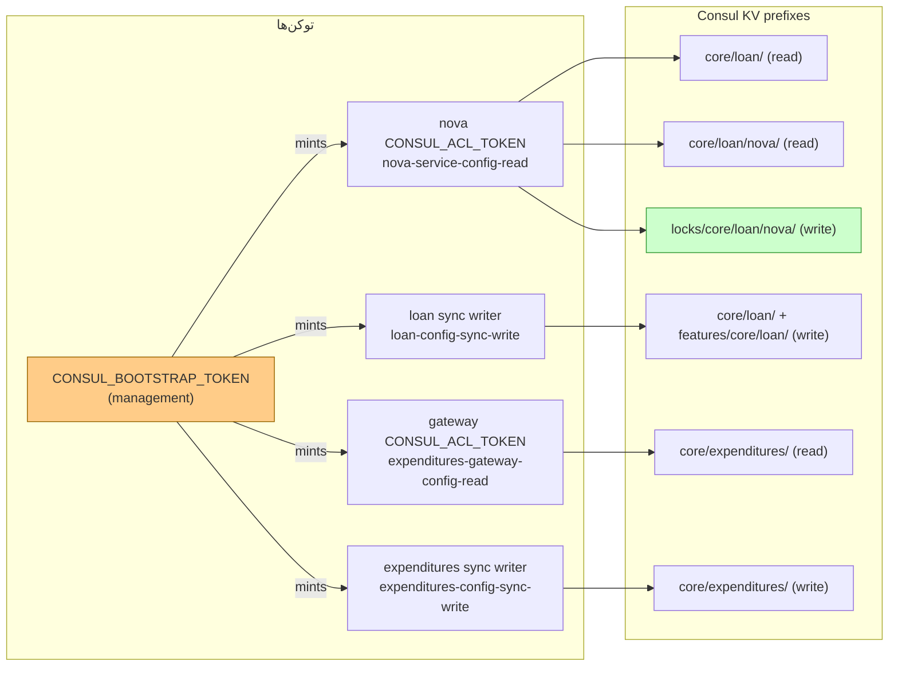

# RB-0003. Consul در تولید: ACL و KV (اجباری)

* **وضعیت**: فعال
* **تاریخ**: 2026-06-04
* **نویسندگان**: تیم معماری Nova
* **دسته‌بندی**: پیکربندی / امنیت (Configuration / Security)
* **تیکت‌های مرتبط**: «—»

> این Runbook **قرارداد اجباری ACL و KV** را مستند می‌کند، نه نحوهٔ اجرای Consul در تولید. مانیفست
> استقرار (تعداد گره‌ها، شبکه، سرویس سیستمی، snapshot tier) به محیط مربوط است و خارج از دامنهٔ این سند. آنچه
> این‌جا اجباری است: مدل توکن/سیاست (least-privilege)، ترتیب یک‌بارهٔ bootstrap، و قرارداد flatten کردن YAML →
> KV که Nova در زمان اجرا به آن وابسته است. برای بازیابی فاجعه (restore از snapshot) به سند مکمل
> [`consul-dr.md`](../../../platform-consul/docs/runbooks/consul-dr.md) در مخزن `platform-consul` مراجعه کنید.

## زمینه (Context)

Nova هیچ `application.yml` محلی ندارد؛ تنها فایل محلی‌اش `container/src/main/resources/bootstrap.yml` است که فقط
آدرس اتصال Consul و هویت سرویس (`spring.application.name=nova-service`) را نگه می‌دارد. هر مقدار پیکربندی زمان اجرا
(datasource، kafka، fcb، dispatcher، security، …) از **Consul KV** خوانده می‌شود — منبع حقیقت، مخزن `nova-config`
است که کانتینر `platform-consul` (حلقهٔ `git2consul-sync`) آن را روی KV اعمال می‌کند.

در تولید، ACL **فعال** و سیاست پیش‌فرض **deny** است (`consul/server.hcl`). یعنی هر درخواست بدون توکنی که
مجوز صریح داشته باشد رد می‌شود. این Runbook مدل توکن کم‌مجوز، ترتیب bootstrap، قرارداد KV، و بازیابی
سناریوهای ACL را تعریف می‌کند. هر انحراف از این قرارداد یا Nova را از boot بازمی‌دارد (`fail-fast: true`) یا
sync را با `403`/`409` می‌شکند.

## پیکربندیِ اجباریِ ACL (وضعیت فعلی)

از `platform-consul/consul/server.hcl`:

<div dir="ltr">

```hcl
acl {
  enabled                  = true
  default_policy           = "deny"
  enable_token_persistence = true
  down_policy              = "extend-cache"
}
```

</div>

- **`enabled = true`** — بدون توکن، هیچ خواندن یا نوشتنی روی KV ممکن نیست. در تولید این را **نمی‌توان خاموش کرد**.
- **`default_policy = "deny"`** — هر چیزی که سیاست صریح نداشته باشد رد می‌شود. مجوزها باید صراحتاً با `key_prefix … { policy
  = "read"|"write" }` اعطا شوند.
- **`down_policy = "extend-cache"`** — اگر سرور ACL در دسترس نباشد، توکن‌هایی که قبلاً resolve شده‌اند از کش
  استفاده می‌کنند و تا بازگشت سرور **منقضی نمی‌شوند**. یعنی یک قطعی موقت leader ACL سرویس‌های در حال
  اجرا را از کار نمی‌اندازد (به بخش بازگردانی مراجعه کنید).

> ACL همیشه فعال است؛ TLS (که در [RB-0006](RB-0006.nova-tls-ssl-hardening.md) پوشش داده می‌شود) یک لایهٔ جدا و
> توصیه‌شده است. در `server.hcl` بلوک `tls { … }` در dev کامنت است و فقط با `CONSUL_TLS_ENABLED=true` در
> تولید render می‌شود. ACL ربطی به فعال بودن TLS ندارد — حتی روی HTTP ساده هم اجباری است.

## ترتیبِ یک‌بارهٔ bootstrap (اجباری، فقط یک‌بار per cluster)

سیستم ACL باید **یک‌بار per cluster** راه‌اندازی شود تا اولین توکن مدیریتی (management/bootstrap) صادر شود. بعد
از آن همهٔ سیاست‌ها و توکن‌ها از همین توکن مدیریتی مشتق می‌شوند. این کار را `scripts/bootstrap-acl.sh`
(target: `make bootstrap`) انجام می‌دهد و ترتیب زیر را تضمین می‌کند:

<div dir="ltr">

```bash
# 1. منتظر leader شدن
until curl -fsS http://127.0.0.1:8500/v1/status/leader >/dev/null; do sleep 2; done

# 2. bootstrap اولیه → SecretID توکنِ مدیریتی
consul acl bootstrap -format=json   # → CONSUL_BOOTSTRAP_TOKEN در .env نوشته می‌شود

# 3. ساختِ سیاست‌ها + توکن‌های per-repo writer (از CONFIG_REPOS .scope)
#    + اعمالِ consul/policies/*.hcl (سیاست‌های reader)
#    + توکنِ agent (سکوتِ هشدارهای anonymous-ACL)

# 4. ری‌استارتِ stack تا حلقهٔ sync توکن‌ها را از .env بردارد
docker compose up -d --force-recreate
```

</div>

رعایت ترتیب اجباری است: تا `consul acl bootstrap` اجرا نشود و `CONSUL_BOOTSTRAP_TOKEN` در دست نباشد، هیچ سیاستی نمی‌توان
ساخت. `bootstrap` **فقط یک‌بار** مجاز است؛ تلاش دوم خطای `already bootstrapped` می‌دهد و فقط با نوشتن
فایل reset (`/consul/data/acl-bootstrap-reset` همراه reset index) دوباره ممکن می‌شود — این یک مسیر بازیابی است، نه
عملیات روزمره. برای افزودن یک repo writer به cluster زنده از `make add-repo-writer REPO=<name>` استفاده کنید،
**نه** `make bootstrap` (که فقط با reset کل ACL پیش می‌رود).

## مدلِ توکنِ کم‌مجوز (least-privilege)

سیاست‌ها در `platform-consul/consul/policies/*.hcl` تعریف شده‌اند. هر توکن دقیقاً به همان زیردرخت KV محدود است که
به آن نیاز دارد.

| سیاست (Policy)                     | نوع توکن           | مجوزها (دقیقاً از فایلِ HCL)                                                                                                                                                                                           |
|------------------------------------|--------------------|------------------------------------------------------------------------------------------------------------------------------------------------------------------------------------------------------------------------|
| `nova-service-config-read`         | runtime (Nova)     | `read` بر `core/loan/nova/` و `core/loan/`؛ `read` بر `features/core/loan/nova/`+`features/core/loan/`؛ **`write` بر `locks/core/loan/nova/`**؛ self-register `service "nova-service"`؛ `write` بر `session_prefix ""` |
| `loan-config-sync-write`           | sync writer (loan) | `write` بر `core/loan/` و `features/core/loan/`؛ `operator = read`. هیچ مجوز service/agent ندارد.                                                                                                                     |
| `expenditures-gateway-config-read` | runtime (gateway)  | `read` بر `core/expenditures/gateway/`+`core/expenditures/`+`features/…`؛ self-register `service "expenditures-gateway"`                                                                                               |
| `expenditures-config-sync-write`   | sync writer (gw)   | `write` بر `core/expenditures/` و `features/core/expenditures/`؛ `operator = read`                                                                                                                                     |

نکات کلیدی روی `nova-service-config-read`:

- `key_prefix "locks/core/loan/nova/" { policy = "write" }` **عمداً بیرون** درختی است که git2consul مدیریت می‌کند
  (`core/loan/…`)، تا sync هرگز این کلیدها را prune نکند. این زیردرخت برای leasing مبتنی بر session Consul
  لازم است (partition-lease تاپیک پاسخ FCB).
- `session_prefix "" { policy = "write" }` (نه read) لازم است، چون Nova باید session‌ای را که قفل
  reply-partition پشت آن است create/renew/destroy کند؛ ACL session با نام گرهٔ agent مطابقت می‌کند (که per pod پویا
  است)، پس prefix خالی اجباری است.

### توکن‌های per-repo writer

`make bootstrap` برای هر entry در `CONFIG_REPOS` که فیلد `scope` دارد، یک سیاست اختصاصی `<repo>-config-writer`
محدود به همان prefixها می‌سازد و یک توکن mint می‌کند. توکن با نام `CONSUL_HTTP_TOKEN_<UPPER(name-branch)>`
(غیر alnum → `_`) در `.env` ذخیره می‌شود؛ هر کارگر `sync_repo` در `entrypoint.sh` توکن خودش را برمی‌دارد. شاخه
بخشی از هویت توکن است (مثلاً `nova-config@develop` → `*_NOVA_CONFIG_DEVELOP`). entryهای بدون `scope` به
fallback سراسری (`platform-config-writer`، با دامنهٔ گستردهٔ `core/loan/`+`features/core/loan/`) می‌افتند —
fallback فقط در صورت نیاز ساخته می‌شود.

### چرخشِ توکن بدونِ ری‌استارتِ اپ

توکن runtime Nova از env (`CONSUL_ACL_TOKEN`) می‌آید و در `bootstrap.yml` به `discovery.acl-token` و
`config.acl-token` تزریق می‌شود. برای چرخش توکن:

1. توکن جدید را با سیاست `nova-service-config-read` mint کنید (`make add-service-acl SERVICE=nova-service`).
2. `CONSUL_ACL_TOKEN` را در منبع secret (K8s Secret / Vault) به‌روزرسانی کنید.
3. instanceها را rolling ری‌استارت کنید — یا اگر env قابل hot-reload است، بدون ری‌استارت.
4. وقتی مطمئن شدید توکن قدیمی دیگر استفاده نمی‌شود، آن را با `consul acl token delete` حذف کنید.

> چرخش gossip key (`make rotate-gossip`) به توکن **مدیریتی** نیاز دارد (توکن writer فاقد `keyring:write` است)؛ این
> عمدی است.

<div dir="ltr">



</div>

## قراردادِ چیدمانِ KV (flatten)

`platform-consul/scripts/git2consul-sync.sh` تنها flattener مجاز است (نه `git2consul` استاندارد). قرارداد:

<div dir="ltr">

```
<repo>/kv/<arbitrary/path>/<context>/*.yml       → <arbitrary/path>/<context>/<dotted.key>
<repo>/features/<arbitrary/path>/*.yml           → features/<arbitrary/path>/<dotted.key>
```

</div>

- **نام فایل نادیده گرفته می‌شود**؛ فقط مسیر دایرکتوری prefix کلید را تعیین می‌کند. مثلاً
  `kv/core/loan/nova/nova-service/fcb.yml` → کلیدهای زیر `core/loan/nova/nova-service/…`.
- همهٔ نوشتن‌ها به‌صورت atomic از طریق `/v1/txn` در chunkهای `TXN_CHUNK=64` انجام می‌شوند.
- **محافظ‌ها** (همه در `git2consul-sync.sh`):
  - `flock` — جلوی تداخل cron + SIGUSR1 + manual را می‌گیرد.
  - secret guard — مقادیر شبیه JWT / `gldt-*` / `glpat-*` / PEM / `AKIA*` را رد می‌کند. override:
    `ALLOW_SECRET_VALUES=true`.
  - bulk-change throttle — اگر ≥ `LARGE_CHANGE_PCT=20`٪ کلیدهای مدیریت‌شده تغییر کنند، رد می‌کند. override:
    `ALLOW_LARGE_CHANGE=true`.
  - safe prune (پیش‌فرض `PRUNE=true`) — فقط کلیدهای زیر `MANAGED_PREFIXES` (مشتق‌شده از درخت repo) حذف می‌شوند.
    `locks/core/loan/nova/…` عمداً بیرون این درخت است و هرگز prune نمی‌شود.
- خطاهای txn درست surface می‌شوند: `403` = توکن روی یکی از کلیدها مجوز write ندارد؛ `409` = یک یا چند op
  رد شد (طول کلید، مقدار بزرگ، …).

## چگونه پیکربندی به Nova می‌رسد

از `container/src/main/resources/bootstrap.yml`:

<div dir="ltr">

```yaml
spring:
  cloud:
    consul:
      host: ${CONSUL_HOST:10.20.11.123}
      port: ${CONSUL_PORT:8500}
      scheme: ${CONSUL_SCHEME:http}
      discovery:
        acl-token: ${CONSUL_ACL_TOKEN}
      config:
        format: KEY_VALUE
        prefixes:
          - core/loan/nova
          - core/loan
        default-context: application
        profile-separator: ','
        fail-fast: true
        acl-token: ${CONSUL_ACL_TOKEN}
```

</div>

- `prefixes: [core/loan/nova, core/loan]` — اگر کلیدی در هر دو باشد، اولین prefix برنده است (`core/loan/nova` =
  override، `core/loan` = fallback). ترتیب بارگذاری در `bootstrap.yml` مستند شده (بالاترین:
  `core/loan/nova/nova-service/<profile>`).
- `CONSUL_ACL_TOKEN` همان توکن `nova-service-config-read` است که از env تزریق می‌شود؛ بدون آن، با
  `default_policy=deny` همهٔ خواندن‌ها `403` می‌شوند و `fail-fast: true` بوت Nova را می‌شکند.
- پس از sync، تغییرات با `@RefreshScope` (Spring Cloud Consul watch، `wait-time: 55`) بدون redeploy اعمال
  می‌شوند.

## محیط چندنمونه‌ای / HA

- **توپولوژی دو-Consul.** دو خوشهٔ Consul جدا وجود دارد. آدرس‌های `10.20.x` (مثلاً `10.20.11.123` در
  `bootstrap.yml`) از هاست توسعه/تست routable هستند؛ آدرس‌های `10.100.x` روی شبکهٔ bridge داکر **routable
  نیستند** (شکاف bridge). تنظیمات `preferred-networks` در `bootstrap.yml` (`^10\.100\.`، `^10\.20\.`) و
  `CONSUL_ADVERTISE_ADDR` در `entrypoint.sh` باید با شبکهٔ واقعی هماهنگ شوند؛ روی bridge، تنظیم
  `CONSUL_ADVERTISE_ADDR` روی یک IP در دسترس از هاست **اجباری** است، وگرنه کلاینت‌های شبکه‌های دیگر به agent
  نمی‌رسند.
- **سقف watch.** هر کلاینت Spring Cloud Consul حدود ۴ watch باز می‌کند (long-poll هر prefix +
  discovery + health). Consul حدود ۵۰۰۰ watch هم‌زمان per گره را تحمل می‌کند → سقف حدود ۱۰۰۰ instance برای این
  پیکربندی. وقتی مجموع watchهای باز در خوشه از **۲۰۰۰** گذشت، بازنگری کنید (لایهٔ مشترک را به pull دوره‌ای
  ببرید یا sidecar بگذارید).
- **خوشهٔ تولید.** ۳ یا ۵ گره با `bootstrap_expect` متناظر + `retry_join` در `server.hcl`. این بخش به محیط
  مربوط است؛ این Runbook فقط قرارداد ACL/KV را الزام می‌کند.

## بازگردانی/بازیابی (Rollback / Recovery)

### الف) از دست رفتن توکن مدیریتی (bootstrap)

اگر `CONSUL_BOOTSTRAP_TOKEN` گم شد، سیستم ACL را با reset marker مبتنی بر index دوباره bootstrap کنید
(`consul-dr.md §4`):

<div dir="ltr">

```bash
INDEX=$(consul info | awk '/last_log_index/ {print $3; exit}')
echo "$INDEX" > /consul/data/acl-bootstrap-reset    # روی هر سرور
consul acl bootstrap
make apply-policies
make add-service-acl SERVICE=nova-service
```

</div>

توکن‌هایی که قبلاً صادر شده‌اند پس از reset باقی می‌مانند، اما اگر احتمال نشت توکن مدیریتی هست، **همهٔ** توکن‌ها را چرخش
دهید.

### ب) رفتار `extend-cache` هنگام قطعی Consul

به لطف `down_policy = "extend-cache"`، اگر leader ACL موقتاً از دسترس خارج شود، Nova و دیگر سرویس‌ها با
توکن‌های کش‌شده به کار ادامه می‌دهند؛ توکن‌ها تا بازگشت سرور منقضی نمی‌شوند. در این بازه:

- **خواندن/نوشتن تازهٔ** توکن‌هایی که هنوز resolve نشده‌اند ممکن است شکست بخورد، اما instanceهای در حال اجرا
  که config را قبلاً load کرده‌اند تحت تأثیر قرار نمی‌گیرند (config در حافظه است).
- watchهای `@RefreshScope` fail می‌شوند و بی‌سروصدا retry می‌کنند؛ هیچ مقداری ناپدید نمی‌شود، فقط کهنه می‌ماند.
- پس از بازگشت leader، watchها خودبه‌خود همگرا می‌شوند. نیازی به ری‌استارت Nova نیست.

### ج) restore کامل خوشه (RPO/RTO)

برای فاجعهٔ کامل خوشه (از دست رفتن state مربوط به Raft) از snapshot restore استفاده کنید — مستند در
[`consul-dr.md §2`](../../../platform-consul/docs/runbooks/consul-dr.md) (RTO ۱۵ دقیقه / RPO ۱ ساعت، tierهای
hourly/daily/weekly/monthly). پس از restore، سیاست‌ها و توکن‌ها سالم‌اند؛ فقط drift را با `make drift-check
REPO=…` بررسی کنید.

## راستی‌آزمایی (Verification)

۱. **سلامت ACL/leader**: `GET /v1/status/leader` باید آدرس غیرخالی برگرداند؛ در `consul members` همهٔ گره‌ها
   `alive`؛ `consul operator raft list-peers` quorum از Voterها.

۲. **سیاست‌ها اعمال شده‌اند**: `consul acl policy list` باید هر چهار سیاست `*-config-read`/`*-config-sync-write`
   را نشان دهد. `make apply-policies` idempotent است.

۳. **توکن Nova مجوز درست دارد** (با توکن مدیریتی):

<div dir="ltr">

```bash
consul acl token read -id <accessor-id>     # سیاستِ nova-service-config-read را تأیید کن
# read باید روی core/loan/ کار کند، write روی locks/core/loan/nova/ کار کند
consul kv get -token=$CONSUL_ACL_TOKEN core/loan/nova/nova-service/...  # 200
```

</div>

۴. **sync سالم است**: در `make sync-status` آخرین `outcome: "success"` بدون entry در `errors[]`؛ هیچ `403`/`409`
   در لاگ کانتینر `platform-consul`.

۵. **بوت Nova**: بعد از تغییر KV، Nova بدون خطای `spring.config.import` بالا می‌آید (نشانهٔ توکن معتبر +
   در دسترس بودن prefixها)؛ لاگ refresh مقدار جدید را نشان می‌دهد.

۶. **drift**: `make drift-check REPO=/path/to/nova-config` با exit صفر (repo = منبع حقیقت). هر drift قدیمی‌تر از
   یک بازهٔ sync نشانهٔ permissions mismatch، قفل کهنه، یا دور زدن GitOps است.

## مراجع (References)

- سیاست‌های ACL: `platform-consul » consul/policies/{nova-service-config-read,loan-config-sync-write,expenditures-gateway-config-read,expenditures-config-sync-write}.hcl`.
- پیکربندی سرور (acl/tls/limits): `platform-consul » consul/server.hcl`.
- bootstrap: `platform-consul » scripts/bootstrap-acl.sh` (target `make bootstrap`).
- flattener + محافظ‌ها: `platform-consul » scripts/git2consul-sync.sh`.
- entrypoint + حلقهٔ sync per-repo: `platform-consul » scripts/entrypoint.sh`.
- اتصال Nova به Consul: `nova » container/src/main/resources/bootstrap.yml`.
- بازیابی فاجعه (snapshot/ACL re-bootstrap/drift): [`platform-consul » docs/runbooks/consul-dr.md`](../../../platform-consul/docs/runbooks/consul-dr.md).
- Runbookهای مرتبط: [RB-0006](RB-0006.nova-tls-ssl-hardening.md) (سخت‌سازی TLS کانال Consul).
