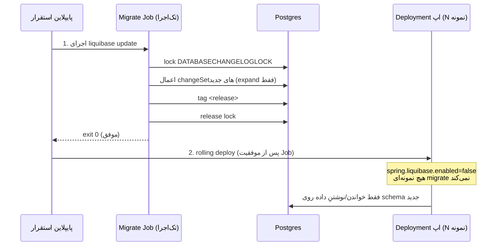
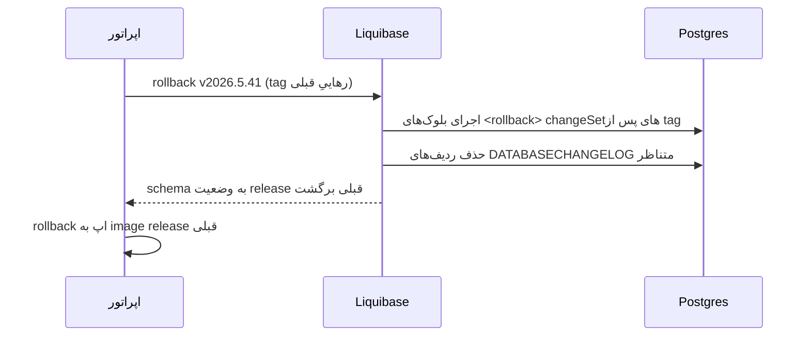

# RB-0004. مهاجرت‌های Liquibase در تولید

* **وضعیت**: پیش‌نویس
* **تاریخ**: 2026-06-04
* **نویسندگان**: تیم معماری Nova
* **دسته‌بندی**: پایگاه‌داده / استقرار (Database / Deployment)
* **تیکت‌های مرتبط**: «—»

> این Runbook نحوهٔ اجرای امنِ مهاجرت‌های schema در یک ناوگانِ چندنمونه‌ای را مستند می‌کند. مدلِ فعلی (مهاجرت
> in-app روی هر boot) برای dev/test پذیرفتنی است اما برای تولیدِ چندنمونه‌ای **هدف** نیست. مرزِ «وضعیت فعلی» در
> برابر «هدف» در سراسرِ سند صریح علامت‌گذاری شده است.

## زمینه (Context)

Nova از Liquibase برای مدیریتِ schema استفاده می‌کند. master changelog در
`container/src/main/resources/db/changelog/db.changelog-master.xml` فقط `include` دارد (هیچ changeSet مستقیم
ندارد) و به ترتیب `framework/db.changelog-framework.xml` سپس `trade-loan/db.changelog-trade-loan.xml` را شامل
می‌شود — جداولِ framework اول، سپس جداولِ دامنه. هر changelog جدید باید از فایلِ `db.changelog-*.xml` متناظر
ارجاع شود؛ فایل‌های یتیم compile می‌شوند اما در زمانِ اجرا `column does not exist` می‌دهند. دایرکتوریِ هر نسخه
الگوی `trade-loan/vYYYY.M.N/NNN-description.xml` را دارد (مثلاً `trade-loan/v2026.5.57/012-add-outbox-poller-index.xml`).

Liquibase از `spring-boot-starter-liquibase` (وابستگیِ ماژولِ `adapters/driven/persistence`) تأمین می‌شود و در
زمانِ اجرا از `spring.liquibase` در `nova-config » kv/core/loan/nova/application/datasource.yml` پیکربندی می‌شود.

## وضعیت فعلی در برابر هدف

### وضعیت فعلی — مهاجرتِ in-app روی هر boot

از `nova-config » kv/core/loan/nova/application/datasource.yml`:

<div dir="ltr">

```yaml
spring:
  liquibase:
    change-log: classpath:db/changelog/db.changelog-master.xml
    enabled: true
```

</div>

با `enabled: true`، **هر نمونهٔ Nova روی هر boot مهاجرت‌ها را اجرا می‌کند**. در یک ناوگانِ N نمونه‌ای این یعنی N
نمونه برای قفلِ changelog (`DATABASECHANGELOGLOCK`) رقابت می‌کنند: فقط یکی قفل را می‌گیرد و migrate می‌کند، بقیه
پشتِ قفل بلاک می‌مانند تا اولی آزاد کند. این در dev/test (که عملاً یک نمونه boot می‌شود) بی‌ضرر است اما در یک
rolling deployِ تولیدی، startupِ نمونه‌ها را سریالی و کند می‌کند و در صورتِ crashِ دارندهٔ قفل، خطرِ قفلِ کهنه
(stale lock) دارد.

### هدف — runnerِ اختصاصی، اپ‌ها هرگز migrate نمی‌کنند

در تولید، `spring.liquibase.enabled` را در `nova-config` به **`false`** بگذارید تا هیچ نمونهٔ اپلیکیشن schema را
تغییر ندهد، و مهاجرت‌ها را به‌صورتِ یک **runnerِ اختصاصی** **پیش از** rolling کردنِ podهای اپ اجرا کنید:

<div dir="ltr">

```yaml
# هدف در nova-config » kv/core/loan/nova/application/datasource.yml
spring:
  liquibase:
    change-log: classpath:db/changelog/db.changelog-master.xml
    enabled: false      # اپ‌ها migrate نمی‌کنند؛ runnerِ مجزا مسئول است
```

</div>

این تنها تغییرِ KV لازم در سمتِ اپ است. اجرای واقعیِ مهاجرت یکی از مسیرهای زیر است.

## رویّهٔ گام‌به‌گام

### مسیرِ K8s — Job (یا initContainer) پیش از rollout

یک Job که همان image اپ را اجرا می‌کند اما به‌جای بوتِ Spring، Liquibase را با همان classpath changelog اجرا
می‌کند. این Job باید **قبل از** rolling کردنِ Deploymentِ اپ کامل شود.

<div dir="ltr">

```yaml
apiVersion: batch/v1
kind: Job
metadata:
  name: nova-db-migrate-2026-5-57
spec:
  backoffLimit: 1
  template:
    spec:
      restartPolicy: Never
      containers:
        - name: liquibase
          image: liquibase/liquibase:4.31
          args:
            - --url=jdbc:postgresql://$(DB_HOST):$(DB_PORT)/$(DB_NAME)
            - --username=$(DB_USERNAME)
            - --password=$(DB_PASSWORD)
            - --changelog-file=db/changelog/db.changelog-master.xml
            - --classpath=/app/nova-changelogs.jar
            - update
          envFrom:
            - secretRef:
                name: nova-db-credentials
```

</div>

- `--classpath` باید changelogهای Nova را در دسترس بگذارد. عملاً همان jarِ اپ (`trade-loan-container`) را به
  image mount/کپی کنید یا یک jarِ فقط-changelog بسازید؛ `--changelog-file` همان مسیرِ classpath است که اپ
  استفاده می‌کند (`db/changelog/db.changelog-master.xml`).
- اگر initContainer ترجیح داده می‌شود، همان args را در یک initContainerِ podِ اپ بگذارید — اما توجه: با N
  replica، N initContainer هم برای قفل رقابت می‌کنند (همان مشکلِ in-app). **Job تک‌اجرا ترجیح دارد**؛
  initContainer فقط وقتی امن است که `replicas: 1` در فازِ migrate باشد.

### مسیرِ Docker / محلی — کانتینرِ یک‌باره یا Maven

<div dir="ltr">

```bash
# کانتینرِ یک‌بارهٔ liquibase
docker run --rm liquibase/liquibase:4.31 \
  --url="jdbc:postgresql://$DB_HOST:$DB_PORT/$DB_NAME" \
  --username="$DB_USERNAME" --password="$DB_PASSWORD" \
  --changelog-file=db/changelog/db.changelog-master.xml \
  --classpath=/changelogs.jar \
  update

# یا از طریقِ Maven plugin روی ماژولِ container (همان classpath changelog)
mvn -pl container liquibase:update \
  -Dliquibase.url="jdbc:postgresql://$DB_HOST:$DB_PORT/$DB_NAME" \
  -Dliquibase.username="$DB_USERNAME" -Dliquibase.password="$DB_PASSWORD" \
  -Dliquibase.changeLogFile=classpath:db/changelog/db.changelog-master.xml
```

</div>

### بهترین‌رویّه — runnerِ مهاجرتِ یگانه

- **یک runner در هر زمان.** هرگز نگذارید N نمونهٔ اپ در changelog lock رقابت کنند. یک Job/کانتینرِ تک‌اجرا
  منبعِ مهاجرت است.
- **`DATABASECHANGELOGLOCK`.** Liquibase پیش از اجرا یک ردیف در این جدول قفل می‌کند و پس از اتمام آزاد می‌کند.
  اگر runner در میانهٔ کار crash کند، قفل کهنه می‌ماند؛ آزادسازیِ دستی با `liquibase releaseLocks` (فقط پس از
  اطمینان از عدمِ اجرای موازی).
- **`contexts` / `labels`.** برای تفکیکِ مهاجرت‌های محیط‌محور یا اختیاری از `--contexts`/`--labels` استفاده کنید
  (مثلاً seedهای فقط-dev). در تولید فقط contextهای مجاز اجرا شوند.
- **`tag` per release.** پیش از هر استقرار یک `liquibase tag <release>` بزنید تا rollback به نقطهٔ مشخص ممکن
  باشد (به بخشِ rollback رجوع کنید).

<div dir="ltr">



</div>

## محیط چندنمونه‌ای / HA

- **ترتیبِ migrate-then-deploy.** همیشه schema را **قبل از** rolling کردنِ اپ migrate کنید. Job باید با exit
  صفر کامل شود؛ در غیرِ این‌صورت rollout متوقف شود.
- **expand/contract (سازگارِ عقب‌رو).** در یک rolling deploy، برای مدتی N نمونهٔ قدیمی و N نمونهٔ جدید هم‌زمان
  روی **همان** schema کار می‌کنند. پس هر مهاجرت باید **expand فقط** باشد — افزودنِ ستون/جدول/ایندکسِ nullable،
  نه drop/rename مخرب. تغییرِ مخرب (drop/rename) فقط در یک release **بعدی** و فقط پس از آن‌که هیچ نمونهٔ قدیمی
  ستون را نمی‌خواند (فازِ contract) مجاز است. الگوی دو-فازی:
  1. **Expand**: ستون/ساختارِ جدید را اضافه کن؛ کدِ جدید روی هر دو می‌نویسد/می‌خواند.
  2. **Contract**: پس از اتمامِ rollout و عدمِ وابستگیِ کدِ قدیمی، ساختارِ قدیمی را drop کن.
- **هرگز race روی قفل.** با `spring.liquibase.enabled=false` در اپ + Jobِ تک‌اجرا، N نمونهٔ اپ هرگز برای
  `DATABASECHANGELOGLOCK` رقابت نمی‌کنند — این کلِ دلیلِ وجودِ این Runbook است.
- **سقفِ اتصالِ runner.** runnerِ مهاجرت یک اتصالِ کوتاه‌مدت می‌گیرد و آزاد می‌کند؛ این روی بودجهٔ استخرِ اتصالِ
  اپ (RB-0001) اثری ندارد چون runner پیش از بالا آمدنِ ناوگان اجرا می‌شود.

## بازگردانی/بازیابی (Rollback / Recovery)

Liquibase سه مکانیزمِ rollback دارد؛ همگی نیازمندِ این‌اند که changeSetهای مخرب بلوکِ `<rollback>` صریح داشته
باشند (changeSetهای صرفاً افزودنی خودکار rollback می‌شوند).

<div dir="ltr">

```bash
# بازگرداندنِ N آخرین changeSet
liquibase --changelog-file=db/changelog/db.changelog-master.xml rollbackCount 1

# بازگرداندن به یک tag (الگوی tag-per-release)
liquibase --changelog-file=db/changelog/db.changelog-master.xml rollback v2026.5.41

# بازگرداندن به یک نقطهٔ زمانی
liquibase --changelog-file=db/changelog/db.changelog-master.xml rollbackToDate 2026-06-01T00:00:00
```

</div>

<div dir="ltr">



</div>

- **tag-per-release.** پیش از هر استقرار `liquibase tag <release>` بزنید تا `rollback <tag>` همیشه یک هدفِ
  مشخص داشته باشد.
- **changeSetهای مخرب نیازمندِ `<rollback>` صریح‌اند.** drop ستون/جدول، تغییرِ نوع، و backfill داده باید بلوکِ
  `<rollback>` معکوس داشته باشند؛ وگرنه `rollback` با خطا متوقف می‌شود. مثالِ مخرب در repo:
  `trade-loan/v2026.5.41/011-drop-collateral-percent-column.xml`.
- **ترتیبِ rollback.** اول schema را rollback کنید، سپس image اپ را به release قبلی برگردانید — معکوسِ ترتیبِ
  forward (migrate-then-deploy ⇒ rollback-app-then-schema یا، در عمل، schema rollback تنها وقتی امن است که هیچ
  نمونهٔ جدیدی روی ساختارِ حذف‌شده ننویسد؛ با expand/contract معمولاً نیازی به schema rollback نیست — فقط image
  اپ برمی‌گردد).

## راستی‌آزمایی (Verification)

۱. **Job موفق پیش از rollout**: exit صفرِ Jobِ مهاجرت؛ لاگِ Liquibase تعدادِ changeSetهای اعمال‌شده را نشان دهد.

۲. **اپ‌ها migrate نمی‌کنند**: پس از تنظیمِ `enabled: false`، لاگِ بوتِ هر نمونهٔ Nova **هیچ** خطِ
   `liquibase: ... update` نداشته باشد؛ زمانِ startup کوتاه‌تر و بدونِ بلاکِ قفل.

۳. **یگانگیِ قفل**: در `DATABASECHANGELOGLOCK` هیچ ردیفِ `LOCKED=true` کهنه پس از اتمامِ Job باقی نماند:

<div dir="ltr">

```sql
SELECT id, locked, lockgranted, lockedby FROM databasechangeloglock;
-- انتظار: locked = false پس از پایان runner
```

</div>

۴. **هم‌زیستیِ N قدیمی + N جدید**: در پنجرهٔ rolling deploy، هیچ خطای `column does not exist` یا
   `relation does not exist` در لاگِ APM (`logs-apm.error-default`, `service.name=nova-service`) — اثباتِ
   expand-only بودنِ مهاجرت.

۵. **drift سازگار با کد**: هر افزودن/حذف/تغییرِ نامِ فیلدِ `@ConfigurationProperties` یا entity باید با
   changelog متناظر در همان merge window باشد (قاعدهٔ workspace: PRهای کد و config با هم ship می‌شوند).

## مراجع (References)

- master changelog + ترتیبِ include: `nova » container/src/main/resources/db/changelog/db.changelog-master.xml`.
- changelogهای framework + trade-loan: `nova » container/src/main/resources/db/changelog/{framework,trade-loan}/…`.
- پیکربندیِ Liquibase زمانِ اجرا: `nova-config » kv/core/loan/nova/application/datasource.yml` (`spring.liquibase`).
- وابستگیِ starter: `nova » adapters/driven/persistence/pom.xml` (`spring-boot-starter-liquibase`).
- ماژولِ container + کنوانسیونِ changelog: `nova » container/CLAUDE.md` (بخشِ Liquibase).
- Runbookِ مرتبط: [RB-0001](RB-0001.nova-db-connection-pool-sizing.md) (سقفِ استخرِ اتصالِ Postgres ناوگان).
