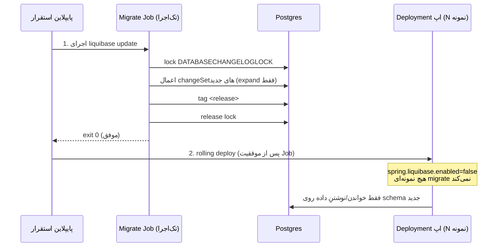
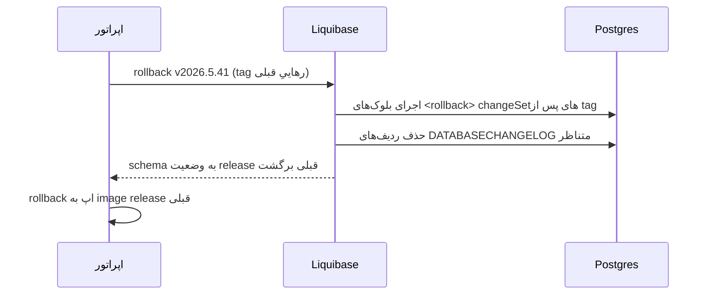

# RB-0004. مهاجرت‌های Liquibase در تولید

* **وضعیت**: فعال
* **تاریخ**: 2026-06-04 (به‌روزرسانی: 2026-06-18 — Liquibase 5.0.3 + ابزارِ `-Pliquibase-ops`/`make db-*`)
* **نویسندگان**: تیم معماری Nova
* **دسته‌بندی**: پایگاه‌داده / استقرار (Database / Deployment)
* **تیکت‌های مرتبط**: «—»

> این Runbook نحوهٔ اجرای امن مهاجرت‌های schema را در یک ناوگان چندنمونه‌ای مستند می‌کند. مدل فعلی (مهاجرت
> in-app روی هر boot) برای dev/test قابل قبول است، اما برای تولید چندنمونه‌ای **هدف** نیست. مرز «وضعیت فعلی» در
> برابر «هدف» در سراسر سند صریح مشخص شده است.

## زمینه (Context)

Nova برای مدیریت schema از Liquibase (نسخهٔ **5.0.3** — پین‌شده در BOMِ pangaea؛ Boot 4.1 هم همین را مدیریت
می‌کند، پس پین یک upgrade نیست بلکه قفلِ پایداری است) استفاده می‌کند. master changelog در
`container/src/main/resources/db/changelog/db.changelog-master.xml` فقط `include` دارد (هیچ changeSet مستقیمی
ندارد) و به ترتیب `framework/db.changelog-framework.xml` و سپس `trade-loan/db.changelog-trade-loan.xml` را شامل
می‌شود — اول جداول framework، بعد جداول دامنه.

**کنوانسیونِ changelog (baselineِ greenfield از 2026-06).** schema به‌صورتِ greenfield بازنویسی شد: هر changeset
یک برگِ formatted-SQL (`--liquibase formatted sql`، یک changeset در هر فایل، نامِ مهرِ‌زمانیِ UTC
`YYYYMMDDTHHMMSS_*.sql`، بلوکِ `--rollback` صریح، `logicalFilePath` پایدار) زیرِ `changes/` است، و masterهای نازکِ
XML آن‌ها را با `include`ِ **صریح و مرتب** می‌آورند (هرگز `includeAll`). masterِ framework هر شش masterِ ماژولیِ
pangaea/expression-kit را که درونِ jarِ وابستگی‌ها ship می‌شوند، از ریشهٔ classpath و به ترتیبِ وابستگی
(persistence → inbox → audit → reconciliation → workflow → expression-kit) include می‌کند. ترتیبِ apply با همین
فهرستِ include تضمین می‌شود؛ پیشوندِ مهرِ‌زمانی نام‌گذاری را append-only نگه می‌دارد و تصادمِ shناسهٔ بین‌jar را
حذف می‌کند. driftِ تاریخی پورت **نشد**: مهاجرت‌های add-column/alter درونِ create-leaf folded شدند و changesetهای
drop/cleanupِ تاریخی (به‌ویژه `saga_*` بازنشسته) که روی DB خالی می‌شکستند، عمداً حذف شدند. کنوانسیونِ کاملِ پلتفرم
در pangaea ADR-0030 (قالبِ changelog) و سمتِ nova در ADR-0006 کدگذاری شده است. هر changelog جدید باید از master
متناظر `include` شود؛ فایل‌های یتیم compile می‌شوند اما در زمان اجرا `column does not exist` می‌دهند.

Liquibase از `spring-boot-starter-liquibase` (وابستگی ماژول `adapters/driven/persistence`) می‌آید و در
زمان اجرا از `spring.liquibase` در `nova-config » kv/core/loan/nova/application/datasource.yml` پیکربندی می‌شود
(مسیرِ master بدونِ تغییر: `classpath:db/changelog/db.changelog-master.xml`).

## وضعیت فعلی در برابر هدف

### وضعیت فعلی — مهاجرتِ in-app روی هر boot

از `nova-config » kv/core/loan/nova/application/datasource.yml`:

<div dir="ltr">

```yaml
spring:
  liquibase:
    change-log: classpath:db/changelog/db.changelog-master.xml
    enabled: true
```

</div>

با `enabled: true`، **هر نمونهٔ Nova روی هر boot مهاجرت‌ها را اجرا می‌کند**. در یک ناوگان N نمونه‌ای یعنی N
نمونه برای قفل changelog (`DATABASECHANGELOGLOCK`) رقابت می‌کنند: فقط یکی قفل را می‌گیرد و migrate می‌کند، بقیه
پشت قفل می‌مانند تا اولی آزادش کند. این در dev/test (که عملاً یک نمونه boot می‌شود) بی‌ضرر است، اما در یک
rolling deploy تولیدی، startup نمونه‌ها را سریالی و کند می‌کند و اگر دارندهٔ قفل crash کند، خطر قفل کهنه
(stale lock) دارد.

### هدف — runner اختصاصی، اپ‌ها هرگز migrate نمی‌کنند

در تولید، `spring.liquibase.enabled` را در `nova-config` روی **`false`** بگذارید تا هیچ نمونهٔ اپلیکیشنی schema را
تغییر ندهد، و مهاجرت‌ها را با یک **runner اختصاصی** و **پیش از** rolling کردن podهای اپ اجرا کنید:

<div dir="ltr">

```yaml
# هدف در nova-config » kv/core/loan/nova/application/datasource.yml
spring:
  liquibase:
    change-log: classpath:db/changelog/db.changelog-master.xml
    enabled: false      # اپ‌ها migrate نمی‌کنند؛ runnerِ مجزا مسئول است
```

</div>

این تنها تغییر KV لازم در سمت اپ است. اجرای واقعی مهاجرت از یکی از مسیرهای زیر انجام می‌شود.

## رویّهٔ گام‌به‌گام

### مسیر K8s — Job (یا initContainer) پیش از rollout

یک Job که همان image اپ را اجرا می‌کند، اما به‌جای بوت Spring، Liquibase را با همان classpath changelog اجرا
می‌کند. این Job باید **قبل از** rolling کردن Deployment اپ کامل شود.

<div dir="ltr">

```yaml
apiVersion: batch/v1
kind: Job
metadata:
  name: nova-db-migrate-2026-5-57
spec:
  backoffLimit: 1
  template:
    spec:
      restartPolicy: Never
      containers:
        - name: liquibase
          image: liquibase/liquibase:5.0.3
          args:
            - --url=jdbc:postgresql://$(DB_HOST):$(DB_PORT)/$(DB_NAME)
            - --username=$(DB_USERNAME)
            - --password=$(DB_PASSWORD)
            - --changelog-file=db/changelog/db.changelog-master.xml
            - --classpath=/app/nova-changelogs.jar
            - update
          envFrom:
            - secretRef:
                name: nova-db-credentials
```

</div>

- `--classpath` باید changelogهای Nova را در دسترس بگذارد. عملاً همان jar اپ (`trade-loan-container`) را در
  image mount/کپی کنید یا یک jar فقط-changelog بسازید؛ `--changelog-file` همان مسیر classpath است که اپ
  استفاده می‌کند (`db/changelog/db.changelog-master.xml`).
- اگر initContainer را ترجیح می‌دهید، همان args را در یک initContainer روی pod اپ بگذارید — اما توجه: با N
  replica، N تا initContainer هم برای قفل رقابت می‌کنند (همان مشکل in-app). **Job تک‌اجرا ترجیح دارد**؛
  initContainer فقط وقتی امن است که در فاز migrate مقدار `replicas: 1` باشد.

### مسیر Docker / محلی — کانتینر یک‌باره یا maven-plugin

<div dir="ltr">

```bash
# کانتینرِ یک‌بارهٔ liquibase (هم‌نسخه با runtime: 5.0.3)
docker run --rm liquibase/liquibase:5.0.3 \
  --url="jdbc:postgresql://$DB_HOST:$DB_PORT/$DB_NAME" \
  --username="$DB_USERNAME" --password="$DB_PASSWORD" \
  --changelog-file=db/changelog/db.changelog-master.xml \
  --classpath=/changelogs.jar \
  update
```

</div>

### مسیر canonical — profile `-Pliquibase-ops` + هدف‌های `make db-*`

ابزارِ یکپارچهٔ operator در repo، یک `liquibase-maven-plugin` پشتِ profileِ غیرفعالِ پیش‌فرضِ `liquibase-ops`
در `container/pom.xml` است. وابستگیِ `liquibase-core`ِ خودِ پلاگین هم به **5.0.3** پین شده تا با runtime
**lockstep** بماند (drift بینِ `mvn liquibase:*` و bootِ Spring، checksum/parse را تغییر می‌دهد).
`changeLogFile=db/changelog/db.changelog-master.xml` از classpath resolve می‌شود — همان masterی که اپ در زمانِ
boot اجرا می‌کند؛ پس **`make install` (reactor → `.m2`) باید اول اجرا شود** تا jarهای changelogِ pangaea/expression-kit
در دسترسِ پلاگین باشند. اتصالِ DB از env-var (`DB_*`) یا `-Dliquibase.url=…` می‌آید؛ هیچ secret هاردکد نمی‌شود.

هدف‌های `make db-*` در `Makefile` ریشهٔ nova هرکدام `$(ENV_FILE)` (`container/.env`) را source و حضورِ `DB_*` را
guard می‌کنند:

<div dir="ltr">

```bash
make db-status              # liquibase:status   — changesetهای apply‌نشده
make db-validate            # liquibase:validate — اعتبارسنجی بدونِ نوشتن روی DB
make db-update              # liquibase:update   — اعمال changesetهای pending
make db-sql                 # liquibase:updateSQL — dry-run، SQL را در container/target/ می‌نویسد
make db-tag TAG=<release>   # liquibase:tag      — tag وضعیت فعلی DB
make db-rollback TAG=<rel>  # liquibase:rollback — rollback تا یک tag
make db-rollback-count N=2  # liquibase:rollback — rollback آخرین N changeset
make db-history             # liquibase:history  — تاریخچهٔ استقرار
make db-release-locks       # liquibase:releaseLocks — آزادسازیِ قفلِ گیرکرده

# شکلِ خام (بدونِ Makefile):
mvn -pl container -Pliquibase-ops liquibase:update \
  -Dliquibase.url="jdbc:postgresql://$DB_HOST:$DB_PORT/$DB_NAME" \
  -Dliquibase.username="$DB_USERNAME" -Dliquibase.password="$DB_PASSWORD"
```

</div>

### بهترین رویّه — یک runner یگانه برای مهاجرت

- **هر بار فقط یک runner.** هرگز نگذارید N نمونهٔ اپ روی changelog lock رقابت کنند. یک Job/کانتینر تک‌اجرا
  منبع مهاجرت است.
- **`DATABASECHANGELOGLOCK`.** Liquibase پیش از اجرا یک ردیف در این جدول قفل و پس از اتمام آزاد می‌کند.
  اگر runner وسط کار crash کند، قفل کهنه باقی می‌ماند؛ آزادسازی دستی با `liquibase releaseLocks` (فقط بعد از
  اطمینان از این‌که هیچ اجرای موازی‌ای در کار نیست).
- **`contexts` / `labels`.** برای جدا کردن مهاجرت‌های محیط‌محور یا اختیاری از `--contexts`/`--labels` استفاده کنید
  (مثلاً seedهای فقط-dev). در تولید فقط contextهای مجاز اجرا شوند.
- **`tag` per release.** پیش از هر استقرار یک `liquibase tag <release>` بزنید تا rollback به یک نقطهٔ مشخص ممکن
  باشد (به بخش rollback مراجعه کنید).

<div dir="ltr">



</div>

## محیط چندنمونه‌ای / HA

- **ترتیب migrate-then-deploy.** همیشه schema را **قبل از** rolling کردن اپ migrate کنید. Job باید با exit
  صفر کامل شود؛ در غیر این‌صورت rollout متوقف شود.
- **expand/contract (سازگار با عقب).** در یک rolling deploy، مدتی N نمونهٔ قدیمی و N نمونهٔ جدید هم‌زمان
  روی **همان** schema کار می‌کنند. پس هر مهاجرت باید **فقط expand** باشد — افزودن ستون/جدول/ایندکس nullable،
  نه drop/rename مخرب. تغییر مخرب (drop/rename) فقط در یک release **بعدی** و فقط وقتی مجاز است که دیگر هیچ نمونهٔ قدیمی
  آن ستون را نمی‌خواند (فاز contract). الگوی دو-فازی:
  1. **Expand**: ستون/ساختار جدید را اضافه کن؛ کد جدید روی هر دو می‌نویسد/می‌خواند.
  2. **Contract**: پس از اتمام rollout و وقتی کد قدیمی دیگر به آن وابسته نیست، ساختار قدیمی را drop کن.
- **هرگز race روی قفل.** با `spring.liquibase.enabled=false` در اپ + یک Job تک‌اجرا، N نمونهٔ اپ هرگز برای
  `DATABASECHANGELOGLOCK` رقابت نمی‌کنند — اصلاً دلیل وجود این Runbook همین است.
- **اتصال runner.** runner مهاجرت یک اتصال کوتاه‌مدت می‌گیرد و آزاد می‌کند؛ این روی سقف استخر اتصال
  اپ (RB-0001) اثری ندارد، چون runner پیش از بالا آمدن ناوگان اجرا می‌شود.

## بازگردانی/بازیابی (Rollback / Recovery)

Liquibase سه مکانیزم rollback دارد؛ همگی نیاز دارند که changeSetهای مخرب بلوک `<rollback>` صریح داشته
باشند (changeSetهای صرفاً افزودنی خودکار rollback می‌شوند).

<div dir="ltr">

```bash
# بازگرداندنِ N آخرین changeSet
liquibase --changelog-file=db/changelog/db.changelog-master.xml rollbackCount 1

# بازگرداندن به یک tag (الگوی tag-per-release)
liquibase --changelog-file=db/changelog/db.changelog-master.xml rollback v2026.5.41

# بازگرداندن به یک نقطهٔ زمانی
liquibase --changelog-file=db/changelog/db.changelog-master.xml rollbackToDate 2026-06-01T00:00:00
```

</div>

<div dir="ltr">



</div>

- **tag-per-release.** پیش از هر استقرار `make db-tag TAG=<release>` (یا `liquibase tag <release>`) بزنید تا
  `make db-rollback TAG=<release>` همیشه یک هدفِ مشخص داشته باشد.
- **changeSetهای مخرب به `<rollback>` صریح نیاز دارند.** drop ستون/جدول، تغییر نوع، و backfill داده باید بلوک
  `<rollback>` معکوس داشته باشند؛ وگرنه `rollback` با خطا متوقف می‌شود. مثال مخرب در repo:
  `trade-loan/v2026.5.41/011-drop-collateral-percent-column.xml`.
- **ترتیب rollback.** اول schema را rollback کنید، بعد image اپ را به release قبلی برگردانید — برعکس ترتیب
  forward (migrate-then-deploy ⇒ rollback-app-then-schema یا، در عمل، rollback روی schema فقط وقتی امن است که هیچ
  نمونهٔ جدیدی روی ساختار حذف‌شده ننویسد؛ با expand/contract معمولاً نیازی به rollback روی schema نیست — فقط image
  اپ برمی‌گردد).

## راستی‌آزمایی (Verification)

۱. **موفقیت Job پیش از rollout**: Job مهاجرت با exit صفر؛ لاگ Liquibase تعداد changeSetهای اعمال‌شده را نشان دهد.

۲. **اپ‌ها migrate نمی‌کنند**: پس از تنظیم `enabled: false`، لاگ بوت هیچ نمونهٔ Nova **هیچ** خط
   `liquibase: ... update` نداشته باشد؛ زمان startup کوتاه‌تر و بدون انتظار پشت قفل.

۳. **یگانگی قفل**: پس از اتمام Job، در `DATABASECHANGELOGLOCK` هیچ ردیف کهنهٔ `LOCKED=true` باقی نماند:

<div dir="ltr">

```sql
SELECT id, locked, lockgranted, lockedby FROM databasechangeloglock;
-- انتظار: locked = false پس از پایان runner
```

</div>

۴. **هم‌زیستی N قدیمی + N جدید**: در بازهٔ rolling deploy، هیچ خطای `column does not exist` یا
   `relation does not exist` در لاگ APM (`logs-apm.error-default`, `service.name=nova-service`) دیده نشود — این
   اثبات می‌کند مهاجرت expand-only بوده.

۵. **سازگاری drift با کد**: هر افزودن/حذف/تغییر نام فیلد `@ConfigurationProperties` یا entity باید با
   changelog متناظر در همان merge window باشد (قاعدهٔ workspace: PRهای کد و config با هم ship می‌شوند).

## مراجع (References)

- master changelog + ترتیب include: `nova » container/src/main/resources/db/changelog/db.changelog-master.xml`.
- changelogهای framework + trade-loan: `nova » container/src/main/resources/db/changelog/{framework,trade-loan}/…`.
- پیکربندی Liquibase در زمان اجرا: `nova-config » kv/core/loan/nova/application/datasource.yml` (`spring.liquibase`).
- وابستگی starter: `nova » adapters/driven/persistence/pom.xml` (`spring-boot-starter-liquibase`).
- پینِ نسخهٔ Liquibase 5.0.3: `pangaea » dependencies/pom.xml` (`<liquibase.version>`).
- profileِ `liquibase-ops` (maven-plugin): `nova » container/pom.xml`؛ هدف‌های operator: `nova » Makefile` (`db-*`).
- ماژول container + کنوانسیون changelog: `nova » container/CLAUDE.md` (بخش Liquibase).
- ADRهای مرتبط: nova [ADR-0006](../adr/ADR-0006.trade-loan-greenfield-schema-baseline.md) (baselineِ greenfield)؛
  pangaea ADR-0028 (تنظیم PG18)، ADR-0029 (UUID v7)، ADR-0030 (قالبِ changelog)، ADR-0031 (Liquibase 5.0.3).
- Runbook مرتبط: [RB-0001](RB-0001.nova-db-connection-pool-sizing.md) (سقف استخر اتصال Postgres ناوگان).
