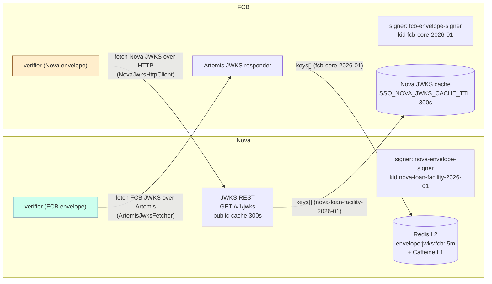
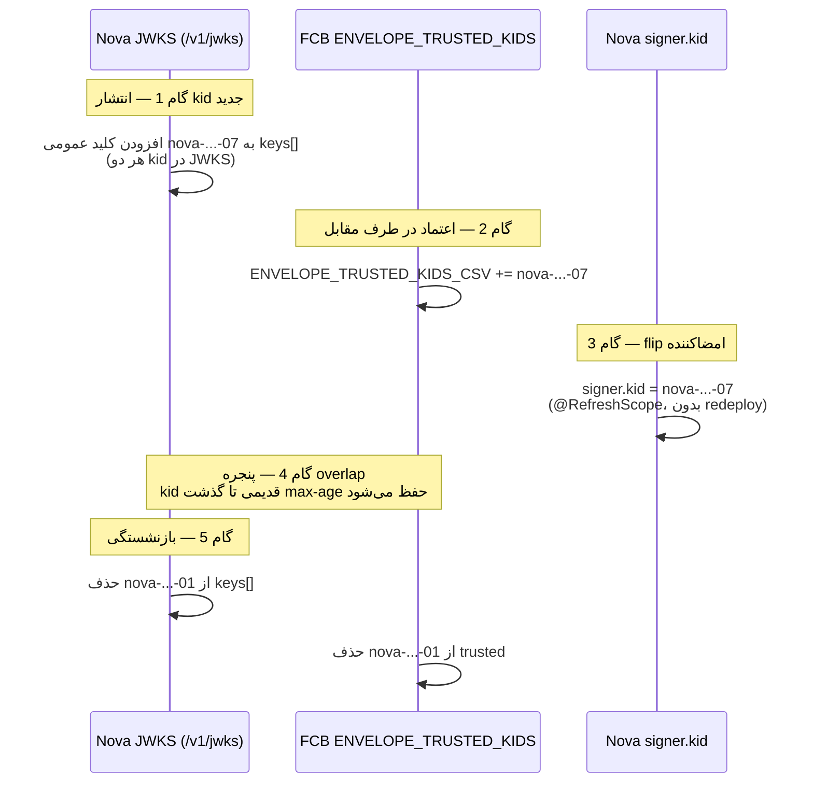

# RB-0005. کلیدها و JWKS امضای پاکت (Nova و FCB)

* **وضعیت**: فعال
* **تاریخ**: 2026-06-04
* **نویسندگان**: تیم معماری Nova
* **دسته‌بندی**: امنیت / مدیریت کلید (Security / Key Management)
* **تیکت‌های مرتبط**: «—»

> هر پیام بین‌سرویسی Nova↔FCB یک **پاکت بازیگر (actor envelope)** امضاشده با JWS حمل می‌کند که provenance
> مربوط به Initiator/Accountability/Execution را مستقل از توکن OAuth2 (که فقط هویت سرویس را دارد) امضا می‌کند. این
> Runbook مدیریت keystoreهای امضا، دو جهت اعتماد JWKS، و چرخش بدون قطعی کلید را مستند می‌کند. لایهٔ
> تأیید پاکت **حذف‌نشدنی** است؛ سخت‌سازی انتقال خود کانال‌ها در [RB-0006](RB-0006.nova-tls-ssl-hardening.md)
> پوشش داده می‌شود.

## زمینه (Context)

دو طرف مستقل، هرکدام با یک «کلید ربات (bot)» امضا، پاکت را امضا و پاکت طرف مقابل را تأیید می‌کنند:

| طرف  | keystore (وضعیت فعلی dev)           | نوع    | alias                  | kid                          | منبع پیکربندی                                                               |
|------|-------------------------------------|--------|------------------------|------------------------------|------------------------------------------------------------------------------|
| Nova | `file:` PKCS12 (`ENVELOPE_*` env)   | PKCS12 | `nova-envelope-signer` | `nova-loan-facility-2026-01` | `nova-config » kv/core/loan/nova/nova-service/fcb.yml`                       |
| FCB  | `file:/home/developer/keystore.jks` | JKS    | `fcb-envelope-signer`  | `fcb-core-2026-01`           | `nova-fcb-zk-config » zk/core-release/LIN00127/eventbus/nova-sso.properties` |

هر طرف **kid طرف مقابل** را در فهرست kidهای مورد اعتمادش دارد و کلید عمومی آن را از JWKS طرف مقابل می‌گیرد.
الگوریتم‌های مجاز هر دو طرف: **RS256 / PS256 / ES256** (الگوریتم امضای هر دو ربات RS256 است).

## مدل امضا — سمت Nova

از `nova-config » kv/core/loan/nova/nova-service/fcb.yml` (`platform.envelope`):

<div dir="ltr">

```yaml
platform:
  envelope:
    verification-enabled: true
    clock-skew: 30s
    max-age: 15m
    signer:
      kid: "${ENVELOPE_SIGNER_KID:nova-loan-facility-2026-01}"
      algorithm: RS256
      private-key-ref: "${ENVELOPE_SIGNER_PRIVATE_KEY_REF}"
      keystore-type: PKCS12
      keystore-password: "${ENVELOPE_KEYSTORE_PASSWORD}"
      key-alias: "${ENVELOPE_KEY_ALIAS:nova-envelope-signer}"
      key-password: "${ENVELOPE_KEY_PASSWORD}"
    trusted:
      kids: "${ENVELOPE_TRUSTED_KIDS:fcb-core-2026-01}"
      allowed-algorithms: [RS256, PS256, ES256]
      cache:
        backend: REDIS
        ttl: 5m
        key-prefix: "envelope:jwks:fcb:"
    jwks-rest:
      enabled: true
      public-cache-seconds: 300
```

</div>

اینها به `EnvelopeProperties` (pangaea `pangaea-envelope-impl-jws`) bind می‌شوند. signer سمت Nova با کلید خصوصی
`nova-envelope-signer` پاکت را امضا می‌کند؛ kid آن `nova-loan-facility-2026-01` است.

## مدل امضا — سمت FCB

از `nova-fcb-zk-config » zk/.../nova-sso.properties` (کلیدهای `ENVELOPE_*` که `NovaSsoConfig` می‌خواند):

<div dir="ltr">

```properties
ENVELOPE_INTEGRITY_MODE=JWS
ENVELOPE_CODEC=PACKED
ENVELOPE_SIGNER_ALGORITHM=RS256
ENVELOPE_SIGNER_KID=fcb-core-2026-01
ENVELOPE_KEYSTORE_TYPE=JKS
ENVELOPE_KEY_ALIAS=fcb-envelope-signer
ENVELOPE_SIGNER_PRIVATE_KEY_REF=file:/home/developer/keystore.jks
ENVELOPE_KEYSTORE_PASSWORD=changeit
ENVELOPE_KEY_PASSWORD=changeit
ENVELOPE_TRUSTED_KIDS_CSV=nova-loan-facility-2026-01
ENVELOPE_ALLOWED_ALGS_CSV=RS256,PS256,ES256
ENVELOPE_VERIFICATION_ENABLED=true
```

</div>

FCB برای تجزیهٔ `ENVELOPE_SIGNER_PRIVATE_KEY_REF` از `KeystoreLoader.parseRef` (با پشتیبانی از `file:…?alias=…` و
`keystore:…`) و سپس `load(path, type, password)` استفاده می‌کند. signer سمت FCB با `fcb-envelope-signer` امضا
می‌کند؛ kid آن `fcb-core-2026-01` است.

> **مقادیر فعلی dev:** keystoreهای `file:` با رمز `changeit` فقط برای حلقهٔ تست‌اند (طبق قاعدهٔ
> `nova-fcb-zk-config`: creds تست می‌توانند literal باشند). در تولید این **هرگز** نباید literal باشد — به بخش
> «منبع secret در تولید» مراجعه کنید.

## دو جهت اعتماد JWKS

هر طرف برای تأیید به کلید عمومی طرف مقابل نیاز دارد و آن را از JWKS طرف مقابل می‌گیرد. دو جهت **نامتقارن**اند:

<div dir="ltr">



</div>

### جهت ۱ — Nova پاکت FCB را تأیید می‌کند (JWKS روی Artemis)

verifier سمت pangaea (`JwsActorEnvelopeVerifier`) از SPI `JwksFetcher` استفاده می‌کند. Nova یک
`@Primary ArtemisJwksFetcher` (در `nova » container/.../config/fcb/ArtemisJwksFetcher.java`) دارد که JWKS مربوط به FCB را
**روی همان corridor Artemis** درخواست می‌کند:

- درخواست: یک `TextMessage` به `jwks-request-address` (`nova.fcb.jwks.request.v1`) با body = JSON
  `JwksRequest{requestId, requestedKid}`، `JMSReplyTo` = صف موقت per-request، و propertyهای JMS شامل
  `operationType=GET_FCB_JWKS` (از `platform.envelope.trusted.kafka.operation-type`)، `authorization` (Bearer
  service-token)، و `actorEnvelope` (امضاشده).
- پاسخ: FCB با JSON `JwksReply` پاسخ می‌دهد؛ آرایهٔ `keys` (RFC 7517) خوانده و هر JWK در
  `RedisTrustedKeyStore` نوشته می‌شود.
- لایه‌های کش: **L2 = Redis** با key-prefix `envelope:jwks:fcb:` و TTL ۵ دقیقه (`cache.backend=REDIS`)؛
  **L1 = Caffeine** درون‌فرایندی. هر خطای JMS/timeout/parse مقدار `false` برمی‌گرداند (هرگز throw نمی‌کند) تا یک قطعی
  گذرای JWKS فقط به «کلید هنوز مورد اعتماد نیست» تبدیل شود، نه شکست verifier.
- این fetcher فقط با `nova.fcb.artemis.enabled=true` فعال می‌شود و **حتماً** به
  `platform.envelope.trusted.cache.backend=REDIS` نیاز دارد (وگرنه در startup fail-fast می‌شود).

### جهت ۲ — FCB پاکت Nova را تأیید می‌کند (JWKS روی HTTP)

FCB کلید عمومی Nova را از endpoint REST Nova می‌گیرد. کلاینت `NovaJwksHttpClient`
(`core-release-customer-based » .../security/jwks/NovaJwksHttpClient.java`) یک `GET` به URL مربوط به JWKS Nova
(ساخته‌شده از آدرس gateway در `NovaConnectionConfig` + مسیر `/v1/jwks`) می‌زند، آرایهٔ `keys` را parse می‌کند،
و کلیدها را کش می‌کند. این مسیر **همیشه پس از رویداد** است: فراخوانی FCB→Nova بعد از این رخ می‌دهد که FCB یک
رویداد Nova را مصرف کرده باشد. timeoutها و TTLها از ZK می‌آیند:

<div dir="ltr">

```properties
SSO_NOVA_JWKS_CONNECT_TIMEOUT_MS=5000
SSO_NOVA_JWKS_READ_TIMEOUT_MS=10000
SSO_NOVA_JWKS_CACHE_TTL_SECONDS=300
SSO_NOVA_JWKS_NEGATIVE_CACHE_TTL_SEC=30
```

</div>

سمت Nova این endpoint را با `platform.envelope.jwks-rest.enabled=true` و
`public-cache-seconds: 300` (سرآیند Cache-Control) سرو می‌کند؛ مسیر کنترلر در pangaea
`/v{version}/jwks` (نسخهٔ `1+`) است → `GET /v1/jwks`.

## رجیستری kid و الگوریتم‌ها

| kid                          | مالک  | alias کلید             | الگوریتم | حضور در فهرست trusted طرف مقابل      |
|------------------------------|-------|------------------------|----------|---------------------------------------|
| `nova-loan-facility-2026-01` | Nova  | `nova-envelope-signer` | RS256    | FCB `ENVELOPE_TRUSTED_KIDS_CSV`       |
| `fcb-core-2026-01`           | FCB   | `fcb-envelope-signer`  | RS256    | Nova `platform.envelope.trusted.kids` |

الگوریتم‌های مجاز (هر دو طرف): `RS256`, `PS256`, `ES256` (مطابق پیش‌فرض `EnvelopeProperties.Trusted.allowedAlgorithms`
و `ENVELOPE_ALLOWED_ALGS_CSV`). هر الگوریتمی خارج از این مجموعه در تأیید رد می‌شود.

## چرخش بدون قطعی کلید (dual-kid overlap)

چون verifier کلیدها را با kid پیدا می‌کند و هر دو طرف فهرست trusted چندتایی را می‌پذیرند، چرخش بدون قطعی
ممکن است. ترتیب اجباری (مثال: چرخش کلید Nova از `nova-loan-facility-2026-01` به `nova-loan-facility-2026-07`):

<div dir="ltr">



</div>

۱. **انتشار kid جدید در JWKS** — کلید عمومی جدید را به `keys[]` خروجی JWKS اضافه کنید؛ هر دو kid موقتاً منتشر
   می‌شوند. (هنوز هیچ پیامی با kid جدید امضا نشده.)
۲. **افزودن kid جدید به trusted طرف مقابل** — `ENVELOPE_TRUSTED_KIDS_CSV` در FCB (یا `platform.envelope.trusted.kids`
   در Nova برای جهت معکوس) را با kid جدید به‌روزرسانی کنید. منتظر propagation بمانید (FCB یک‌بار در startup
   می‌خواند؛ Nova با `@RefreshScope`).
۳. **flip امضاکننده** — `signer.kid` را به kid جدید تغییر دهید. در Nova این با `@RefreshScope` دوباره bind می‌شود
   (بدون redeploy)؛ در FCB به ری‌استارت نیاز دارد (ZK یک‌بار در startup خوانده می‌شود).
۴. **نگه‌داشتن kid قدیمی تا گذشت بازهٔ max-age** — پیام‌های در پروازِ امضاشده با kid قدیمی باید تا `max-age` (Nova:
   `15m`؛ FCB: `ENVELOPE_MAX_AGE_SECONDS=900`) همچنان قابل تأیید بمانند. پس kid قدیمی را در JWKS و در trusted
   نگه دارید تا دست‌کم این بازه (+ حاشیهٔ کش JWKS، ۵m) بگذرد.
۵. **بازنشستگی kid قدیمی** — پس از این بازه، کلید قدیمی را از `keys[]` JWKS و از فهرست trusted طرف مقابل حذف
   کنید. کش JWKS طرف مقابل ظرف TTL (۵m Redis / ۳۰۰s FCB) همگرا می‌شود.

> هرگز گام ۳ (flip) را قبل از گام ۲ (trust) انجام ندهید — وگرنه طرف مقابل تا زمان propagation همهٔ پیام‌ها را با
> «kid ناشناخته» رد می‌کند (قطعی).

## منبع secret در تولید

- **هرگز** keystore یا رمز را به‌صورت literal در config نگذارید. مقادیر فعلی dev (`file:/…/keystore.p12`،
  `file:/home/developer/keystore.jks`، رمز `changeit`) فقط برای تست‌اند.
- در سمت Nova، همهٔ `ENVELOPE_*` با placeholderِ `${ENV_VAR}` تأمین می‌شوند (Consul هیچ secretی ندارد؛ secret guard
  مقادیر شبیه JWT/PEM را رد می‌کند). در تولید این env varها باید از **K8s Secret یا Vault** تزریق شوند، و
  `ENVELOPE_SIGNER_PRIVATE_KEY_REF` به یک keystore که از Secret mount شده اشاره کند (نه مسیر توسعه‌دهنده).
- در سمت FCB، با `STRICT_SECRETS=1` در CI مسیرهای prod، مقادیر `ENVELOPE_KEYSTORE_PASSWORD`/`ENVELOPE_KEY_PASSWORD`
  باید `${ENV_VAR}` باشند، نه `changeit`.

## محیط چندنمونه‌ای / HA

- هر دو Nova و FCB چندنمونه‌ای‌اند. کلید امضا و فهرست trusted **per ناوگان** یکسان‌اند؛ همهٔ نمونه‌ها از همان
  keystore (که از همان Secret mount شده) و همان config می‌خوانند.
- کش JWKS سمت Nova یک **L2 مشترک روی Redis** است (`envelope:jwks:fcb:`)؛ پس یک fetch توسط یک نمونه، کلید را
  از طریق Redis برای کل ناوگان در دسترس می‌گذارد. L1 (Caffeine) per نمونه است.
- هنگام چرخش کلید، چون propagation از طریق JWKS + فهرست trusted انجام می‌شود (نه redeploy هم‌زمان)، rolling restart FCB
  برای flip kid امن است: نمونه‌های قدیمی همچنان با kid قدیمی امضا می‌کنند که هنوز trusted است.

## بازگردانی/بازیابی (Rollback / Recovery)

- **چرخش ناقص/خراب**: اگر پس از flip (گام ۳) طرف مقابل پیام‌ها را رد کرد، `signer.kid` را به kid قبلی برگردانید
  (Nova: `@RefreshScope`؛ FCB: ری‌استارت). چون kid قدیمی هنوز در JWKS و trusted است (گام ۵ هنوز اجرا نشده)،
  این بازگشت بدون قطعی است.
- **نشت کلید خصوصی**: چرخش اضطراری را اجرا کنید (همان ۵ گام، اما گام ۵ را بلافاصله پس از بازهٔ max-age انجام
  دهید تا کلید نشتی هرچه زودتر بازنشسته شود). کلید نشتی را از JWKS حذف کنید تا دیگر هیچ امضای جدیدی با آن پذیرفته
  نشود.
- **قطعی JWKS fetch**: به لطف کش stale-but-trusted (L2 Redis + freshTtl/staleTtl در pangaea)، قطعی گذرای
  مسیر fetch تا وقتی کلید در کش است باعث رد شدن تأیید نمی‌شود؛ circuit breaker جلوی refresh-storm را می‌گیرد.

## راستی‌آزمایی (Verification)

۱. **JWKS Nova سرو می‌شود**: `GET /v1/jwks` باید آرایهٔ `keys` شامل `nova-loan-facility-2026-01` (و هنگام چرخش،
   kid جدید) را با سرآیند `Cache-Control: max-age=300` برگرداند.

۲. **Nova کلید FCB را پیدا می‌کند**: یک پیام امضاشده توسط FCB با `fcb-core-2026-01` بدون خطای
   `key not trusted` تأیید شود؛ کلید `envelope:jwks:fcb:fcb-core-2026-01` در Redis موجود باشد.

۳. **FCB کلید Nova را پیدا می‌کند**: یک رویداد امضاشده توسط Nova با `nova-loan-facility-2026-01` در FCB بدون
   `NovaTokenVerificationException.JWKS_UNAVAILABLE` تأیید شود؛ تله‌متری `NovaJwksTelemetry.success`.

۴. **چرخش بدون قطعی**: در طول ۵ گام، نرخ شکست تأیید در APM (`logs-apm.error-default`,
   `service.name=nova-service`) صفر بماند؛ هیچ `unknown kid` در هیچ طرفی نباشد.

۵. **نبودِ literal secret در prod**: `STRICT_SECRETS=1 scripts/validate.sh` در `nova-fcb-zk-config` و
   secret-shape guard در `nova-config` پاک باشند.

## مراجع (References)

- پیکربندی signer/trusted Nova: `nova-config » kv/core/loan/nova/nova-service/fcb.yml` (`platform.envelope`).
- پیکربندی envelope FCB: `nova-fcb-zk-config » zk/core-release/LIN00127/eventbus/nova-sso.properties` (`ENVELOPE_*`).
- fetcher JWKS روی Artemis (Nova): `nova » container/src/main/java/ir/dotin/loan/trade/config/fcb/{ArtemisJwksFetcher,ArtemisJwksFetcherConfig}.java`.
- properties پاکت pangaea + SPI: `pangaea » pangaea-messaging/pangaea-envelope-impl-jws/.../config/EnvelopeProperties.java`، `pangaea » pangaea-messaging/pangaea-envelope-api/.../JwksFetcher.java`.
- keystore loader + accessorهای FCB: `core-release-customer-based » .../eventbus/nova/security/config/{KeystoreLoader,NovaSsoConfig}.java`.
- کلاینت JWKS HTTP (FCB→Nova): `core-release-customer-based » .../eventbus/nova/security/jwks/NovaJwksHttpClient.java`.
- Runbookهای مرتبط: [RB-0006](RB-0006.nova-tls-ssl-hardening.md) (سخت‌سازی TLS کانال‌ها)، [RB-0013](RB-0013.nova-fcb-transport-switch.md) (سوییچ corridor میان Artemis/Kafka که JWKS هم روی آن سوار است).
