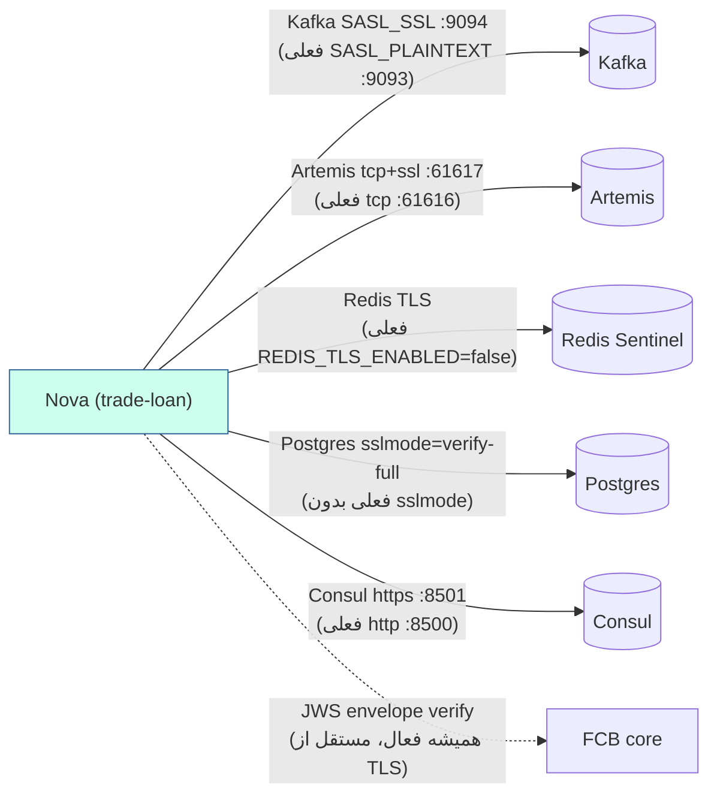

# RB-0006. TLS/SSL: لایهٔ اجباری و سخت‌سازی انتقال

* **وضعیت**: پیش‌نویس
* **تاریخ**: 2026-06-04
* **نویسندگان**: تیم معماری Nova
* **دسته‌بندی**: امنیت / شبکه (Security / Network)
* **تیکت‌های مرتبط**: «—»

> این Runbook دو لایهٔ مجزا را از هم جدا می‌کند: (۱) لایهٔ **حذف‌نشدنی** — تأیید امضای JWS پاکت — که هرگز نباید
> خاموش شود؛ (۲) **سخت‌سازی انتقال توصیه‌شده** — رمزگذاری TLS هر کانال شبکه‌ای — که در dev خاموش است و باید
> در تولید فعال شود. لایهٔ ۱ مستقل از TLS است و در [RB-0005](RB-0005.envelope-signing-keys-jwks.md) مفصل پوشش
> داده شده.

## زمینه (Context)

Nova از طریق چند کانال شبکه‌ای با چند backend ارتباط دارد: Kafka (رویدادها + req/reply به FCB)، Artemis
(corridor مربوط به Nova↔FCB)، Redis (کش + idempotency)، Postgres (persistence)، و Consul (config + discovery). در
پیکربندی فعلی dev، اکثر این کانال‌ها **رمزنشده** (plaintext) هستند. این برای تست محلی قابل قبول است، اما در
تولید باید سخت شوند. در عین حال، **امنیت سطح پیام** (پاکت امضاشده) مستقل از رمزگذاری انتقال همیشه فعال است.

## لایهٔ حذف‌نشدنی — تأیید امضای پاکت

از `nova-config » kv/core/loan/nova/nova-service/fcb.yml` و `nova-fcb-zk-config » …/nova-sso.properties`:

<div dir="ltr">

```yaml
# Nova
platform:
  envelope:
    verification-enabled: true
```

</div>

<div dir="ltr">

```properties
# FCB
ENVELOPE_VERIFICATION_ENABLED=true
```

</div>

`verification-enabled` / `ENVELOPE_VERIFICATION_ENABLED` در تولید **هرگز** نباید `false` شود. هر پیام
بین‌سرویسی Nova↔FCB یک پاکت امضاشده با JWS (RS256/PS256/ES256) حمل می‌کند که provenance بازیگر را مستقل از
توکن OAuth2 و مستقل از رمزگذاری انتقال تضمین می‌کند. یعنی حتی اگر یک کانال انتقال موقتاً plaintext باشد،
جعل پاکت (بدون کلید خصوصی امضاکننده) ناممکن است. جزئیات کلید/JWKS/چرخش: [RB-0005](RB-0005.envelope-signing-keys-jwks.md).

> سخت‌سازی انتقال (TLS) محرمانگی و یکپارچگی سطح کانال را اضافه می‌کند؛ تأیید پاکت اصالت و انکارناپذیری سطح
> پیام را تضمین می‌کند. این دو مکمل هم‌اند، نه جایگزین — هرگز تأیید پاکت را به بهانهٔ فعال بودن TLS خاموش نکنید.

## سخت‌سازی انتقال توصیه‌شده — وضعیت فعلی در برابر هدف

| کانال    | وضعیت فعلی                                                              | هدف                                              | کلیدهای env                                                              |
|----------|------------------------------------------------------------------------|--------------------------------------------------|-------------------------------------------------------------------------|
| Kafka    | `SASL_PLAINTEXT` / `SCRAM-SHA-256`، بروکر `:9093`                       | `SASL_SSL` `:9094` + truststore                  | `KAFKA_TRUSTSTORE_LOCATION`، `KAFKA_TRUSTSTORE_PASSWORD`                 |
| Artemis  | `tcp://${ACTIVEMQ_HOST}:${ACTIVEMQ_PORT:61616}` (plaintext)             | `tcp+ssl://…` + trustStore/keyStore              | `ARTEMIS_TRUSTSTORE_*`، `ARTEMIS_KEYSTORE_*`                            |
| Redis    | `ssl.enabled: ${REDIS_TLS_ENABLED:false}` (خاموش)                      | `REDIS_TLS_ENABLED=true` + CA                    | `REDIS_TLS_ENABLED`، `REDIS_TRUSTSTORE_*`                                |
| Postgres | `jdbc:postgresql://${DB_HOST}:${DB_PORT}/${DB_NAME}` (بدون `sslmode`) | `sslmode=verify-full` + root CA در JDBC URL      | `DB_SSLMODE`، `DB_SSL_ROOT_CERT`                                         |
| Consul   | `scheme: ${CONSUL_SCHEME:http}` (TLS hooks کامنت)                       | `https` + uncomment hooks                        | `CONSUL_TLS_ENABLED`، `CONSUL_TLS_CERT_PATH`، `CONSUL_TLS_TRUSTSTORE_*` |

### Kafka — SASL_SSL

از `nova-config » kv/core/loan/nova/nova-service/messaging.yml` (وضعیت فعلی):

<div dir="ltr">

```yaml
platform:
  messaging:
    kafka:
      security:
        protocol: SASL_PLAINTEXT
        sasl-mechanism: SCRAM-SHA-256
        sasl-jaas-config: 'org.apache.kafka.common.security.scram.ScramLoginModule required username="${KAFKA_USER}" password="${KAFKA_PASSWORD}";'
```

</div>

**هدف** — protocol را به `SASL_SSL` تغییر دهید، listener مربوط به TLS بروکر (`:9094`) را هدف بگیرید و truststore
بدهید (احراز همان SCRAM می‌ماند، فقط کانال رمز می‌شود):

<div dir="ltr">

```yaml
platform:
  messaging:
    kafka:
      bootstrap-servers: "${KAFKA_BOOTSTRAP_SERVERS}"   # هدف: brokerها روی :9094
      security:
        protocol: SASL_SSL
        sasl-mechanism: SCRAM-SHA-256
        ssl:
          truststore-location: "${KAFKA_TRUSTSTORE_LOCATION}"
          truststore-password: "${KAFKA_TRUSTSTORE_PASSWORD}"
          endpoint-identification-algorithm: https   # تأیید hostname
```

</div>

> توجه: e2e Testcontainers عمداً `SASL_PLAINTEXT` روی `:9094` با `localhost` advertised را به کار می‌برد تا فقط
> مکانیزم SCRAM را همتراز کند (نه TLS) — این یک محیط تست است، نه هدف تولیدی.

### Artemis — tcp+ssl

از `nova-config » kv/core/loan/nova/nova-service/fcb.yml` (وضعیت فعلی):

<div dir="ltr">

```yaml
nova:
  fcb:
    artemis:
      broker-url: "tcp://${ACTIVEMQ_HOST}:${ACTIVEMQ_PORT:61616}"
```

</div>

**هدف** — scheme برابر `tcp+ssl://` + پارامترهای trustStore/keyStore در URL:

<div dir="ltr">

```yaml
nova:
  fcb:
    artemis:
      broker-url: "tcp+ssl://${ACTIVEMQ_HOST}:${ACTIVEMQ_SSL_PORT:61617}?sslEnabled=true&trustStorePath=${ARTEMIS_TRUSTSTORE_PATH}&trustStorePassword=${ARTEMIS_TRUSTSTORE_PASSWORD}&keyStorePath=${ARTEMIS_KEYSTORE_PATH}&keyStorePassword=${ARTEMIS_KEYSTORE_PASSWORD}&verifyHost=true"
```

</div>

JWKS هم روی همین corridor Artemis سوار است ([RB-0005](RB-0005.envelope-signing-keys-jwks.md))، پس رمزگذاری
Artemis به‌طور خودکار مسیر JWKS را هم می‌پوشاند.

### Redis — TLS

از `nova-config » kv/core/loan/nova/application/cache.yml` (وضعیت فعلی — کلید از قبل وجود دارد، اما خاموش):

<div dir="ltr">

```yaml
spring:
  data:
    redis:
      ssl:
        enabled: "${REDIS_TLS_ENABLED:false}"
```

</div>

**هدف** — `REDIS_TLS_ENABLED=true` در env + CA در truststore. چون Nova از Lettuce + Sentinel با یک
`ConnectionFactory` سفارشی (`RedisConfig`) استفاده می‌کند، گواهی CA بروکر و Sentinelها باید در truststore
JVM یا یک bundle جدا باشد. کلید YAML تغییری لازم ندارد؛ فقط env var را `true` کنید و CA را در دسترس بگذارید.

### Postgres — sslmode=verify-full

از `nova-config » kv/core/loan/nova/application/datasource.yml` (وضعیت فعلی — بدون `sslmode`):

<div dir="ltr">

```yaml
spring:
  datasource:
    url: "jdbc:postgresql://${DB_HOST}:${DB_PORT}/${DB_NAME}"
```

</div>

**هدف** — `sslmode=verify-full` + root CA در JDBC URL (سخت‌ترین حالت: رمزگذاری + تأیید زنجیره + تأیید
hostname):

<div dir="ltr">

```yaml
spring:
  datasource:
    url: "jdbc:postgresql://${DB_HOST}:${DB_PORT}/${DB_NAME}?sslmode=verify-full&sslrootcert=${DB_SSL_ROOT_CERT}"
```

</div>

`verify-full` هم رمزگذاری و هم تطبیق CN/SAN با hostname را الزام می‌کند؛ `verify-ca` فقط زنجیره را تأیید
می‌کند (ضعیف‌تر). در تولید `verify-full` ترجیح دارد.

### Consul — https

از `nova » container/src/main/resources/bootstrap.yml` (وضعیت فعلی — `http`، hooks کامنت‌شده):

<div dir="ltr">

```yaml
spring:
  cloud:
    consul:
      scheme: ${CONSUL_SCHEME:http}
#      tls:
#        enabled: ${CONSUL_TLS_ENABLED:false}
#        certificate-path: ${CONSUL_TLS_CERT_PATH:}
#        key-store-instance-type: ${CONSUL_TLS_TRUSTSTORE_TYPE:JKS}
#        key-store-password: ${CONSUL_TLS_TRUSTSTORE_PASSWORD:}
```

</div>

**هدف** — `scheme: https` + از کامنت درآوردن بلوک `tls` و تنظیم envها. در سمت سرور، `platform-consul » consul/server.hcl`
یک بلوک `tls { … }` کامنت‌شده دارد که فقط با `CONSUL_TLS_ENABLED=true` توسط `entrypoint.sh` (به‌صورت
`tls.hcl` کنار `server.hcl`) render می‌شود؛ آنجا پورت `https` فعال می‌شود (پیش‌فرض `8501`). هر دو سمت باید
هم‌زمان فعال شوند.

<div dir="ltr">



</div>

## محیط چندنمونه‌ای / HA

- همهٔ کانال‌ها per ناوگان یکنواخت پیکربندی می‌شوند؛ truststore/keyStore باید روی هر نمونه (که از
  همان Secret mount شده) یکسان باشد. نمونه‌ها نباید پیکربندی TLS ناهمگون داشته باشند.
- فعال‌سازی TLS باید با rolling deploy و **هم‌زمان روی هر دو سمت کانال** انجام شود (مثلاً بروکر Kafka، listener
  مربوط به TLS را قبل از تغییر `protocol` در Nova فعال کند)؛ در غیر این‌صورت نمونه‌ها به یک listener ناموجود وصل می‌شوند.
- Redis Sentinel HA: گواهی TLS باید SANهای masterها، replicaها و Sentinelها را بپوشاند، چون Lettuce هنگام failover
  به آدرس کشف‌شده وصل می‌شود.

## بازگردانی/بازیابی (Rollback / Recovery)

- **فعال‌سازی ناقص TLS** (یک سمت TLS، سمت دیگر plaintext): اتصال شکست می‌خورد. بازگردانی سریع = برگرداندن
  کلید env/scheme به وضعیت فعلی plaintext (`SASL_PLAINTEXT`، `tcp://`، `REDIS_TLS_ENABLED=false`، حذف
  `sslmode`، `scheme: http`) و — برای کلیدهای `@RefreshScope` در `nova-config` — همگرایی بدون redeploy؛ scheme
  مربوط به Consul در `bootstrap.yml` به ری‌استارت نیاز دارد.
- **چرخش/انقضای CA یا truststore**: گواهی جدید CA را **قبل از** بازنشستگی قدیمی به truststore اضافه کنید
  (الگوی overlap، مشابه چرخش kid در RB-0005)؛ پس از اطمینان از این‌که همه وصل می‌شوند، CA قدیمی را حذف کنید. هرگز CA
  قدیمی را قبل از توزیع کامل گواهی جدید حذف نکنید (قطعی).
- **حداقل نسخه/cipher**: دست‌کم **TLS 1.2** را الزام کنید (TLS 1.3 ترجیحی)؛ پروتکل‌های قدیمی‌تر (TLS 1.0/1.1، SSLv3)
  را غیرفعال کنید. cipherهای ضعیف (RC4، 3DES، export-grade) را در پیکربندی JVM یا بروکر مسدود کنید.

## راستی‌آزمایی (Verification)

۱. **تأیید پاکت همیشه فعال**: `platform.envelope.verification-enabled=true` و `ENVELOPE_VERIFICATION_ENABLED=true`
   در هر دو سمت؛ هیچ پیامی بدون پاکت معتبر پردازش نشود.

۲. **Kafka رمز است**: اتصال Nova به `:9094` با `SASL_SSL` برقرار شود؛ هیچ خطای handshake در لاگ نباشد؛ از سمت بروکر
   تأیید کنید listener مربوط به TLS فعال است.

۳. **Artemis رمز است**: لاگ Nova اتصال `tcp+ssl://` به Artemis را نشان دهد؛ JWKS-over-Artemis بدون خطای
   handshake کار کند.

۴. **Redis/Postgres/Consul رمزاند**:

<div dir="ltr">

```bash
# Postgres: تأیید رمزگذاری اتصال فعلی
psql "host=$DB_HOST dbname=$DB_NAME sslmode=verify-full sslrootcert=$DB_SSL_ROOT_CERT" \
  -c "SELECT ssl, version FROM pg_stat_ssl JOIN pg_stat_activity USING (pid) WHERE pid = pg_backend_pid();"

# Consul: تأیید پاسخ‌دهی HTTPS
curl --cacert "$CONSUL_TLS_CA" https://$CONSUL_HOST:8501/v1/status/leader
```

</div>

۵. **حداقل نسخه**: handshakeها فقط TLS 1.2+ مذاکره کنند (اتصال با `openssl s_client -tls1_1` رد شود).

۶. **بدون regression**: پس از فعال‌سازی، نرخ خطای اتصال در APM (`logs-apm.error-default`,
   `service.name=nova-service`) صفر بماند؛ health (db/redis/kafka) روی `UP`.

## مراجع (References)

- پیکربندی Kafka (security/protocol): `nova-config » kv/core/loan/nova/nova-service/messaging.yml`.
- پیکربندی Artemis (broker-url): `nova-config » kv/core/loan/nova/nova-service/fcb.yml` (`nova.fcb.artemis`).
- پیکربندی Redis TLS: `nova-config » kv/core/loan/nova/application/cache.yml` (`spring.data.redis.ssl`).
- پیکربندی Postgres JDBC: `nova-config » kv/core/loan/nova/application/datasource.yml`.
- پیکربندی Consul (scheme + TLS hooks): `nova » container/src/main/resources/bootstrap.yml`؛ سمت سرور `platform-consul » consul/server.hcl` + `scripts/entrypoint.sh` (render `tls.hcl`).
- Runbookهای مرتبط: [RB-0005](RB-0005.envelope-signing-keys-jwks.md) (لایهٔ اجباری تأیید پاکت)، [RB-0003](RB-0003.consul-prod-acl-kv.md) (ACL/KV Consul که TLS مکمل آن است).
