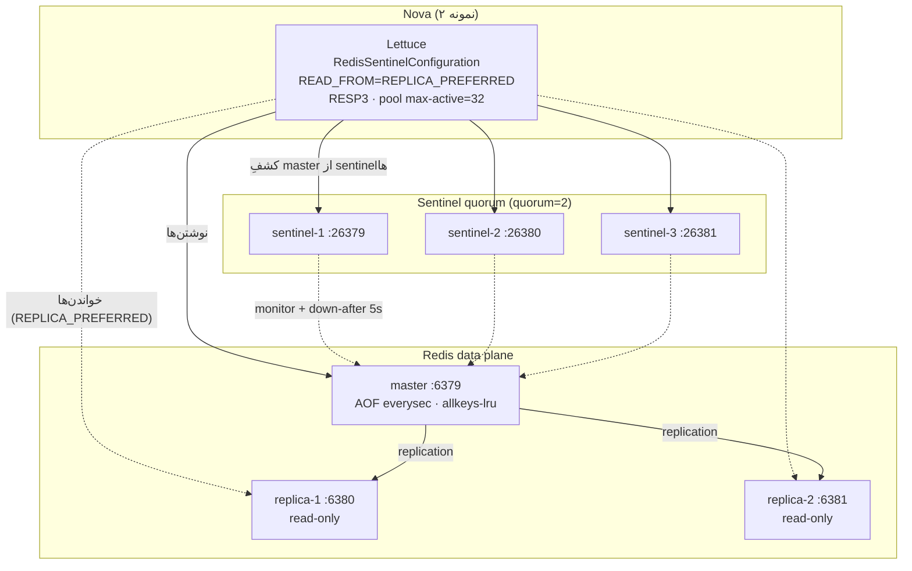

# RB-0007. Redis Sentinel HA (اجباری)

* **وضعیت**: منسوخ‌شده با مهاجرت Cluster-only
* **تاریخ**: 2026-06-04
* **نویسندگان**: تیم معماری Nova
* **دسته‌بندی**: کش / دسترس‌پذیری بالا (Cache / High Availability)
* **تیکت‌های مرتبط**: [LN-59431](https://jira.dotin.ir/browse/LN-59431) (کش پرس‌وجوی رویدادمحور)، [LN-59413](https://jira.dotin.ir/browse/LN-59413) (lease پارتیشن پاسخ)

> **هشدار:** این Runbook فقط سابقهٔ توپولوژی قبلی Sentinel را نگه می‌دارد و نباید برای استقرار جدید استفاده شود.
> قرارداد فعال Nova در [راهنمای مهاجرت Redis Cluster](../redis-cluster-migration.md) ثبت شده است.

> این Runbook توپولوژی HA لازم برای Redis در Nova، روال failover و رفتار مورد انتظار اپلیکیشن هنگام از دست رفتن
> master را شرح می‌دهد. Nova با Lettuce به‌صورت **Sentinel-aware** به Redis وصل می‌شود؛ یک Redis تک‌گره برای چند
> مسیر حیاتی سرویس نقطهٔ شکست منفرد (SPOF) است (پایین را ببینید).

## زمینه (Context)

Redis در Nova فقط یک کش ساده نیست — چند زیرسیستم حیاتی به آن تکیه دارند و اگر Redis کاملاً از دسترس خارج شود، هر کدام
رفتار متفاوتی نشان می‌دهند. به همین دلیل یک Redis تک‌گره **SPOF** است و توپولوژی Sentinel HA اجباری است.

مصرف‌کننده‌های Redis در Nova:

- **کش پرس‌وجوی رویدادمحور (LN-59431)** — `RedisCacheManager` با TTL پیش‌فرض ۱ ساعت (`entryTtl(Duration.ofHours(1))`
  در `RedisConfig.redisLoanCacheManager`)؛ کلیدها string و مقادیر JSON هستند.
- **کش مرجع FCB** — cache-nameهای `fcb.economical-sector`, `fcb.economical-sector-by-code`,
  `fcb.sector-for-loan-type`, `fcb.resource`, `fcb.reason-type` (`application/cache.yml`).
- **کش JWKS پاکت امضا (envelope)** — `backend: REDIS`, `ttl: 5m`, `key-prefix: "envelope:jwks:fcb:"`
  (`nova-service/fcb.yml » platform.envelope.trusted.cache`). کلیدهای عمومی FCB برای راستی‌آزمایی پاکت اینجا کش
  می‌شوند.
- **کش توکن OAuth2 / JWKS** — cache-nameهای `oauth2-tokens`, `jwt-jwks`, `delegation:accessTokenCache`
  (`application/cache.yml`).
- **مخزن idempotency دستور** — `RedisIdempotencyStore` (مرجعش در RB-0001؛ تایم‌اوت retrieve هنگام گرسنگی pool به
  `CancellationException` تبدیل می‌شود).
- **حالت lease پارتیشن پاسخ (LN-59413)** — قفل پارتیشن پاسخ روی **Consul session** است
  (`nova.fcb.kafka.lease.kv-prefix: locks/core/loan/nova/reply-partition`)، نه Redis؛ اما مسیر request/reply در کل
  به سلامت کش JWKS وابسته است. خود lease به Redis دست نمی‌زند، ولی برای روشن ماندن مرز، در ماتریس تنزل پایین آورده
  شده است.

از دست رفتن همان یک گره Redis یعنی همهٔ این موارد هم‌زمان آسیب می‌بینند. Sentinel با انتخاب خودکار master جدید و
به‌روزرسانی توپولوژی Lettuce، این پنجره را به چند ثانیه محدود می‌کند.

## وضعیت فعلی در برابر هدف (Current vs. Target)

| بُعد           | dev (نمونهٔ `nova-dev-stack`)            | هدف تولید                                              |
|----------------|------------------------------------------|--------------------------------------------------------|
| master         | ۱ (`redis-master`, `redis:8.6-alpine`)   | ۱ master                                               |
| replica        | ۲ (`redis-replica-1`, `redis-replica-2`) | ≥ ۲ replica (تحمل یک node-failure)                     |
| sentinel       | ۳ (`redis-sentinel-1..3`)                | ≥ ۳ sentinel روی domainهای شکست مجزا (تا quorum بماند) |
| quorum         | ۲ (`monitor ... 2`)                      | ۲ (اکثریت ۳)                                           |
| پایداری        | AOF `everysec`                           | AOF `everysec` + RDB دوره‌ای (backup)                  |
| سیاست eviction | `allkeys-lru`                            | `allkeys-lru` با `maxmemory` متناسب با working-set     |

**حداقل توپولوژی HA**: ۳ sentinel + quorum ۲ + ≥۲ replica. با کمتر از ۳ sentinel، از دست رفتن یک sentinel
quorum را می‌شکند و failover خودکار ناممکن می‌شود.

## توپولوژی (Topology)

<div dir="ltr">



</div>

پیکربندی Sentinel (از `redis/sentinel.conf.tmpl`):

<div dir="ltr">

```conf
sentinel monitor <master> <host> <port> 2
sentinel down-after-milliseconds <master> 5000
sentinel failover-timeout <master> 10000
sentinel parallel-syncs <master> 1
sentinel auth-pass <master> <password>
sentinel resolve-hostnames yes
sentinel announce-hostnames yes
```

</div>

سمت کلاینت (Lettuce + Sentinel) از `application/cache.yml` و `RedisConfig.java`:

<div dir="ltr">

```yaml
spring:
  data:
    redis:
      client-type: lettuce
      timeout: 3000ms          # command timeout
      connect-timeout: 2000ms
      ssl:
        enabled: "${REDIS_TLS_ENABLED:false}"
      sentinel:
        master: "${REDIS_MASTER_NAME:nova-master}"
        nodes: "${REDIS_SENTINEL_NODES}"   # CSV: host:26379,host:26380,host:26381
        password: "${REDIS_PASSWORD}"
      lettuce:
        pool:
          enabled: true
          max-active: 32
          max-idle: 16
          min-idle: 4
          max-wait: 2000ms
        shutdown-timeout: 200ms
```

</div>

نکات کلیدی کلاینت (`RedisConfig.redisConnectionFactory`):

- **`ReadFrom.REPLICA_PREFERRED`** — خواندن‌ها به replica می‌روند و فقط وقتی replica نباشد به master برمی‌گردند؛ بار
  master کم می‌شود.
- **`ProtocolVersion.RESP3`** — پروتکل نسل سوم.
- **`autoReconnect=true`** — اتصال‌ها پس از قطع، خودکار بازسازی می‌شوند.
- **`disconnectedBehavior=REJECT_COMMANDS`** — در پنجرهٔ قطع اتصال، دستورها بلافاصله رد می‌شوند (نه صف‌بندی
  نامحدود)؛ یعنی fail-fast و جلوگیری از انباشت بی‌حد دستور هنگام failover.
- **`commandTimeout = 3000ms`** (از `timeout`) و **`connectTimeout = 2000ms`**.
- pool لِتیوس (Lettuce): `maxTotal=32`, `maxIdle=16`, `minIdle=4`, `maxWait=2000ms`, `testOnBorrow`/`testWhileIdle`.

## روال گام‌به‌گام (Failover Drill)

سناریو: master از دست می‌رود (crash یا قطع شبکه). هدف: تأیید اینکه Sentinel درست failover می‌کند و Nova خودش را
ترمیم می‌کند.

۱. **دیدن master فعلی** از یک sentinel:

<div dir="ltr">

```bash
redis-cli -p 26379 sentinel get-master-addr-by-name nova-master
redis-cli -p 26379 sentinel master nova-master   # وضعیت کامل + شمار slaveها/sentinelها
```

</div>

۲. **از کار انداختن master** (در dev):

<div dir="ltr">

```bash
docker stop redis-master
```

</div>

۳. **منتظر تشخیص و انتخاب** — هر sentinel پس از `down-after-milliseconds` (۵۰۰۰ms) master مرده را `+sdown`
   می‌بیند؛ با رسیدن به quorum (۲) به `+odown` می‌رسد، یک sentinel رهبر می‌شود و یکی از replicaها را promote می‌کند.
   `parallel-syncs 1` یعنی همگام‌سازی بقیهٔ replicaها سریالی انجام می‌شود (بار هم‌زمان کمتر). کل failover داخل
   `failover-timeout` (۱۰۰۰۰ms) جمع می‌شود.

۴. **به‌روزرسانی توپولوژی Lettuce** — کلاینت Sentinel-aware رویداد `+switch-master` را می‌گیرد و اتصال‌های نوشتن را
   به master جدید می‌برد. در همین پنجرهٔ کوتاه، دستورهای روی اتصال قطع‌شده به‌خاطر **`REJECT_COMMANDS`** بلافاصله رد
   می‌شوند (نه اینکه کامل ۳ ثانیه تایم‌اوت بخورند).

۵. **رفتار اپلیکیشن در این پنجره** — هندلر خطای کش (`ResilientCacheErrorHandler`) خطاهای Redis را **می‌بلعد**، پس
   مسیرهای دستور با cache-miss ادامه می‌یابند و شکست نمی‌خورند. اثرش روی کاربر = افزایش موقت تأخیر و نرخ miss، نه خطای
   ۵۰۰ (به ماتریس تنزل پایین مراجعه کنید).

۶. **تأیید master جدید**:

<div dir="ltr">

```bash
redis-cli -p 26379 sentinel get-master-addr-by-name nova-master   # باید replica ترفیع‌یافته باشد
```

</div>

۷. **برگرداندن گرهٔ قدیمی** — `docker start redis-master`؛ گرهٔ برگشته به‌عنوان replica به master جدید ملحق می‌شود
   (Sentinel آن را `slaveof` می‌کند). توپولوژی دوباره ۱ master + ۲ replica می‌شود.

## محیط چندنمونه‌ای / HA (Multi-instance / HA)

- **هر دو نمونهٔ Nova** به همان CSV از sentinelها (`REDIS_SENTINEL_NODES`) و همان `REDIS_MASTER_NAME` وصل‌اند؛ کشف
  master مستقل اما هم‌گراست — همهٔ نمونه‌ها بعد از failover به همان master جدید همگرا می‌شوند.
- **خواندن از replica** (`REPLICA_PREFERRED`) ممکن است lag همتاسازی نشان دهد؛ برای کش idempotency و JWKS این
  قابل‌قبول است (TTL کوتاه است و مقادیر به‌ندرت عوض می‌شوند). داده‌ای که باید read-your-write باشد را باید از master
  خواند — اما Nova روی Redis چنین الگویی ندارد (نوشتن‌های idempotency پیش از خواندن بعدی روی master قطعی‌اند، چون
  نوشتن همیشه به master می‌رود).
- **quorum روی domainهای شکست مجزا**: ۳ sentinel را روی سه گرهٔ فیزیکی/AZ جدا بگذارید تا از دست رفتن یک گره quorum
  را نشکند.
- **pool لِتیوس به‌ازای هر نمونه**: `max-active=32` × ۲ نمونه؛ Redis به‌راحتی هزاران اتصال را تحمل می‌کند، پس این سقف
  محدودیت Redis نیست بلکه سقف هم‌زمانی کلاینت است.

## پایداری و eviction (Persistence & Eviction)

- **AOF با `appendfsync everysec`** (`redis-master.conf`) — حداکثر ~۱ ثانیه نوشتن از دست‌رفته هنگام crash گره؛ مصالحهٔ
  استاندارد دوام در برابر کارایی. AOF روی replicaها هم فعال است (`--appendonly yes --appendfsync everysec` در compose).
- **`maxmemory-policy allkeys-lru`** — وقتی حافظه پر می‌شود، Redis کم‌استفاده‌ترین کلیدها را (صرف‌نظر از TTL) حذف
  می‌کند. پیامد: **هیچ کلیدی ماندگاری تضمین‌شده ندارد**؛ کش JWKS یا idempotency ممکن است زیر فشار حافظه زودتر از TTL
  حذف شود. مسیرها باید miss را تحمل کنند — و می‌کنند (`ResilientCacheErrorHandler` + بازخوانی از منبع).
- **`maxmemory` در تولید**: متناسب با working-set تنظیم شود تا eviction نادر بماند؛ نرخ `evicted_keys` را در
  `INFO stats` پایش کنید.

## اندازه‌گیریِ گره تولید (Prod Node Sizing)

- **CPU**: پردازش data-plane در Redis تک‌رشته‌ای است؛ ۲ تا ۴ vCPU برای master تولید کافی است (I/O threads جداست).
- **حافظه**: `maxmemory ≈ working-set × ۱.۵` (سرفضا برای fragmentation + AOF rewrite buffer). working-set در Nova
  کوچک است (کش‌های مرجع FCB + JWKS + idempotency کوتاه‌عمر)، پس چند صد مگابایت تا چند گیگابایت کافی است.
- **دیسک**: برای AOF؛ اندازه ≈ چند برابر `maxmemory` تا rewrite امن انجام شود.
- **شبکه**: sentinelها سبک‌اند؛ روی همان گرهٔ data یا یک گرهٔ جدا، با CPU/حافظهٔ ناچیز.

## بازگردانی/بازیابی (Recovery)

- **failover خودکار** (بالا) — تا وقتی quorum سالم باشد، هیچ مداخلهٔ دستی لازم نیست.
- **از دست رفتن quorum** (≥۲ sentinel down): failover خودکار متوقف می‌شود. بازیابی یعنی برگرداندن sentinelها تا
  quorum دوباره برقرار شود، یا (اضطراری) promote دستی یک replica با `REPLICAOF NO ONE` و سپس اصلاح پیکربندی
  sentinelها.
- **بازسازی یک replica از صفر**: گرهٔ خالی را با `replicaof <master-host> <master-port>` بالا بیاورید؛ full sync
  خودکار انجام می‌شود.
- **بازیابی کامل داده از AOF**: گرهٔ Redis را با AOF موجود در `/data` بالا بیاورید؛ Redis هنگام استارت AOF را replay
  می‌کند. چون همهٔ داده‌های Redis در Nova کش‌اند (نه منبع حقیقت)، حتی از دست رفتن کامل Redis فقط cache-miss می‌سازد،
  نه از دست رفتن دادهٔ کسب‌وکار.

## ماتریسِ تنزل — Redis کاملاً down (Degrade Matrix)

| مصرف‌کننده                           | رفتار وقتی Redis کاملاً down است                                                                              |
|--------------------------------------|---------------------------------------------------------------------------------------------------------------|
| کش پرس‌وجو (LN-59431)                | cache-miss؛ پرس‌وجو مستقیم به دیتابیس می‌رود. فقط تأخیر بیشتر، نه خطا (handler خطا را می‌بلعد).               |
| کش مرجع FCB                          | miss؛ هر بار از FCB بارگذاری می‌شود. تأخیر بیشتر؛ بار FCB بالاتر.                                             |
| کش JWKS پاکت (`envelope:jwks:fcb:`)  | miss؛ کلیدهای عمومی هر بار دوباره fetch می‌شوند (Artemis JWKS request). تأخیر بیشتر در راستی‌آزمایی پاکت.     |
| کش توکن OAuth2 / `jwt-jwks`          | miss؛ توکن/JWKS دوباره گرفته می‌شود. تأخیر بیشتر در فراخوان‌های احرازشده.                                     |
| مخزن idempotency دستور               | بدون store، **ضمانت idempotency از بین می‌رود** — خطر پردازش دوبارهٔ دستور تکراری. جدی‌ترین تنزل همین است.    |
| lease پارتیشن پاسخ (LN-59413)        | اثر مستقیمی ندارد — lease روی **Consul** است، نه Redis. مسیر request/reply مستقل از Redis، lease می‌گیرد.    |

> **نتیجه:** بیشتر مسیرها با از دست رفتن Redis فقط کندتر می‌شوند (به‌لطف `ResilientCacheErrorHandler`)، اما
> **idempotency دستور** ضمانتش را از دست می‌دهد. به همین دلیل Redis نباید SPOF باشد و Sentinel HA اجباری است.

## راستی‌آزمایی (Verification)

۱. **سلامت توپولوژی**:

<div dir="ltr">

```bash
redis-cli -p 26379 sentinel master nova-master
# انتظار: num-slaves=2, num-other-sentinels=2, flags=master (نه s_down/o_down)
```

</div>

۲. **failover drill** (بالا) را اجرا کنید و تأیید کنید بعد از افتادن master، خروجی `get-master-addr-by-name` به
   replica پروموت‌شده اشاره می‌کند و Nova بدون خطای ۵۰۰ ادامه می‌دهد.

۳. **اتصال کلاینت از Nova** — لاگ Lettuce باید رویداد `+switch-master` و بازاتصال را نشان دهد؛ بعد از پنجرهٔ failover
   نباید `RedisConnectionException` ماندگاری باقی بماند.

۴. **نشت‌نکردن کلید در span** — تأیید کنید spanهای Redis در APM (`db.system=redis`) آرگومان‌های دستور را شامل
   نمی‌شوند (`includeCommandArgsInSpanTags=false`).

۵. **پایش eviction**: `redis-cli info stats | grep evicted_keys` — نرخ بالا یعنی `maxmemory` کم است.

## مراجع (References)

- کش رویدادمحور: [LN-59431](https://jira.dotin.ir/browse/LN-59431).
- lease پارتیشن پاسخ (روی Consul، نه Redis): [LN-59413](https://jira.dotin.ir/browse/LN-59413).
- توپولوژی dev: `nova-dev-stack » docker-compose.yml` (redis-master + redis-replica-{1,2} + redis-sentinel-{1,2,3}).
- پیکربندی Sentinel: `nova-dev-stack » redis/sentinel.conf.tmpl`.
- پیکربندی master: `nova-dev-stack » redis/redis-master.conf`.
- پیکربندی کلاینت: `nova-config » kv/core/loan/nova/application/cache.yml`.
- پیاده‌سازی کلاینت: `nova » adapters/driven/persistence/.../config/RedisConfig.java` (Lettuce + Sentinel + REPLICA_PREFERRED + REJECT_COMMANDS).
- کش JWKS و idempotency: `nova-config » kv/core/loan/nova/nova-service/fcb.yml » platform.envelope.trusted.cache`.
- Runbook مرتبط: [RB-0008](RB-0008.artemis-broker.md) (کارگزار Artemis — منبع JWKS request).
