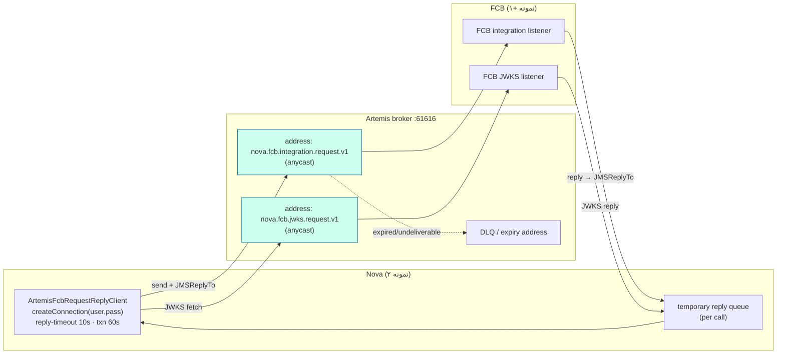
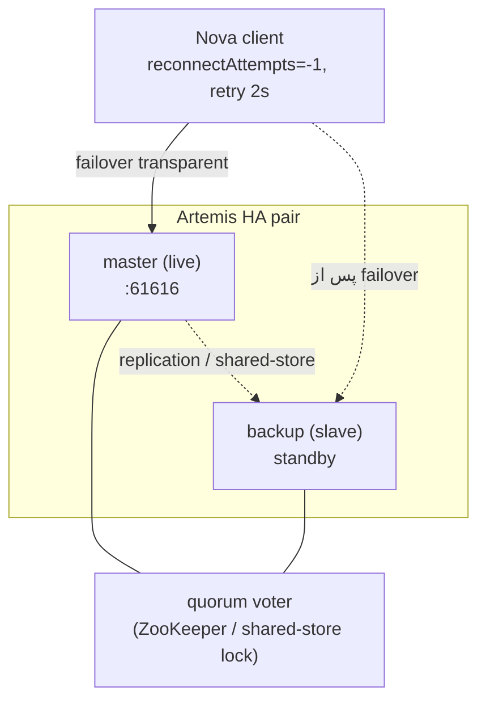

# RB-0008. کارگزار Artemis

* **وضعیت**: فعال
* **تاریخ**: 2026-06-04
* **نویسندگان**: تیم معماری Nova
* **دسته‌بندی**: پیام‌رسانی / دسترس‌پذیری بالا (Messaging / High Availability)
* **تیکت‌های مرتبط**: [LN-59417](https://jira.dotin.ir/browse/LN-59417)

> این Runbook نقش کارگزار **ActiveMQ Artemis** را به‌عنوان ترابر همگام request/reply و JWKS بین Nova و FCB، الگوی
> address/queue، رفتار reconnect هنگام restart کارگزار، و HA تولید (master/slave) شرح می‌دهد.
> ترابر فعال (artemis یا kafka) در Consul انتخاب می‌شود — به [RB-0013](RB-0013.nova-fcb-transport-switch.md) مراجعه کنید.

## زمینه (Context)

Artemis **تنها کارگزار JMS پشتیبانی‌شده** برای مسیر همگام request/reply و انتقال JWKS بین Nova و FCB است. در
`nova-service/fcb.yml`، کلید `nova.fcb.transport-mode` روی **`artemis`** است و `nova.fcb.artemis.enabled` فعال؛ هر دو
کلاینت (artemis اصلی و kafka به‌عنوان fallback) wired می‌مانند تا سوئیچ ترابر آنی باشد.

> **توجه:** ActiveMQ Classic قدیمی (`rmohr/activemq`، ماژول `adapters/driving/messaging-activemq`،
> `docker-compose-activemq.yml`) **پشتیبانی نمی‌شود و در حال حذف از اپلیکیشن است**؛ آن را گزینهٔ زمان اجرا حساب نکنید.

فقط مسیر همگام request/reply روی Artemis است؛ رویدادهای FCB→Nova و انتشار outbox فارغ از مقدار `transport-mode` همچنان
روی Kafka می‌مانند.

## پیکربندی (Configuration)

از `nova-service/fcb.yml » nova.fcb.artemis` و `ArtemisFcbProperties`:

<div dir="ltr">

```yaml
nova:
  fcb:
    transport-mode: "artemis"
    artemis:
      enabled: "true"
      broker-url: "tcp://${ACTIVEMQ_HOST}:${ACTIVEMQ_PORT:61616}"
      user: "${ARTEMIS_USER}"
      password: "${ARTEMIS_PASSWORD}"
      request-address: "${NOVA_FCB_ARTEMIS_REQUEST_ADDRESS:nova.fcb.integration.request.v1}"
      jwks-request-address: "${NOVA_FCB_ARTEMIS_JWKS_REQUEST_ADDRESS:nova.fcb.jwks.request.v1}"
      reply-timeout: "${NOVA_FCB_ARTEMIS_REPLY_TIMEOUT:10s}"
      transaction-timeout: "${NOVA_FCB_ARTEMIS_TRANSACTION_TIMEOUT:60s}"
```

</div>

تنظیمات `ActiveMQConnectionFactory` (از `ArtemisFcbConfig.artemisFcbConnectionFactory`):

<div dir="ltr">

```java
factory.setBlockOnDurableSend(false);     // ارسالِ غیرمسدودکننده — publish منتظرِ رفت‌وبرگشتِ کارگزار نمی‌ماند
factory.setBlockOnNonDurableSend(false);
factory.setCacheDestinations(true);       // lookupِ کش‌شدهٔ مقصد
factory.setConsumerWindowSize(1024 * 1024);     // prefetch ۱ مگابایت برای مصرف‌کنندهٔ پاسخ
factory.setConfirmationWindowSize(1024 * 1024); // ۱ مگابایت
factory.setReconnectAttempts(-1);         // reconnect بی‌نهایت — corridor پس از blip خود را ترمیم می‌کند
factory.setRetryInterval(2000L);          // ۲ ثانیه بین تلاش‌ها
factory.setUseGlobalPools(true);
```

</div>

نکات کلیدی:

- **ConnectionFactory با تأخیر (lazy) وصل می‌شود** — `ActiveMQConnectionFactory` سوکت را فقط در اولین
  `createConnection()` باز می‌کند؛ پس کارگزار down هرگز بوت Nova را بلاک نمی‌کند، حتی وقتی `artemis.enabled=true` اما
  `transport-mode=kafka` باشد.
- **ارسال غیرمسدودکننده** — `blockOnDurableSend=false`؛ publish درخواست منتظر confirm نمی‌ماند، ولی خود فراخوان هنوز
  روی **دریافت پاسخ** بلاک می‌شود (تا `reply-timeout`).
- **reconnect بی‌نهایت** (`reconnectAttempts=-1`, `retryInterval=2000`) — بعد از restart کارگزار، اتصال خودکار
  بازسازی می‌شود.
- کلاینت `@Primary` نیست؛ تنها bean ‌`@Primary` همان `FcbRequestReplyClient` روتر ترکیب‌بندی است (که بین artemis/kafka
  انتخاب می‌کند).

## مدلِ آدرس و صف (Address / Queue Model)

<div dir="ltr">



</div>

- **address درخواست** `nova.fcb.integration.request.v1` (anycast) — listener یکپارچه‌سازی FCB از آن مصرف می‌کند؛
  باید byte-for-byte با سمت FCB یکی باشد.
- **address درخواست JWKS** `nova.fcb.jwks.request.v1` (anycast) — `ArtemisJwksFetcher` در Nova کلیدهای عمومی FCB را
  از این address می‌گیرد (و در Redis کش می‌کند — RB-0007).
- **صف‌های پاسخ موقت** — هر فراخوان یک temporary reply queue با `JMSReplyTo` می‌سازد؛ مصرف‌کنندهٔ پاسخ با prefetch ۱
  مگابایت آن را تخلیه می‌کند. در dev این addressها در اولین استفاده auto-create می‌شوند.
- **DLQ / expiry** — پیام‌های منقضی یا غیرقابل‌تحویل به address ‌DLQ می‌روند؛ برای بازرسی و redelivery از کنسول وب
  استفاده کنید.

## محیط چندنمونه‌ای / HA (Multi-instance / HA)

برای تولید، Artemis را به‌صورت جفت HA (master/slave) مستقر کنید. دو راهبرد:

| راهبرد           | مکانیزم                                            | مصالحه                                                                       |
|------------------|----------------------------------------------------|------------------------------------------------------------------------------|
| **shared-store** | master و slave یک ذخیرهٔ پیام مشترک (SAN/NFS) دارند | بدون کپی داده؛ failover سریع. وابسته به storage مشترک قابل‌اعتماد.            |
| **replication**  | slave پیام‌ها را روی شبکه از master replicate می‌کند | بدون storage مشترک؛ اما برای جلوگیری از split-brain به pluggable quorum نیاز دارد. |

**جلوگیری از split-brain**: در حالت replication یک رأی‌گیری quorum لازم است تا وقتی master و slave از هم جدا می‌شوند،
هر دو هم‌زمان live نشوند. از **pluggable quorum vote** (مثلاً ZooKeeper یا یک رأی‌دهندهٔ Artemis) با تعداد فرد
رأی‌دهنده استفاده کنید. در shared-store، قفل روی storage مشترک نقش tie-break را بازی می‌کند (فقط دارندهٔ قفل live
می‌شود).

<div dir="ltr">



</div>

- **failover شفاف برای کلاینت** — با `reconnectAttempts=-1` و `retryInterval=2000`، کلاینت Nova بعد از افتادن master
  به backup پروموت‌شده بازوصل می‌شود؛ نیازی به restart کردن Nova نیست.
- **درخواست‌های در پرواز هنگام failover** — فراخوانی که لحظهٔ افتادن کارگزار منتظر پاسخ بود، پاسخی نمی‌گیرد و در
  `reply-timeout` (۱۰ ثانیه) تایم‌اوت می‌خورد؛ مسیر بالادست خطایش را مدیریت می‌کند (retry سطح کاربر). عملیات تراکنشی
  طولانی تا `transaction-timeout` (۶۰ ثانیه) فرصت دارند.
- **هر دو نمونهٔ Nova** به همان `broker-url` وصل می‌شوند؛ addressهای anycast بار مصرف را بین نمونه‌های FCB پخش
  می‌کنند.

## بازگردانی/بازیابی (Recovery)

- **restart کارگزار (تک‌گره dev)** — کلاینت Nova با reconnect بی‌نهایت، بعد از بالا آمدن کارگزار خودکار وصل می‌شود؛
  فراخوان‌هایی که در پنجرهٔ down بودند تایم‌اوت خورده‌اند و باید از سر گرفته شوند.
- **failover جفت HA** — backup ‌live می‌شود و کلاینت‌ها شفاف بازوصل می‌شوند. بعد از برگشت master اصلی، بسته به
  پیکربندی یا master دوباره live می‌شود (failback) یا backup فعلی live می‌ماند.
- **انباشت DLQ** — اگر پیام‌ها به DLQ می‌روند، علتش را در کنسول بررسی کنید (مصرف‌کنندهٔ پاسخ گم‌شده، انقضای زودهنگام،
  یا address اشتباه) و بعد از رفع، redelivery کنید.
- **پاک‌سازی temporary reply queueها** — در حالت عادی با بسته شدن اتصال خودکار حذف می‌شوند؛ نشت آن‌ها نشانهٔ کلاینتی
  است که اتصالش را close نمی‌کند.

## عملیات کنسول وب (`:8161`)

کنسول مدیریت Artemis روی پورت **۸۱۶۱** در دسترس است (`EXTRA_ARGS: --http-host 0.0.0.0 --relax-jolokia`). کارهای
عملیاتی رایج:

- **عمق صف (queue depth)** — `Message Count` روی صف‌های `nova.fcb.integration.request.v1` و
  `nova.fcb.jwks.request.v1`؛ عمق بالا یعنی مصرف‌کنندهٔ FCB کند یا کم است.
- **مصرف‌کننده‌ها (consumers)** — مقدار `Consumer Count`؛ صفر یعنی FCB متصل نیست (مسیر مسدود می‌شود).
- **DLQ redelivery** — از نمای DLQ پیام‌ها را به address اصلی move/retry کنید.
- **بازرسی پیام** — preview محتوای پیام برای تشخیص envelope/headerهای نادرست.

## راستی‌آزمایی (Verification)

۱. **سلامت کارگزار** (dev):

<div dir="ltr">

```bash
docker exec nova-fcb-artemis /var/lib/artemis-instance/bin/artemis check node --up
```

</div>

۲. **اتصال کلاینت از Nova** — لاگ بوت باید نشان دهد ترابر فعال `artemis` است (نه kafka) و اولین `createConnection`
   موفق است.

۳. **یک journey منفرد** — یک فراخوان request/reply (مثلاً JWKS fetch یا یک اعتبارسنجی FCB) باید داخل `reply-timeout`
   (۱۰ ثانیه) پاسخ بگیرد و کلید JWKS در Redis کش شود (RB-0007).

۴. **drill ‌restart** — کارگزار را با `docker restart nova-fcb-artemis` ری‌استارت کنید؛ تأیید کنید Nova بعد از بالا
   آمدن خودکار بازوصل می‌شود (لاگ reconnect) و فراخوان‌های بعدی موفق‌اند.

۵. **عمق صف زیر بار** — در کنسول `:8161` تأیید کنید عمق صف درخواست زیر بار به صفر میل می‌کند (مصرف‌کننده‌های FCB
   همگام‌اند) و `Consumer Count > 0` است.

## سخت‌سازی برای تولید (Production Hardening)

خوشهٔ فعلی dev شش بروکر است: سه primary و سه backup با replication (پورت‌های live ‌61616/61626/61636 و backup
‌61646/61656/61666). مواردی که در جریان incident مربوط به پر شدن دیسک و probe‌ی liveness مشخص شد و باید در هر ring
رعایت شود:

### ۱. جفت‌شدن replication باید قطعی باشد — `group-name`

بدون `group-name`، هر backup به اولین primary‌ای که جواب بدهد وصل می‌شود. یک بار پس از restart، `backup1` به
primary دیگری sync شد. نتیجه در بدترین حالت: یک primary بدون backup و یکی با دو backup — یعنی از دست رفتن خاموشِ HA،
نه یک خطای قابل‌مشاهده.

هر جفت `ARTEMIS_HA_GROUP` مخصوص خود را دارد (`nova-ha-1/2/3`) و `artemis-init.sh` آن را به شکل `<group-name>` داخل
`<primary>`/`<backup>` می‌نویسد. فرمِ XML در `nova-fcb-address-settings.xml` هست.

> **ترتیب اعمال:** `artemis-init.sh` فقط هنگام ساخت instance اجرا می‌شود، پس روی بروکرِ موجود باید `broker.xml`
> دستی ویرایش و بروکر restart شود. برای اجتناب از failover بی‌مورد، backup هر جفت را stop کنید، primary را
> restart کنید، سپس backup را start کنید — جفت‌به‌جفت. هرگز `docker compose up` روی آن هاست اجرا نکنید.

### ۲. journal روی دیسک اختصاصی

journal و paging هم‌اکنون روی همان دیسک ۵۰ گیگابایتی‌اند که image‌های Docker و بقیهٔ کانتینرها از آن استفاده
می‌کنند. وقتی مصرف از `max-disk-usage=90` گذشت، Artemis همهٔ producerها را با `AMQ212054` بلاک کرد و این علتِ اصلی
قطعی بود. **این مورد نیازمند تأمین دیسک است و با تغییر مخزن حل نمی‌شود** — یک volume اختصاصی برای
`/var/lib/artemis-instance/data` لازم است.

تا آن زمان روی `AMQ222210` (هشدار آستانهٔ دیسک) و `AMQ212054` (بلاک شدن producer) alert بگذارید؛ رسیدن این دو یعنی
مسیر request/reply همین حالا متوقف است.

### ۳. سقف و پایش DLQ و ExpiryQueue

هیچ‌کدام مصرف‌کننده ندارند؛ بدون سقف تا پر شدن دیسک رشد می‌کنند (حدود ۵۴ هزار پیام انباشته شده بود). حالا هر دو
`address-full-policy=DROP` و `max-size-bytes=50MB` دارند. `PAGE` همان چیزی است که دیسک را پر کرد و `BLOCK` آدرسِ
مبدأ را متوقف می‌کند، پس هیچ‌کدام برای یک گورستان درست نیستند.

`MessageCount` این دو صف باید عملاً صفر بماند. رشدِ پیوسته یعنی یک نقص بالادستی — نه چیزی که با purge حل شود:

| نشانه | تفسیر |
|---|---|
| `ExpiryQueue` با بدنهٔ `{"pangaea":"liveness-probe"}` رشد می‌کند | `platform.clock.offset` با اسکیوِ بروکر نمی‌خواند؛ probe منقضی‌متولد می‌شود |
| `DLQ` بعد از `max-delivery-attempts=3` رشد می‌کند | مصرف‌کنندهٔ FCB پیام را پس می‌زند |
| هر دو ثابت‌اند ولی دیسک پر می‌شود | paging؛ به `global-max-size` و `max-size-bytes` هر address نگاه کنید |

### ۴. auto-create فقط جایی که واقعاً لازم است

`auto-create-queues`/`auto-create-addresses` روی `nova.fcb.#` خاموش شد تا یک نام اشتباه، آدرسِ زندهٔ بی‌مصرف نسازد.
دو namespace پاسخ (`nova.fcb.integration.reply.#` و `nova.fcb.jwks.reply.#`) آن را صریحاً روشن می‌کنند، چون نام صف
پاسخ per-instance است و از پیش معلوم نیست. دو address ثابتِ request از پیش در `<addresses>` تعریف شده‌اند.

### ۵. `global-max-size` صریح

قالبِ پیش‌فرض این کلید را کامنت گذاشته، یعنی نصفِ `-Xmx` — عددی که کسی انتخاب نکرده و با تغییر heap جابه‌جا می‌شود.
حالا صریحاً `512Mb` است (قابل override با `ARTEMIS_GLOBAL_MAX_SIZE`).

### ۶. سمت کلاینت: `useTopologyForLoadBalancing=false` و `confirmationWindowSize`

با `ha=true` کلاینت روی هر reconnect از topology برای load balancing استفاده می‌کند، پس صف پاسخِ per-instance بین
گره‌ها جابه‌جا می‌شود و روی گره‌های قبلی نسخه‌های بی‌مصرف‌کننده جا می‌گذارد. `useTopologyForLoadBalancing=false`
نمونه را روی یک گره ثابت نگه می‌دارد؛ مسیر failover تحت تأثیر نیست چون از load balancing استفاده نمی‌کند.
`confirmationWindowSize` هم لازم است وگرنه `reconnectAttempts` نمی‌تواند ارسال‌های تأییدنشده را replay کند.

## مراجع (References)

- تیکت مرتبط: [LN-59417](https://jira.dotin.ir/browse/LN-59417).
- سرویس Artemis (dev): `nova-dev-stack » docker-compose.yml » artemis` (`apache/activemq-artemis:2.43.0`، پورت‌های 61616/5672/8161).
- پیکربندی ترابر: `nova-config » kv/core/loan/nova/nova-service/fcb.yml » nova.fcb.artemis`.
- پیاده‌سازی کلاینت: `nova » adapters/driven/fcb-messaging-artemis/.../config/ArtemisFcbConfig.java`، `ArtemisFcbProperties.java`.
- Runbook مرتبط: [RB-0013](RB-0013.nova-fcb-transport-switch.md) (سوئیچ ترابر artemis ↔ kafka)، [RB-0007](RB-0007.redis-sentinel-ha.md) (کش JWKS).
