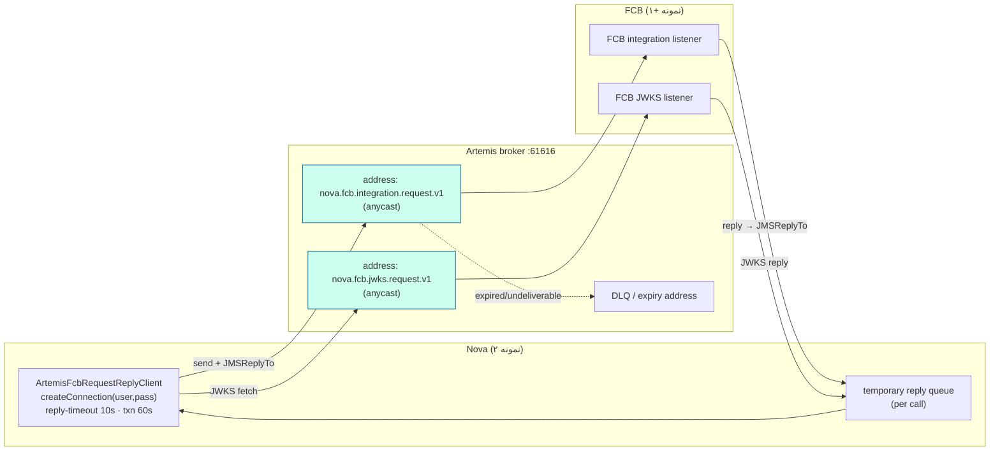
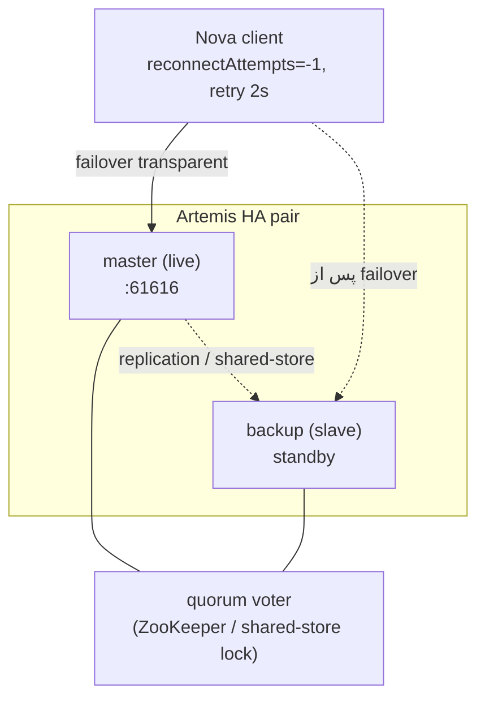

# RB-0008. کارگزار Artemis

* **وضعیت**: فعال
* **تاریخ**: 2026-06-04
* **نویسندگان**: تیم معماری Nova
* **دسته‌بندی**: پیام‌رسانی / دسترس‌پذیری بالا (Messaging / High Availability)
* **تیکت‌های مرتبط**: [LN-59417](https://jira.dotin.ir/browse/LN-59417)

> این Runbook نقشِ کارگزارِ **ActiveMQ Artemis** به‌عنوانِ ترابرِ همگامِ request/reply و JWKS بینِ Nova و FCB، الگوی
> آدرس/صف، معناشناسیِ reconnect در زمانِ بازچرخهٔ کارگزار، و HAِ تولید (master/slave) را مستند می‌کند.
> ترابرِ فعال (artemis یا kafka) در Consul انتخاب می‌شود — به [RB-0013](RB-0013.nova-fcb-transport-switch.md) مراجعه کنید.

## زمینه (Context)

Artemis **تنها کارگزارِ JMSِ پشتیبانی‌شده** برای مسیرِ همگامِ request/reply و انتقالِ JWKS بینِ Nova و FCB است. در
`nova-service/fcb.yml`، کلیدِ `nova.fcb.transport-mode` روی **`artemis`** نشسته و `nova.fcb.artemis.enabled` فعال است؛
هر دو کلاینت (artemis اصلی، kafka به‌عنوانِ fallback) wired می‌مانند تا فلیپِ ترابر آنی باشد.

> **توجه:** ActiveMQ Classic قدیمی (`rmohr/activemq`، ماژولِ `adapters/driving/messaging-activemq`،
> `docker-compose-activemq.yml`) **پشتیبانی‌نشده و در حالِ حذف از اپلیکیشن** است؛ به‌عنوانِ گزینهٔ زمانِ اجرا در نظر
> گرفته نشود.

فقط مسیرِ همگامِ request/reply روی Artemis است؛ رویدادهای FCB→Nova و انتشارِ outbox همچنان روی Kafka می‌مانند،
صرف‌نظر از مقدارِ `transport-mode`.

## پیکربندی (Configuration)

از `nova-service/fcb.yml » nova.fcb.artemis` و `ArtemisFcbProperties`:

<div dir="ltr">

```yaml
nova:
  fcb:
    transport-mode: "artemis"
    artemis:
      enabled: "true"
      broker-url: "tcp://${ACTIVEMQ_HOST}:${ACTIVEMQ_PORT:61616}"
      user: "${ARTEMIS_USER}"
      password: "${ARTEMIS_PASSWORD}"
      request-address: "${NOVA_FCB_ARTEMIS_REQUEST_ADDRESS:nova.fcb.integration.request.v1}"
      jwks-request-address: "${NOVA_FCB_ARTEMIS_JWKS_REQUEST_ADDRESS:nova.fcb.jwks.request.v1}"
      reply-timeout: "${NOVA_FCB_ARTEMIS_REPLY_TIMEOUT:10s}"
      transaction-timeout: "${NOVA_FCB_ARTEMIS_TRANSACTION_TIMEOUT:60s}"
```

</div>

تنظیماتِ `ActiveMQConnectionFactory` (از `ArtemisFcbConfig.artemisFcbConnectionFactory`):

<div dir="ltr">

```java
factory.setBlockOnDurableSend(false);     // ارسالِ غیرمسدودکننده — publish منتظرِ رفت‌وبرگشتِ کارگزار نمی‌ماند
factory.setBlockOnNonDurableSend(false);
factory.setCacheDestinations(true);       // lookupِ کش‌شدهٔ مقصد
factory.setConsumerWindowSize(1024 * 1024);     // prefetch ۱ مگابایت برای مصرف‌کنندهٔ پاسخ
factory.setConfirmationWindowSize(1024 * 1024); // ۱ مگابایت
factory.setReconnectAttempts(-1);         // reconnect بی‌نهایت — corridor پس از blip خود را ترمیم می‌کند
factory.setRetryInterval(2000L);          // ۲ ثانیه بین تلاش‌ها
factory.setUseGlobalPools(true);
```

</div>

نکاتِ کلیدی:

- **ConnectionFactory با تأخیر (lazy) وصل می‌شود** — `ActiveMQConnectionFactory` فقط در اولین `createConnection()`
  سوکت باز می‌کند؛ پس کارگزارِ down هرگز بوتِ Nova را بلاک نمی‌کند، حتی وقتی `artemis.enabled=true` ولی
  `transport-mode=kafka`.
- **ارسالِ غیرمسدودکننده** — `blockOnDurableSend=false`؛ publishِ درخواست منتظرِ confirm نمی‌ماند، اما خودِ فراخوان
  هنوز روی **دریافتِ پاسخ** بلاک می‌شود (تا `reply-timeout`).
- **reconnect بی‌نهایت** (`reconnectAttempts=-1`, `retryInterval=2000`) — پس از بازچرخهٔ کارگزار، اتصال خودکار
  بازسازی می‌شود.
- کلاینت `@Primary` نیست؛ روترِ ترکیب‌بندی تنها `FcbRequestReplyClient`ِ `@Primary` است (بینِ artemis/kafka انتخاب
  می‌کند).

## مدلِ آدرس و صف (Address / Queue Model)

<div dir="ltr">



</div>

- **آدرسِ درخواست** `nova.fcb.integration.request.v1` (anycast) — listenerِ یکپارچه‌سازیِ FCB از آن مصرف می‌کند؛
  باید byte-for-byte با سمتِ FCB یکی باشد.
- **آدرسِ JWKS-request** `nova.fcb.jwks.request.v1` (anycast) — `ArtemisJwksFetcher`ِ Nova کلیدهای عمومیِ FCB را از
  این آدرس می‌گیرد (و در Redis کش می‌کند — RB-0007).
- **صف‌های پاسخِ موقت** — هر فراخوان یک temporary reply queue با `JMSReplyTo` می‌سازد؛ مصرف‌کنندهٔ پاسخ با prefetch
  ۱ مگابایت تخلیه می‌کند. در dev این آدرس‌ها در اولین استفاده auto-create می‌شوند.
- **DLQ / expiry** — پیام‌های منقضی یا غیرقابل‌تحویل به آدرسِ DLQ می‌روند؛ برای بازرسی و redelivery از کنسولِ وب
  استفاده کنید.

## محیط چندنمونه‌ای / HA (Multi-instance / HA)

برای تولید، Artemis را به‌صورتِ جفتِ HA (master/slave) مستقر کنید. دو راهبرد:

| راهبرد              | مکانیزم                                          | مصالحه                                                                  |
|---------------------|-------------------------------------------------|------------------------------------------------------------------------|
| **shared-store**    | master و slave یک ذخیرهٔ پیام مشترک (SAN/NFS) دارند | بدونِ کپیِ داده؛ failover سریع. وابسته به storageِ مشترکِ قابل‌اعتماد. |
| **replication**     | slave پیام‌ها را روی شبکه از master replicate می‌کند | بدونِ storageِ مشترک؛ اما نیازمندِ pluggable quorum برای جلوگیری از split-brain. |

**جلوگیری از split-brain**: در حالتِ replication، یک رأی‌گیریِ quorum لازم است تا وقتی master و slave از هم جدا
می‌شوند، هر دو هم‌زمان live نشوند. از **pluggable quorum vote** (مثلاً ZooKeeper یا یک رأی‌دهندهٔ Artemis) با تعدادِ
فردِ رأی‌دهنده استفاده کنید. در shared-store، قفلِ روی storageِ مشترک نقشِ tie-break را بازی می‌کند (تنها دارندهٔ قفل
live می‌شود).

<div dir="ltr">



</div>

- **failover شفاف برای کلاینت** — با `reconnectAttempts=-1` و `retryInterval=2000`، کلاینتِ Nova پس از سقوطِ master
  به backupِ ترفیع‌یافته بازوصل می‌شود؛ نیازی به بازچرخهٔ Nova نیست.
- **درخواست‌های در پرواز در زمانِ failover** — فراخوانی که در لحظهٔ سقوطِ کارگزار منتظرِ پاسخ بود، پاسخ نمی‌گیرد و در
  `reply-timeout` (۱۰ ثانیه) تایم‌اوت می‌خورد؛ مسیرِ بالادست خطای آن را مدیریت می‌کند (retry سطحِ کاربر). عملیاتِ
  تراکنشیِ بلند تا `transaction-timeout` (۶۰ ثانیه) فرصت دارند.
- **هر دو نمونهٔ Nova** به همان `broker-url` وصل می‌شوند؛ آدرس‌های anycast بارِ مصرف را بینِ نمونه‌های FCB پخش
  می‌کنند.

## بازگردانی/بازیابی (Recovery)

- **بازچرخهٔ کارگزار (تک‌گره dev)** — کلاینتِ Nova با reconnect بی‌نهایت پس از بالا آمدنِ کارگزار خودکار وصل می‌شود؛
  فراخوان‌هایی که در پنجرهٔ down بودند تایم‌اوت خورده‌اند و باید از سرگرفته شوند.
- **failover جفتِ HA** — backup live می‌شود؛ کلاینت‌ها شفاف بازوصل می‌شوند. پس از بازگشتِ masterِ اصلی، بسته به
  پیکربندی، یا master دوباره live می‌شود (failback) یا backupِ فعلی live می‌ماند.
- **انباشتِ DLQ** — اگر پیام‌ها به DLQ می‌روند، علت را در کنسول بررسی کنید (مصرف‌کنندهٔ پاسخ گم‌شده، انقضای زودهنگام،
  یا آدرسِ نادرست) و پس از رفع، redelivery کنید.
- **پاک‌سازیِ temporary reply queueها** — در حالتِ عادی با بستنِ اتصال خودکار حذف می‌شوند؛ نشتِ آن‌ها نشانهٔ کلاینتِ
  بدونِ close است.

## عملیاتِ کنسولِ وب (`:8161`)

کنسولِ مدیریتِ Artemis روی پورتِ **۸۱۶۱** در دسترس است (`EXTRA_ARGS: --http-host 0.0.0.0 --relax-jolokia`).
وظایفِ عملیاتیِ رایج:

- **عمقِ صف (queue depth)** — `Message Count` روی صف‌های `nova.fcb.integration.request.v1` و
  `nova.fcb.jwks.request.v1`؛ عمقِ بالا یعنی مصرف‌کنندهٔ FCB کند است یا کم.
- **مصرف‌کننده‌ها (consumers)** — تعدادِ `Consumer Count`؛ صفر یعنی FCB متصل نیست (مسیر مسدود می‌شود).
- **DLQ redelivery** — از نمای DLQ، پیام‌ها را به آدرسِ اصلی move/retry کنید.
- **بازرسیِ پیام** — preview محتوای پیام برای تشخیصِ envelope/headerهای نادرست.

## راستی‌آزمایی (Verification)

۱. **سلامتِ کارگزار** (dev):

<div dir="ltr">

```bash
docker exec nova-fcb-artemis /var/lib/artemis-instance/bin/artemis check node --up
```

</div>

۲. **اتصالِ کلاینت از Nova** — لاگِ بوت باید نشان دهد ترابرِ فعال `artemis` است (نه kafka)، و اولین
   `createConnection` موفق است.

۳. **یک journey منفرد** — یک فراخوانِ request/reply (مثلاً JWKS fetch یا یک اعتبارسنجیِ FCB) باید درونِ
   `reply-timeout` (۱۰ ثانیه) پاسخ بگیرد؛ کلیدِ JWKS در Redis کش شود (RB-0007).

۴. **drill بازچرخه** — کارگزار را `docker restart nova-fcb-artemis` کنید؛ تأیید کنید Nova پس از بالا آمدن خودکار
   بازوصل می‌شود (لاگِ reconnect) و فراخوان‌های بعدی موفق‌اند.

۵. **عمقِ صف زیر بار** — در کنسولِ `:8161` تأیید کنید عمقِ صفِ درخواست زیر بار به صفر میل می‌کند (مصرف‌کننده‌های FCB
   همگام‌اند) و `Consumer Count > 0`.

## مراجع (References)

- تیکتِ مرتبط: [LN-59417](https://jira.dotin.ir/browse/LN-59417).
- سرویسِ Artemis (dev): `nova-dev-stack » docker-compose.yml » artemis` (`apache/activemq-artemis:2.43.0`، پورت‌های 61616/5672/8161).
- پیکربندیِ ترابر: `nova-config » kv/core/loan/nova/nova-service/fcb.yml » nova.fcb.artemis`.
- پیادهٔ کلاینت: `nova » adapters/driven/fcb-messaging-artemis/.../config/ArtemisFcbConfig.java`، `ArtemisFcbProperties.java`.
- Runbookِ مرتبط: [RB-0013](RB-0013.nova-fcb-transport-switch.md) (سوئیچِ ترابرِ artemis ↔ kafka)، [RB-0007](RB-0007.redis-sentinel-ha.md) (کشِ JWKS).
