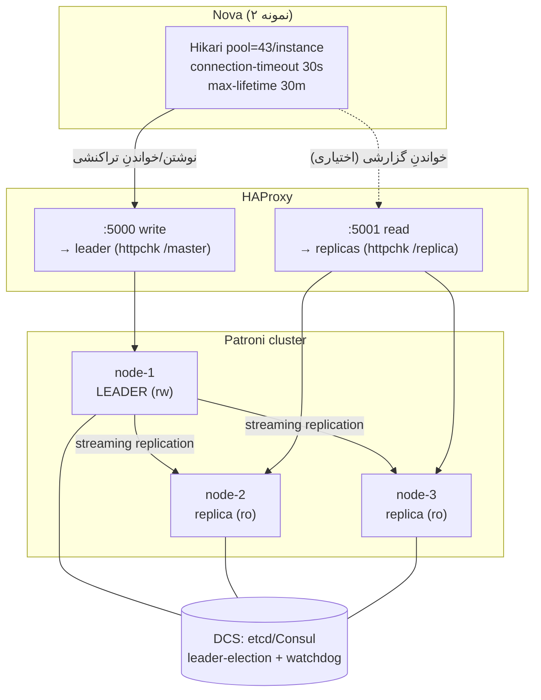

# RB-0009. Postgres در تولید: Patroni + HAProxy (توصیه‌شده)

* **وضعیت**: فعال
* **تاریخ**: 2026-06-04
* **نویسندگان**: تیم معماری Nova
* **دسته‌بندی**: پایگاه‌داده / دسترس‌پذیری بالا (Database / High Availability)
* **تیکت‌های مرتبط**: [LN-59412](https://jira.dotin.ir/browse/LN-59412)

> این Runbook توپولوژیِ **توصیه‌شدهٔ** Postgres برای تولید را مستند می‌کند: یک کلاستر Patroni سه‌گره (leader + ۲
> replica) با HAProxy که پورتِ نوشتن (leader) و پورتِ خواندن (replicaها) را جدا عرضه می‌کند. سقفِ استخرِ اتصال و
> مدلِ بودجهٔ ناوگان در [RB-0001](RB-0001.nova-db-connection-pool-sizing.md) است؛ اینجا تکرار نمی‌شود.

## زمینه (Context)

محیطِ dev (`nova-dev-stack`) یک Postgresِ تک‌گره دارد:

<div dir="ltr">

```yaml
postgres:
  image: postgres:18.0-alpine
  ports:
    - "5433:5432"          # host 5433 → container 5432
  environment:
    TZ: Asia/Tehran
  healthcheck:
    test: ["CMD-SHELL", "pg_isready -U ${DB_USERNAME}"]
```

</div>

این تک‌گره برای تولید یک SPOF است. توصیهٔ تولید: خوشهٔ Patroni سه‌گره با leader-election خودکار (روی DCS:
etcd/Consul/ZooKeeper) و HAProxy جلوی آن برای routing بر اساسِ نقش (leader/replica). Nova بدونِ تغییرِ کد، فقط با
عوض شدنِ `DB_HOST`/`DB_PORT` به پورتِ نوشتنِ HAProxy وصل می‌شود.

پیکربندیِ datasourceِ Nova (از `application/datasource.yml`) صرف‌نظر از توپولوژیِ زیرین یکسان می‌ماند:

<div dir="ltr">

```yaml
spring:
  datasource:
    url: "jdbc:postgresql://${DB_HOST}:${DB_PORT}/${DB_NAME}"
    hikari:
      maximum-pool-size: 43
      minimum-idle: 5
      connection-timeout: 30000
      idle-timeout: 600000
      max-lifetime: 1800000
  jpa:
    open-in-view: false
  sql:
    init:
      mode: never
```

</div>

## وضعیت فعلی در برابر هدف (Current vs. Target)

| بُعد               | dev (`nova-dev-stack`) | هدفِ تولید (توصیه‌شده)                                      |
|--------------------|------------------------|-------------------------------------------------------------|
| توپولوژی           | Postgres تک‌گره        | Patroni ۳ گره (leader + ۲ replica)                          |
| failover           | دستی (restart)         | خودکار (Patroni + DCS leader-election)                      |
| نقطهٔ اتصالِ Nova  | مستقیم به گره          | HAProxy پورتِ نوشتن (leader)                                |
| خواندنِ مقیاس‌پذیر | همان گره               | HAProxy پورتِ خواندن (replicaها) — اختیاری                  |
| پشتیبان            | volume snapshot        | pg_basebackup + WAL archiving (PITR)                        |
| TLS                | بدون (محلی)            | `sslmode` طبقِ [RB-0006](RB-0006.nova-tls-ssl-hardening.md) |

## توپولوژی (Topology)

<div dir="ltr">



</div>

- **HAProxy با `httpchk` به Patroni REST API** نقشِ هر گره را تشخیص می‌دهد: پورتِ نوشتن فقط گرهی که
  `GET /master` با ۲۰۰ پاسخ می‌دهد (leader) را پشتیبان می‌کند؛ پورتِ خواندن گره‌هایی که `GET /replica` با ۲۰۰
  پاسخ می‌دهند را. پس از failover، HAProxy خودکار leaderِ جدید را در پورتِ نوشتن قرار می‌دهد.
- **Nova به پورتِ نوشتنِ HAProxy** (`DB_PORT=5000`) وصل می‌شود؛ همهٔ تراکنش‌های Nova (دستور + پرس‌وجوی تراکنشی) read-write
  هستند و به leader می‌روند. پورتِ خواندن برای بارِ گزارشیِ صرفاً read-only اختیاری است (Nova امروز از آن استفادهٔ
  پیش‌فرض ندارد).

## پیکربندیِ نمونه (Representative Snippets)

HAProxy (مفهومی — routing بر اساسِ نقش از Patroni REST):

<div dir="ltr">

```haproxy
listen postgres_write
    bind *:5000
    option httpchk GET /master
    http-check expect status 200
    default-server inter 3s fall 3 rise 2 on-marked-down shutdown-sessions
    server node1 10.0.0.11:5432 check port 8008
    server node2 10.0.0.12:5432 check port 8008
    server node3 10.0.0.13:5432 check port 8008

listen postgres_read
    bind *:5001
    balance roundrobin
    option httpchk GET /replica
    http-check expect status 200
    server node1 10.0.0.11:5432 check port 8008
    server node2 10.0.0.12:5432 check port 8008
    server node3 10.0.0.13:5432 check port 8008
```

</div>

`pg_hba.conf` (دسترسی + replication؛ `scram-sha-256` و TLS طبقِ RB-0006):

<div dir="ltr">

```
# TYPE  DATABASE     USER         ADDRESS          METHOD
hostssl  all         nova         10.0.0.0/24      scram-sha-256
hostssl  replication replicator   10.0.0.0/24      scram-sha-256
```

</div>

نمونهٔ failover/switchover با `patronictl`:

<div dir="ltr">

```bash
patronictl -c /etc/patroni/patroni.yml list nova-cluster        # نمایشِ نقش‌ها + lag
patronictl -c /etc/patroni/patroni.yml switchover nova-cluster \
    --leader node1 --candidate node2 --force                    # سوئیچِ برنامه‌ریزی‌شده
patronictl -c /etc/patroni/patroni.yml failover nova-cluster \
    --candidate node2 --force                                   # failover اضطراری (leader مرده)
```

</div>

## رفتارِ failover و تعاملِ Hikari (Failover & Hikari Interplay)

هنگامِ switchover/failover، leaderِ قدیمی نوشتن را قطع می‌کند و اتصال‌های موجودِ Hikari به آن گره **stale**
می‌شوند:

- **`connection-timeout: 30000`** — اگر در پنجرهٔ failover اتصالِ تازه از استخر خواسته شود و HAProxy هنوز leaderِ
  جدید را آماده نکرده باشد، تلاش پس از ۳۰ ثانیه fail-fast می‌شود (به‌جای آویزانیِ نامحدود).
- **`max-lifetime: 1800000` (۳۰ دقیقه)** — Hikari اتصال‌ها را به‌صورتِ دوره‌ای بازنشانی می‌کند؛ اتصال‌های stale پس
  از failover با تستِ سلامتِ Hikari و بازنشانیِ lifetime تخلیه می‌شوند، نه نگه‌داریِ نامحدود.
- **معناشناسیِ recovery** — تراکنش‌های در پروازِ روی leaderِ قدیمی در لحظهٔ failover **rollback** می‌شوند (نه
  commit)؛ Nova خطای آن‌ها را می‌گیرد و مسیرِ بالادست retry می‌کند. چون `open-in-view: false`، اتصال فقط حولِ تراکنش
  نگه داشته می‌شود، پس پنجرهٔ آسیبِ stale کوتاه است.
- پس از failover، اولین تلاش‌های اتصال به leaderِ جدید (از طریقِ HAProxy) موفق می‌شوند و استخر خود را پر می‌کند.

> برای سرعتِ بیشترِ کشفِ خرابی می‌توان `option httpchk` در HAProxy را با `inter` کوتاه‌تر تنظیم کرد، اما باید
> هماهنگ با `connection-timeout` بماند تا Nova زودتر از HAProxy fail نکند.

## محیط چندنمونه‌ای / HA — بودجهٔ استخرِ ناوگان

Nova چند-نمونه‌ای است؛ همهٔ نمونه‌ها از طریقِ پورتِ نوشتنِ HAProxy به **یک** leader وصل می‌شوند. بنابراین سقفِ
`max_connections` روی leader توسطِ مجموعِ استخرهای همهٔ نمونه‌ها مصرف می‌شود:

<div dir="ltr">

```
Σ(maximum-pool-size × instance_count)  ≤  max_connections − superuser_reserved − slack
```

</div>

مدلِ کامل (سقف ۸۷ قابل‌استفاده روی ۲ نمونه → ⌊۸۷ ÷ ۲⌋ = ۴۳ per-instance) و قاعدهٔ انسجام در
[RB-0001](RB-0001.nova-db-connection-pool-sizing.md) است و اینجا تکرار نمی‌شود. نکتهٔ مهمِ Patroni: پس از failover،
**leaderِ جدید** باید همان `max_connections` را داشته باشد تا بودجه نشکند — پیکربندیِ Postgres روی هر سه گره یکسان
نگه داشته شود (Patroni آن را از `patroni.yml » postgresql.parameters` همگام می‌کند).

## پشتیبان و PITR (Backup & Point-in-Time Recovery)

- **base backup**: `pg_basebackup` دوره‌ای از یک replica (تا بارِ leader اضافه نشود).
- **WAL archiving**: `archive_mode = on` و `archive_command` که WAL را به ذخیرهٔ امن (S3/NFS) آرشیو می‌کند؛ برای
  PITR لازم است.

نمونهٔ base backup:

<div dir="ltr">

```bash
pg_basebackup -h <replica-host> -U replicator -D /backup/base-$(date +%F) \
    -Ft -z -Xs -P -c fast
```

</div>

رویّهٔ بازیابیِ PITR (مفهومی):

<div dir="ltr">

```bash
# 1) restore آخرین base backup
tar -xzf /backup/base-YYYY-MM-DD/base.tar.gz -C $PGDATA

# 2) WAL آرشیوشده را برای replay در دسترس قرار بده
#    در postgresql.conf:
#      restore_command = 'cp /wal-archive/%f %p'
#      recovery_target_time = '2026-06-04 11:30:00+03:30'

# 3) سیگنالِ بازیابی + استارت
touch $PGDATA/recovery.signal
pg_ctl -D $PGDATA start
# Postgres تا recovery_target_time را replay می‌کند، سپس promote
```

</div>

پس از بازیابیِ یک گره به‌عنوانِ leaderِ تنها، خوشهٔ Patroni را با `patronictl reinit` روی گره‌های دیگر بازسازی کنید
تا از leaderِ بازیابی‌شده re-clone شوند.

## بازگردانی/بازیابی (Recovery)

- **failover خودکار** — Patroni با watchdog/DCS، مرگِ leader را تشخیص داده و یک replica را promote می‌کند؛ HAProxy
  از `GET /master` leaderِ جدید را در پورتِ نوشتن قرار می‌دهد. Nova با fail-fast + بازنشانیِ استخر بازوصل می‌شود.
- **switchover برنامه‌ریزی‌شده** (نگهداری) — `patronictl switchover`؛ بدونِ از دست رفتنِ داده، با قطعیِ کوتاهِ نوشتن.
- **عقب‌افتادگیِ replica (lag)** — با `patronictl list` پایش کنید؛ lagِ بالا یعنی replica برای promote آماده نیست
  (ریسکِ از دست رفتنِ نوشته‌های اخیر در failover).
- **بازسازیِ یک replica** — `patronictl reinit nova-cluster <node>` گرهٔ خراب را از leader دوباره clone می‌کند.

## interplay با TLS (`sslmode`)

اتصالِ Nova به Postgres باید با `sslmode` سخت‌شده انجام شود؛ جزئیات (مقدارِ `sslmode`، گواهی‌ها، `hostssl` در
`pg_hba`) در [RB-0006](RB-0006.nova-tls-ssl-hardening.md) است. هنگامِ افزودنِ HAProxy، TLS را به‌صورتِ end-to-end
نگه دارید (HAProxy در حالتِ TCP passthrough تا TLS بینِ Nova و گرهِ Postgres برقرار بماند، یا re-encrypt با گواهیِ
معتبرِ HAProxy). از terminate شدنِ TLS روی HAProxy بدونِ re-encrypt پرهیز کنید مگر شبکهٔ بین HAProxy و Postgres
مورداعتماد باشد.

## راستی‌آزمایی (Verification)

۱. **سلامتِ خوشه**: `patronictl list nova-cluster` — یک Leader و ۲ replica با lagِ پایین.

۲. **routingِ HAProxy**: تأیید کنید پورتِ نوشتن (`:5000`) فقط leader و پورتِ خواندن (`:5001`) فقط replicaها را
   سالم نشان می‌دهد (آمارِ HAProxy یا `GET /master` و `GET /replica` روی هر گره).

۳. **اتصالِ Nova**: شمارشِ اتصال روی leader زیرِ بودجه بماند:

<div dir="ltr">

```sql
SELECT client_addr, count(*) AS conns
FROM pg_stat_activity
WHERE application_name = 'PostgreSQL JDBC Driver'
GROUP BY client_addr ORDER BY conns DESC;
-- قاعده: Σ(conns) = pool × instances ≤ بودجهٔ RB-0001
```

</div>

۴. **drill switchover**: `patronictl switchover` را اجرا کنید؛ تأیید کنید Nova پس از پنجرهٔ کوتاه بدونِ خطای
   پایدارِ اتصال ادامه می‌دهد و leaderِ جدید نوشتن‌ها را می‌پذیرد.

۵. **اعتبارِ پشتیبان**: یک restoreِ PITR روی محیطِ جدا را به‌صورتِ دوره‌ای تمرین کنید (پشتیبانِ تست‌نشده = پشتیبانِ
   ناموجود).

## مراجع (References)

- تیکتِ مرتبط: [LN-59412](https://jira.dotin.ir/browse/LN-59412) (رفعِ استخرِ اتصال — RB-0001).
- مدلِ سقفِ استخر + بودجهٔ ناوگان: [RB-0001](RB-0001.nova-db-connection-pool-sizing.md).
- توپولوژیِ dev: `nova-dev-stack » docker-compose.yml » postgres` (`postgres:18.0-alpine`، host 5433→5432، TZ Asia/Tehran، pg_isready).
- پیکربندیِ datasource: `nova-config » kv/core/loan/nova/application/datasource.yml` (Hikari max-pool 43 / min-idle 5 / connection-timeout 30s / max-lifetime 30m، open-in-view false، sql.init.mode never).
- سخت‌سازیِ TLS: [RB-0006](RB-0006.nova-tls-ssl-hardening.md) (`sslmode`).
