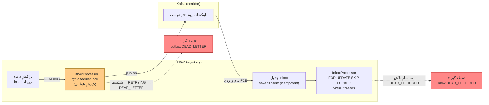

# RB-0010. تخلیه و بازپخش Outbox/Inbox

* **وضعیت**: فعال
* **تاریخ**: 2026-06-04
* **نویسندگان**: تیم معماری Nova
* **دسته‌بندی**: پیام‌رسانی / عملیات (Messaging / Operations)
* **تیکت‌های مرتبط**: [LN-59440](https://jira.dotin.ir/browse/LN-59440) (نقاط‌پایانیِ ops مدیریت)، [LN-59441](https://jira.dotin.ir/browse/LN-59441) (رفعِ پاکتِ خطای 500 در inbox)، [LN-59394](https://jira.dotin.ir/browse/LN-59394) (ایندکسِ جزئیِ پولرِ outbox)

> این Runbook مکملِ [RB-0011](RB-0011.saga-stuck-compensation-recovery.md) است. هر دو از یک سطحِ مدیریتِ `/v1/ops`
> استفاده می‌کنند، اما این یکی به جریانِ outbox/inbox می‌پردازد و RB-0011 به ساگا. هنگامی که یک رویدادِ outbox به
> ساگایی گیرکرده وابسته است، هر دو را با هم بخوانید.

## زمینه (Context)

Nova رویدادهای دامنه را با الگوی **transactional outbox** منتشر می‌کند و پیام‌های ورودیِ FCB را با الگوی
**idempotent inbox** مصرف می‌کند. هر دو سمت توسط چارچوبِ pangaea-messaging تأمین می‌شوند:

- **Outbox.** نوشتنِ رویداد در همان تراکنشِ تغییرِ aggregate انجام می‌شود (روی جدولِ per-aggregate). یک پولرِ
  زمان‌بندی‌شده (`OutboxProcessor`) رکوردهای `PENDING`/`RETRYING` را برمی‌دارد و روی Kafka منتشر می‌کند. شکستِ
  انتشار رکورد را به `RETRYING` و سپس — پس از اتمامِ تلاش‌ها — به `DEAD_LETTER` می‌برد.
- **Inbox.** هر پیامِ ورودی پیش از پردازش به‌صورتِ idempotent در جدولِ inbox ثبت می‌شود (`saveIfAbsent`؛ نقضِ کلیدِ
  یکتا = `AlreadyPersisted` ⇒ تکرار بی‌اثر). `InboxProcessor` با `FOR UPDATE SKIP LOCKED` یک batch را claim می‌کند،
  هندلرها را روی virtual threadها اجرا می‌کند و در صورتِ اتمامِ تلاش‌ها پیام را `DEAD_LETTERED` می‌کند.

نقاط‌پایانیِ مدیریتِ ops (LN-59440) سطحِ کنترلِ عملیاتیِ این دو پایپ‌لاین‌اند:

- خواندنی (همیشه روشن): `GET /v1/ops/outbox`, `GET /v1/ops/inbox` (جست‌وجو، `/summary`، `/dead-letters`، detail،
  `/retry-status`).
- نوشتنی (فقط وقتی `read-only=false`): `POST /v1/ops/outbox/{aggregateType}/{eventId}/retry`،
  `POST /v1/ops/outbox/republish`، `POST /v1/ops/inbox/{id}/retry`.

> **توجه به مسیرِ نسخه‌دار.** کنترلرها روی `@RequestMapping("/v{version}/ops/...")` با `version="1"` نگاشت می‌شوند؛
> مسیرِ مؤثر در نسخهٔ ۱ همان `/v1/ops/...` است. مقادیرِ بالا از کدِ کنترلرها تأیید شده‌اند (نه حدس).

ایندکسِ جزئیِ پولر (LN-59394) جداولِ `loan_*_outbox_events` را روی `(status, aggregate_id, sequence_number)` با
`WHERE status IN ('PENDING','RETRYING')` ایندکس می‌کند تا dispatchِ `LIMIT` بدونِ گرهِ sort سرو شود و ایندکس کوچک
بماند (رکوردهای processed/dead-letter حذف‌اند).

<div dir="ltr">



</div>

## علائم / تشخیص (Symptoms / Diagnosis)

نشانه‌های یک outbox یا inbox گیرکرده/انباشته:

- **lag پولرِ outbox.** رشدِ پایدارِ تعدادِ رکوردهای `PENDING`/`RETRYING` در `loan_*_outbox_events`؛ رویدادهای
  پایین‌دستی (FCB / مصرف‌کننده‌ها) دیر می‌رسند. در APM، فاصلهٔ زمانیِ بینِ commit و publish بالا می‌رود.
- **انباشتِ DEAD_LETTER در outbox.** رکوردها به `DEAD_LETTER` می‌رسند (انتشارِ ناموفقِ پس از اتمامِ تلاش‌ها).
- **عقب‌ماندنِ inbox.** رشدِ رکوردهای در حالتِ pending/claimed در جدولِ inbox؛ یا انباشتِ `DEAD_LETTERED`.
- **خطای 500 پاکتِ inbox (LN-59441).** پیش از این رفع، یک خطای داخلیِ نگاشتِ پاکت می‌توانست مسیرِ ops inbox را
  500 کند؛ اکنون پاکتِ خطا درست ساخته می‌شود. اگر باز هم 500 دیدید، نسخهٔ سرویس را بررسی کنید.

شمارشِ مستقیمِ جداول (Postgres-MCP / `psql`):

<div dir="ltr">

```sql
-- وضعیت outbox به‌تفکیک جدولِ per-aggregate
SELECT 'loan_facility'        AS tbl, status, count(*) FROM loan_facility_outbox_events        GROUP BY status
UNION ALL
SELECT 'installment_schedule', status, count(*) FROM installment_schedule_outbox_events GROUP BY status
UNION ALL
SELECT 'loan_arrangement',     status, count(*) FROM loan_arrangement_outbox_events     GROUP BY status
UNION ALL
SELECT 'loan_type',            status, count(*) FROM loan_type_outbox_events            GROUP BY status
ORDER BY tbl, status;

-- قدیمی‌ترین رکوردِ منتشرنشده (سنِ lag)
SELECT min(created_at) AS oldest_pending, now() - min(created_at) AS lag
FROM loan_facility_outbox_events
WHERE status IN ('PENDING','RETRYING');
```

</div>

سطحِ ops برای تشخیصِ بدونِ SQL (ترجیحی برای اپراتور):

<div dir="ltr">

```bash
curl -sH "Authorization: Bearer $OPS_TOKEN" \
  "$NOVA/v1/ops/outbox/summary"
curl -sH "Authorization: Bearer $OPS_TOKEN" \
  "$NOVA/v1/ops/outbox/dead-letters?size=50"
curl -sH "Authorization: Bearer $OPS_TOKEN" \
  "$NOVA/v1/ops/inbox/dead-letters?size=50"
```

</div>

## رویّهٔ گام‌به‌گام (Step-by-step)

### ۱) آیا پولر زنده است؟

پیش از هر اقدامِ دستی، تأیید کنید پولر کار می‌کند (یک نمونهٔ فعال در کلِ ناوگان — به بخشِ چند‌نمونه‌ای مراجعه کنید).
اگر `summary` در حالِ کاهشِ صفِ `PENDING` است، lag گذرا است و نیازی به مداخله نیست. اگر صف **ثابت** است، پولر یا
متوقف است یا تک‌نمونهٔ دارای lock مرده است.

### ۲) تخلیه (drain) از طریقِ سطحِ ops

سطحِ ops رکوردها را مستقیم پاک نمی‌کند؛ آن‌ها را دوباره به جریان برمی‌گرداند تا پولرِ معمول تخلیه‌شان کند:

- **بازپخشِ رکوردهای processedِ outbox** (مثلاً پس از یک مصرف‌کنندهٔ پایین‌دستیِ از‌دست‌رفته):

<div dir="ltr">

```bash
# درخواستِ کران‌دار الزامی است؛ درخواستِ بی‌کران با 400 رد می‌شود
curl -sX POST -H "Authorization: Bearer $OPS_TOKEN" -H 'Content-Type: application/json' \
  "$NOVA/v1/ops/outbox/republish" \
  -d '{"aggregateType":"TradeLoanFacility","from":"2026-06-04T00:00:00Z","to":"2026-06-04T06:00:00Z","limit":200}'
```

</div>

  پاسخ `RepublishResponse{count}` تعدادِ رکوردهای بازگردانده‌شده به `PENDING` را می‌دهد. `limit` در سرویس به سقفِ
  `maxRepublish` (پیش‌فرضِ ۵۰۰) کلَمپ می‌شود.

### ۳) بازپخش/Redrive از DLQ

- **outbox DEAD_LETTER → retry** (فقط رکوردِ `DEAD_LETTER`، در غیر این صورت 409؛ رکوردِ قفل‌شده هم 409):

<div dir="ltr">

```bash
curl -sX POST -H "Authorization: Bearer $OPS_TOKEN" \
  "$NOVA/v1/ops/outbox/TradeLoanFacility/$EVENT_ID/retry"   # 204 No Content در موفقیت
```

</div>

  مسیرِ `eventId` با `aggregateType` مقیّد می‌شود چون جداولِ outbox **per-aggregate** هستند — `aggregateType` می‌تواند
  نامِ ساده یا FQN باشد.

- **inbox DEAD_LETTERED → retry** (فقط رکوردِ `DEAD_LETTERED` و قفل‌نشده، در غیر این صورت 409):

<div dir="ltr">

```bash
curl -sX POST -H "Authorization: Bearer $OPS_TOKEN" \
  "$NOVA/v1/ops/inbox/$INBOX_ID/retry"                      # 204 No Content در موفقیت
```

</div>

> **توجه به DLT کافکا.** تاپیکِ dead-letterِ کافکا در Nova **به‌صورتِ طراحی غیرفعال** است
> (`platform.messaging.dead-letter.enabled: false` — `messaging.yml`): dedupِ inbox + کلیدهای idempotency + مهلتِ
> درخواست همهٔ حالاتِ از‌دست‌رفتن/سمّی را پوشش می‌دهند. DLQِ واقعی همان جداولِ `dead_letter_messages`/
> `dlq_message_headers` (چارچوب) است که سطحِ ops از روی آن کار می‌کند، نه یک تاپیکِ موازیِ کافکا.

### ۴) چرا تکرارِ تحویل امن است (idempotent inbox)

هر redrive یا redeliveryِ broker بی‌خطر است: `InboxService.saveIfAbsent` نقضِ کلیدِ یکتا را به `AlreadyPersisted`
ترجمه می‌کند، پس پردازشِ دوبارهٔ یک پیامِ از پیش‌دیده‌شده no-op است. به همین دلیل عملیاتِ retry/republish را می‌توان
بی‌نگرانی از duplicate تکرار کرد.

## محیط چندنمونه‌ای (Multi-instance)

Nova چند JVM هم‌زمان است؛ پولرها باید ناوگان‌امن باشند:

- **پولرِ outbox تک‌فعال است.** `OutboxProcessor.processEvents` با
  `@SchedulerLock(name="OutboxProcessor_processEvents", lockAtMostFor="9m")` محافظت می‌شود — در هر لحظه فقط یک نمونه
  در کلِ ناوگان پولر را اجرا می‌کند (ShedLock روی جدولِ `shedlock`). بازیابیِ رکوردهای stale نیز جداگانه
  `@SchedulerLock(name="OutboxProcessor_recoverStale")` دارد. نتیجه: تخلیه دوبار اجرا نمی‌شود.
- **پولرِ inbox تک‌فعال + claim ایمن.** `InboxProcessor.processBatch` با
  `@SchedulerLock(name="platform-inbox-processor")` و claimِ batch با `FOR UPDATE SKIP LOCKED` کار می‌کند؛ حتی اگر دو
  نمونه هم‌زمان وارد شوند، SKIP LOCKED تضمین می‌کند هر رکورد فقط یک‌بار claim شود.
- پیامدِ عملیاتی: مداخلهٔ دستیِ شما (retry/republish) را **هر نمونه‌ای** می‌پذیرد؛ تخلیهٔ بعدی توسطِ تک‌نمونهٔ
  دارای lock انجام می‌شود. نیازی به هدف‌گیریِ نمونهٔ خاص نیست.

## بازیابی / Rollback

- اقدامات از طریقِ سطحِ ops **غیرمخرب**اند: republish فقط `PROCESSED → PENDING` می‌برد و retry فقط رکوردِ
  `DEAD_LETTER`/`DEAD_LETTERED` را دوباره صف می‌کند. اگر بازپخش بیش از حد بود، اثرِ آن صرفاً انتشارِ مجددِ رویدادهاست؛
  مصرف‌کننده‌ها idempotent (کلیدِ inbox سمتِ مقابل) آن را خنثی می‌کنند.
- اگر سطحِ نوشتنیِ ops به اشتباه باز مانده بود، آن را با `read-only=true` در KV ببندید (به مرجعِ زیر مراجعه کنید) و
  پولر را دست‌نخورده بگذارید — پولر مستقل از سطحِ ops کار می‌کند.
- هیچ تغییرِ schema لازم نیست؛ این یک رویّهٔ صرفاً عملیاتی است.

## راستی‌آزمایی (Verification)

۱. **صفِ outbox در حالِ کاهش.** کوئریِ شمارشِ بالا را تکرار کنید؛ `PENDING`+`RETRYING` باید نزولی باشد و
   `oldest_pending` lag رو به صفر برود.

۲. **APM data streams (Kibana).** روی پنجرهٔ اقدام:
   - شمارشِ خطا روی `logs-apm.error-default` (`service.name=nova-service`) — صفر/ناچیزِ خطای انتشارِ outbox و
     خطای هندلرِ inbox.
   - رویدادهای انتشارِ موفق در `logs-apm.app.nova_service-default`.
   - در `traces-apm-default`، اسپن‌های publishِ outbox و پردازشِ inbox دوباره با تأخیرِ نرمال ظاهر می‌شوند.

۳. **خالی‌شدنِ DLQ.** `GET /v1/ops/outbox/dead-letters` و `GET /v1/ops/inbox/dead-letters` پس از redrive نباید همان
   رکوردها را نشان دهند؛ رکوردِ retry‌شده یا به `PENDING` رفته یا (در inbox) دوباره پردازش شده است.

۴. **سلامتِ پایگاه‌داده (Postgres-MCP).** `pg_stat_activity` نشان دهد پولر در حالِ پیشرفت است (کوئری‌های
   `findEventsForProcessing` کوتاه‌اند، نه قفل‌مانده).

## مراجع (References)

- نقاط‌پایانیِ ops: [LN-59440](https://jira.dotin.ir/browse/LN-59440)؛ رفعِ پاکتِ inbox-500:
  [LN-59441](https://jira.dotin.ir/browse/LN-59441)؛ ایندکسِ پولر: [LN-59394](https://jira.dotin.ir/browse/LN-59394).
- کنترلرهای ops:
  `pangaea » pangaea-messaging/pangaea-outbox-management/.../rest/OutboxOperationsController.java`
  (`/v{version}/ops/outbox`)،
  `pangaea » pangaea-messaging/pangaea-inbox-management/.../rest/InboxOperationsController.java`
  (`/v{version}/ops/inbox`). SPIها: `OutboxAdminPort` (`pangaea-outbox-api`)، `InboxAdminPort` (`pangaea-inbox-api`).
- گیتِ read-only: `platform.messaging.outbox.management.read-only` / `platform.messaging.inbox.management.read-only`
  (پیش‌فرض `true` ⇒ مسیرهای نوشتنی 404). برای فعال‌سازیِ ops نوشتنی در KV `false` کنید.
- ایندکسِ پولر: `nova » container/.../db/changelog/trade-loan/v2026.5.57/012-add-outbox-poller-index.xml`.
- جداولِ DLQ: `pangaea » pangaea-persistence/.../db/changelog/framework/v2026.3.0/002-create-dead-letter-tables.xml`.
- رشته‌های پردازنده: `nova-config » kv/core/loan/nova/nova-service/messaging.yml`
  (`platform.messaging.outbox.processor-threads: 3`، `platform.messaging.inbox.processor-threads: 3`،
  `platform.messaging.dead-letter.enabled: false`).
- ShedLock: `OutboxProcessor` / `InboxProcessor` در `pangaea-outbox-core` / `pangaea-inbox-core`.
- Runbookِ مرتبط: [RB-0011](RB-0011.saga-stuck-compensation-recovery.md) (ساگای گیرکرده و جبران).
