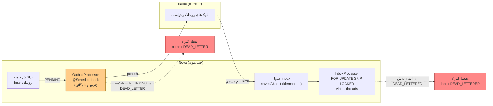

# RB-0010. تخلیه و بازپخش Outbox/Inbox

* **وضعیت**: فعال
* **تاریخ**: 2026-06-04
* **نویسندگان**: تیم معماری Nova
* **دسته‌بندی**: پیام‌رسانی / عملیات (Messaging / Operations)
* **تیکت‌های مرتبط**: [LN-59440](https://jira.dotin.ir/browse/LN-59440) (ops endpointهای مدیریتی)، [LN-59441](https://jira.dotin.ir/browse/LN-59441) (رفع خطای 500 در envelope مسیر inbox)، [LN-59394](https://jira.dotin.ir/browse/LN-59394) (partial index پولر outbox)

> این Runbook مکمل [RB-0011](RB-0011.saga-stuck-compensation-recovery.md) است. هر دو از همان سطح مدیریتی `/v1/ops`
> استفاده می‌کنند، با این تفاوت که این یکی روی جریان outbox/inbox تمرکز دارد و RB-0011 روی saga. اگر یک رویداد outbox
> به یک saga گیرکرده وابسته بود، هر دو را با هم بخوانید.

## زمینه (Context)

Nova رویدادهای دامنه را با الگوی **transactional outbox** منتشر می‌کند و پیام‌های ورودی FCB را با الگوی
**idempotent inbox** مصرف می‌کند. هر دو سمت روی فریم‌ورک pangaea-messaging بنا شده‌اند:

- **Outbox.** رویداد در همان تراکنشی نوشته می‌شود که aggregate را تغییر می‌دهد (روی جدول per-aggregate). یک پولر
  زمان‌بندی‌شده (`OutboxProcessor`) رکوردهای `PENDING`/`RETRYING` را برمی‌دارد و روی Kafka منتشر می‌کند. اگر انتشار
  شکست بخورد رکورد به `RETRYING` و در نهایت — بعد از تمام‌شدن تلاش‌ها — به `DEAD_LETTER` می‌رود.
- **Inbox.** هر پیام ورودی پیش از پردازش به‌شکل idempotent در جدول inbox ثبت می‌شود (`saveIfAbsent`؛ نقض کلید
  یکتا = `AlreadyPersisted` ⇒ تکرار بی‌اثر است). `InboxProcessor` با `FOR UPDATE SKIP LOCKED` یک batch را claim می‌کند،
  هندلرها را روی virtual threadها اجرا می‌کند و اگر تلاش‌ها تمام شود پیام را `DEAD_LETTERED` می‌کند.

ops endpointهای مدیریتی (LN-59440) سطح کنترل عملیاتی این دو پایپ‌لاین هستند:

- خواندنی (همیشه فعال): `GET /v1/ops/outbox`, `GET /v1/ops/inbox` (جست‌وجو، `/summary`، `/dead-letters`، detail،
  `/retry-status`).
- نوشتنی (فقط وقتی `read-only=false`): `POST /v1/ops/outbox/{aggregateType}/{eventId}/retry`،
  `POST /v1/ops/outbox/republish`، `POST /v1/ops/inbox/{id}/retry`.

> **نکته دربارهٔ مسیر نسخه‌دار.** کنترلرها روی `@RequestMapping("/v{version}/ops/...")` با `version="1"` map می‌شوند؛
> پس مسیر مؤثر در نسخهٔ ۱ همان `/v1/ops/...` است. مقادیر بالا از روی کد کنترلرها تأیید شده‌اند، نه حدس.

partial index پولر (LN-59394) جدول‌های `loan_*_outbox_events` را روی `(status, aggregate_id, sequence_number)` با
شرط `WHERE status IN ('PENDING','RETRYING')` ایندکس می‌کند تا dispatch با `LIMIT` بدون مرحلهٔ sort سرو شود و ایندکس
هم کوچک بماند (رکوردهای processed/dead-letter بیرون می‌مانند).

<div dir="ltr">



</div>

## علائم / تشخیص (Symptoms / Diagnosis)

نشانه‌های یک outbox یا inbox گیرکرده یا انباشته:

- **lag پولر outbox.** تعداد رکوردهای `PENDING`/`RETRYING` در `loan_*_outbox_events` پیوسته بالا می‌رود؛ رویدادهای
  پایین‌دستی (FCB و مصرف‌کننده‌ها) دیر می‌رسند. در APM فاصلهٔ زمانی بین commit و publish زیاد می‌شود.
- **انباشت DEAD_LETTER در outbox.** رکوردها به `DEAD_LETTER` می‌رسند (انتشار بعد از تمام‌شدن تلاش‌ها ناموفق مانده).
- **عقب‌ماندن inbox.** رکوردهای pending/claimed در جدول inbox زیاد می‌شوند، یا `DEAD_LETTERED` انباشته می‌شود.
- **خطای 500 در envelope مسیر inbox (LN-59441).** پیش از این رفع، یک خطای داخلی در ساختن envelope می‌توانست مسیر ops
  inbox را 500 کند؛ حالا envelope خطا درست ساخته می‌شود. اگر باز هم 500 دیدید، نسخهٔ سرویس را بررسی کنید.

شمارش مستقیم جدول‌ها (Postgres-MCP / `psql`):

<div dir="ltr">

```sql
-- وضعیت outbox به‌تفکیک جدولِ per-aggregate
SELECT 'loan_facility'        AS tbl, status, count(*) FROM loan_facility_outbox_events        GROUP BY status
UNION ALL
SELECT 'installment_schedule', status, count(*) FROM installment_schedule_outbox_events GROUP BY status
UNION ALL
SELECT 'loan_arrangement',     status, count(*) FROM loan_arrangement_outbox_events     GROUP BY status
UNION ALL
SELECT 'loan_type',            status, count(*) FROM loan_type_outbox_events            GROUP BY status
ORDER BY tbl, status;

-- قدیمی‌ترین رکوردِ منتشرنشده (سنِ lag)
SELECT min(created_at) AS oldest_pending, now() - min(created_at) AS lag
FROM loan_facility_outbox_events
WHERE status IN ('PENDING','RETRYING');
```

</div>

سطح ops برای تشخیص بدون SQL (راه ترجیحی برای اپراتور):

<div dir="ltr">

```bash
curl -sH "Authorization: Bearer $OPS_TOKEN" \
  "$NOVA/v1/ops/outbox/summary"
curl -sH "Authorization: Bearer $OPS_TOKEN" \
  "$NOVA/v1/ops/outbox/dead-letters?size=50"
curl -sH "Authorization: Bearer $OPS_TOKEN" \
  "$NOVA/v1/ops/inbox/dead-letters?size=50"
```

</div>

## رویّهٔ گام‌به‌گام (Step-by-step)

### ۱) آیا پولر زنده است؟

پیش از هر اقدام دستی، مطمئن شوید پولر کار می‌کند (در کل ناوگان یک نمونهٔ فعال — به بخش چندنمونه‌ای مراجعه کنید).
اگر `summary` نشان می‌دهد صف `PENDING` در حال کم‌شدن است، lag گذرا است و مداخله لازم نیست. اگر صف **ثابت** مانده،
یا پولر متوقف شده یا همان نمونه‌ای که lock را دارد مرده است.

### ۲) تخلیه (drain) از طریق سطح ops

سطح ops رکوردها را مستقیم پاک نمی‌کند؛ آن‌ها را دوباره وارد جریان می‌کند تا پولر معمول خودش تخلیه‌شان کند:

- **بازپخش رکوردهای processed در outbox** (مثلاً وقتی یک مصرف‌کنندهٔ پایین‌دستی پیامی را از دست داده):

<div dir="ltr">

```bash
# درخواستِ کران‌دار الزامی است؛ درخواستِ بی‌کران با 400 رد می‌شود
curl -sX POST -H "Authorization: Bearer $OPS_TOKEN" -H 'Content-Type: application/json' \
  "$NOVA/v1/ops/outbox/republish" \
  -d '{"aggregateType":"TradeLoanFacility","from":"2026-06-04T00:00:00Z","to":"2026-06-04T06:00:00Z","limit":200}'
```

</div>

  پاسخ `RepublishResponse{count}` می‌گوید چند رکورد به `PENDING` برگردانده شده. `limit` در سرویس تا سقف
  `maxRepublish` (پیش‌فرض ۵۰۰) clamp می‌شود.

### ۳) بازپخش/Redrive از DLQ

- **outbox DEAD_LETTER → retry** (فقط روی رکورد `DEAD_LETTER`؛ در غیر این صورت 409، رکورد قفل‌شده هم 409):

<div dir="ltr">

```bash
curl -sX POST -H "Authorization: Bearer $OPS_TOKEN" \
  "$NOVA/v1/ops/outbox/TradeLoanFacility/$EVENT_ID/retry"   # 204 No Content در موفقیت
```

</div>

  مسیر `eventId` همراه `aggregateType` می‌آید چون جدول‌های outbox **per-aggregate** هستند — `aggregateType` می‌تواند
  نام ساده یا FQN باشد.

- **inbox DEAD_LETTERED → retry** (فقط روی رکورد `DEAD_LETTERED` و قفل‌نشده؛ در غیر این صورت 409):

<div dir="ltr">

```bash
curl -sX POST -H "Authorization: Bearer $OPS_TOKEN" \
  "$NOVA/v1/ops/inbox/$INBOX_ID/retry"                      # 204 No Content در موفقیت
```

</div>

> **نکته دربارهٔ DLT کافکا.** تاپیک dead-letter کافکا در Nova **عمداً و طبق طراحی غیرفعال** است
> (`platform.messaging.dead-letter.enabled: false` — `messaging.yml`): dedup inbox + کلیدهای idempotency + مهلت
> درخواست، همهٔ حالت‌های گم‌شدن یا پیام سمی را پوشش می‌دهند. DLQ واقعی همان جدول‌های `dead_letter_messages`/
> `dlq_message_headers` فریم‌ورک است که سطح ops روی آن کار می‌کند، نه یک تاپیک موازی کافکا.

### ۴) چرا تکرار تحویل امن است (idempotent inbox)

هر redrive یا redelivery از سمت broker بی‌خطر است: `InboxService.saveIfAbsent` نقض کلید یکتا را به `AlreadyPersisted`
تبدیل می‌کند، پس پردازش دوبارهٔ پیامی که قبلاً دیده شده no-op است. به همین خاطر retry/republish را بی‌نگرانی از
duplicate می‌توان تکرار کرد.

## محیط چندنمونه‌ای (Multi-instance)

Nova چند JVM هم‌زمان دارد؛ پولرها باید در کل ناوگان امن باشند:

- **پولر outbox تک‌فعال است.** `OutboxProcessor.processEvents` با
  `@SchedulerLock(name="OutboxProcessor_processEvents", lockAtMostFor="9m")` محافظت می‌شود — در هر لحظه فقط یک نمونه
  در کل ناوگان پولر را اجرا می‌کند (ShedLock روی جدول `shedlock`). بازیابی رکوردهای stale هم lock جداگانهٔ
  `@SchedulerLock(name="OutboxProcessor_recoverStale")` دارد. نتیجه اینکه تخلیه دوبار اجرا نمی‌شود.
- **پولر inbox تک‌فعال + claim امن.** `InboxProcessor.processBatch` با
  `@SchedulerLock(name="platform-inbox-processor")` و claim کردن batch با `FOR UPDATE SKIP LOCKED` کار می‌کند؛ حتی اگر
  دو نمونه هم‌زمان وارد شوند، SKIP LOCKED تضمین می‌کند هر رکورد فقط یک‌بار claim شود.
- پیامد عملیاتی: مداخلهٔ دستی شما (retry/republish) را **هر نمونه‌ای** می‌پذیرد؛ تخلیهٔ بعدی را همان نمونه‌ای که lock
  را دارد انجام می‌دهد. لازم نیست نمونهٔ خاصی را هدف بگیرید.

## بازیابی / Rollback

- اقدام‌ها از طریق سطح ops **غیرمخرب** هستند: republish فقط `PROCESSED → PENDING` می‌برد و retry فقط رکورد
  `DEAD_LETTER`/`DEAD_LETTERED` را دوباره صف می‌کند. اگر بیش از حد بازپخش کردید، تنها اثرش انتشار دوبارهٔ رویدادهاست و
  مصرف‌کننده‌ها چون idempotent هستند (کلید inbox طرف مقابل) آن را خنثی می‌کنند.
- اگر سطح نوشتنی ops اشتباهاً باز مانده، آن را با `read-only=true` در KV ببندید (مرجع زیر را ببینید) و پولر را
  دست‌نخورده بگذارید — پولر مستقل از سطح ops کار می‌کند.
- هیچ تغییر schema لازم نیست؛ این صرفاً یک رویّهٔ عملیاتی است.

## راستی‌آزمایی (Verification)

۱. **صف outbox در حال کاهش است.** کوئری شمارش بالا را تکرار کنید؛ `PENDING`+`RETRYING` باید نزولی باشد و
   `oldest_pending` lag به سمت صفر برود.

۲. **APM data streams (Kibana).** در پنجرهٔ زمانیِ اقدام:
   - شمارش خطا روی `logs-apm.error-default` (`service.name=nova-service`) — خطای انتشار outbox و خطای هندلر inbox
     صفر یا ناچیز باشد.
   - رویدادهای انتشار موفق در `logs-apm.app.nova_service-default`.
   - در `traces-apm-default`، اسپن‌های publish outbox و پردازش inbox دوباره با تأخیر نرمال ظاهر شوند.

۳. **خالی‌شدن DLQ.** `GET /v1/ops/outbox/dead-letters` و `GET /v1/ops/inbox/dead-letters` بعد از redrive نباید همان
   رکوردها را نشان دهند؛ رکورد retry‌شده یا به `PENDING` رفته یا (در inbox) دوباره پردازش شده است.

۴. **سلامت دیتابیس (Postgres-MCP).** `pg_stat_activity` نشان دهد پولر در حال پیشروی است (کوئری‌های
   `findEventsForProcessing` کوتاه‌اند، نه قفل‌مانده).

## مراجع (References)

- ops endpointها: [LN-59440](https://jira.dotin.ir/browse/LN-59440)؛ رفع envelope خطای inbox-500:
  [LN-59441](https://jira.dotin.ir/browse/LN-59441)؛ index پولر: [LN-59394](https://jira.dotin.ir/browse/LN-59394).
- کنترلرهای ops:
  `pangaea » pangaea-messaging/pangaea-outbox-management/.../rest/OutboxOperationsController.java`
  (`/v{version}/ops/outbox`)،
  `pangaea » pangaea-messaging/pangaea-inbox-management/.../rest/InboxOperationsController.java`
  (`/v{version}/ops/inbox`). SPIها: `OutboxAdminPort` (`pangaea-outbox-api`)، `InboxAdminPort` (`pangaea-inbox-api`).
- گیت read-only: `platform.messaging.outbox.management.read-only` / `platform.messaging.inbox.management.read-only`
  (پیش‌فرض `true` ⇒ مسیرهای نوشتنی 404). برای فعال‌کردن ops نوشتنی، در KV آن را `false` کنید.
- index پولر: `nova » container/.../db/changelog/trade-loan/v2026.5.57/012-add-outbox-poller-index.xml`.
- جدول‌های DLQ: `pangaea » pangaea-persistence/.../db/changelog/framework/v2026.3.0/002-create-dead-letter-tables.xml`.
- thread‌های پردازنده: `nova-config » kv/core/loan/nova/nova-service/messaging.yml`
  (`platform.messaging.outbox.processor-threads: 3`، `platform.messaging.inbox.processor-threads: 3`،
  `platform.messaging.dead-letter.enabled: false`).
- ShedLock: `OutboxProcessor` / `InboxProcessor` در `pangaea-outbox-core` / `pangaea-inbox-core`.
- Runbook مرتبط: [RB-0011](RB-0011.saga-stuck-compensation-recovery.md) (saga گیرکرده و جبران).
