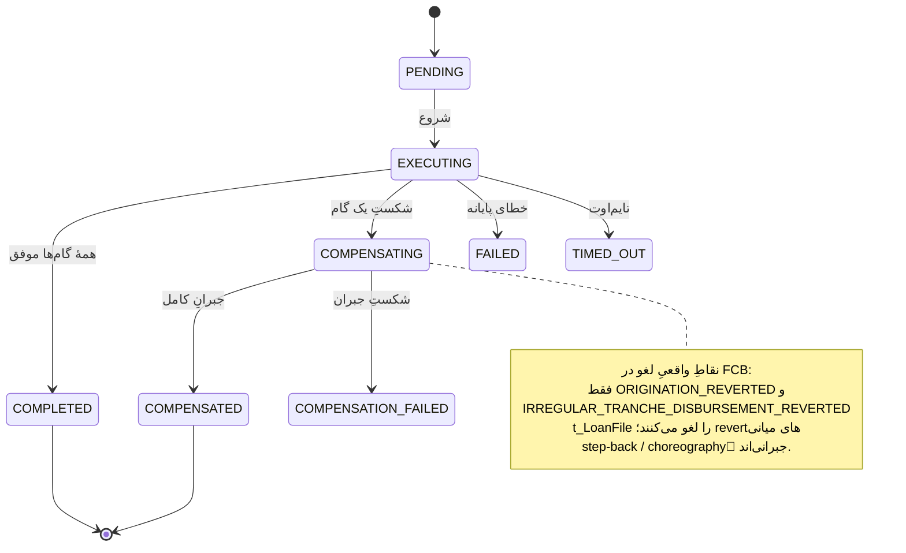

# RB-0011. بازیابی Saga گیرکرده و جبران (Compensation)

* **وضعیت**: فعال
* **تاریخ**: 2026-06-04
* **نویسندگان**: تیم معماری Nova
* **دسته‌بندی**: ساگا / عملیات (Saga / Operations)
* **تیکت‌های مرتبط**: [LN-59417](https://jira.dotin.ir/browse/LN-59417) (ساگای all-or-none + حذفِ facetِ Flow/suspend)، [LN-59391](https://jira.dotin.ir/browse/LN-59391) (هندلرهای orchestration رویداد برنمی‌گردانند)

> این Runbook مکملِ [RB-0010](RB-0010.outbox-inbox-drain-replay.md) است. هر دو از سطحِ `/v1/ops` استفاده می‌کنند؛
> این یکی به ساگا و جبران می‌پردازد. وقتی یک ساگا روی انتشارِ یک رویدادِ outbox گیر کرده، RB-0010 را هم بخوانید.

## زمینه (Context)

ساگاهای Nova توسطِ ارکستراتورِ FSM-محورِ pangaea اجرا می‌شوند. مدلِ فعلی **all-or-none** است (LN-59417): حالتِ
`SUSPENDED` و استراتژیِ `STOP_ON_STEP` و facet/headerهای Flow حذف شده‌اند. هر ساگای غیرپایانه یا به پایان می‌رسد یا
کاملاً جبران می‌شود — حالتِ «پارک‌شده روی یک گام» وجود ندارد. مهاجرتِ DB رکوردهای `SUSPENDED` باقی‌مانده را پاک کرده
(در غیر این صورت بارگذاریِ `EnumType.STRING` با ناپدیدشدنِ مقدار enum می‌شکست).

حالت‌های مرتبطِ ماشینِ FSM:

- `PENDING` → `EXECUTING` → `COMPLETED` (مسیرِ موفق).
- در صورتِ شکستِ یک گام: `EXECUTING` → `COMPENSATING` → `COMPENSATED` (یا `COMPENSATION_FAILED`).
- حالت‌های پایانه: `COMPLETED`, `COMPENSATED`. حالت‌های گیرپذیر (نیازمندِ بازیابی): `PENDING`, `EXECUTING`,
  `COMPENSATING` که از آستانهٔ گیر (`stuck-threshold`) عبور کرده‌اند، و `FAILED`/`TIMED_OUT`/`COMPENSATION_FAILED`.

نکتهٔ مهمِ هندلرها (LN-59391): هندلرهای `NonTransactionalCommand` که orchestration/saga-starter را راه می‌اندازند
**باید `List.of()` برگردانند** — رویدادها per-step منتشر می‌شوند، نه از هندلرِ راه‌انداز. سوءاستفاده (برگرداندنِ
رویداد از یک هندلرِ orchestration) را dispatcher fail-fast می‌کند.

<div dir="ltr">



</div>

## علائم / تشخیص (Symptoms / Diagnosis)

- **ساگای گیرکرده.** رکوردی در `saga_instance` که `current_state` آن غیرپایانه است و `updated_at` آن از
  `stuck-threshold` (پیش‌فرض ۵ دقیقه — `audit-saga.yml`) قدیمی‌تر است.
- **جبرانِ شکست‌خورده.** رکوردِ `COMPENSATION_FAILED`، یا ردیف‌های `saga_compensation` با `status` ناموفق.
- **عدمِ پیشروی.** کاربر/journey منتظر می‌ماند؛ در APM، traceِ ساگا روی یک گام معلق است.

کوئریِ حالتِ ساگا (Postgres-MCP / `psql`):

<div dir="ltr">

```sql
-- ساگاهای غیرپایانهٔ قدیمی‌تر از آستانهٔ گیر
SELECT id, saga_type, current_state, updated_at, now() - updated_at AS age
FROM saga_instance
WHERE current_state NOT IN ('COMPLETED','COMPENSATED')
  AND updated_at < now() - interval '5 minutes'
ORDER BY updated_at;

-- وضعیتِ گام‌های جبرانِ یک ساگا
SELECT step_id, status, executed_at, completed_at, error_message
FROM saga_compensation
WHERE saga_id = :saga_id
ORDER BY executed_at;
```

</div>

سطحِ ops برای تشخیصِ بدونِ SQL:

<div dir="ltr">

```bash
curl -sH "Authorization: Bearer $OPS_TOKEN" "$NOVA/v1/ops/sagas?state=COMPENSATING&page=0&pageSize=50"
curl -sH "Authorization: Bearer $OPS_TOKEN" "$NOVA/v1/ops/sagas/$SAGA_ID"
curl -sH "Authorization: Bearer $OPS_TOKEN" "$NOVA/v1/ops/sagas/$SAGA_ID/retry-status"
```

</div>

> **توجه.** سطحِ ops هرگز نوعِ دادهٔ کاربریِ ساگا (`T`)، payload خامِ گام، یا stacktrace را افشا نمی‌کند — فقط حالت،
> timestamp، نسخه و خلاصهٔ کلیدیِ metadata.

## رویّهٔ گام‌به‌گام (Step-by-step)

### ۱) اجازه دهید بازیابیِ خودکار اول تلاش کند

پیش از مداخلهٔ دستی، بدانید یک سرویسِ بازیابیِ زمان‌بندی‌شده وجود دارد:
`SagaRecoveryService.recoverStuckSagas` هر `platform.saga.recovery.interval` (پیش‌فرض ۳۰s) ساگاهای `PENDING`/
`EXECUTING`/`COMPENSATING`ِ گذشته از `stuck-threshold` را دوباره به سمتِ پایان یا جبران می‌راند. اگر رکورد تازه گیر
کرده، یک دورهٔ بازیابی صبر کنید.

### ۲) مداخلهٔ دستی از طریقِ سطحِ ops

اگر بازیابیِ خودکار رکورد را آزاد نکرد، از سه عملیاتِ نوشتنی (فقط وقتی `read-only=false`) استفاده کنید. همهٔ مسیرها
روی `/v1/ops/sagas/{sagaId}/...` و در موفقیت `204`، در حالتِ نامناسب `409` برمی‌گردانند:

<div dir="ltr">

```bash
# از سرگیریِ یک ساگای PENDING/EXECUTING/COMPENSATING
curl -sX POST -H "Authorization: Bearer $OPS_TOKEN" "$NOVA/v1/ops/sagas/$SAGA_ID/resume"

# باز-راندنِ FSM از روی حالتِ گام‌های persist‌شده برای ساگای FAILED/TIMED_OUT
curl -sX POST -H "Authorization: Bearer $OPS_TOKEN" "$NOVA/v1/ops/sagas/$SAGA_ID/force-resume"

# ورودِ مجدد به زنجیرهٔ جبران برای ساگایی که جبرانش شکست خورده
curl -sX POST -H "Authorization: Bearer $OPS_TOKEN" "$NOVA/v1/ops/sagas/$SAGA_ID/retry-compensation"
```

</div>

انتخابِ عملیات:

- `resume` — ساگا هنوز در یک حالتِ زندهٔ غیرپایانه (`PENDING`/`EXECUTING`/`COMPENSATING`) است و فقط متوقف مانده.
- `force-resume` — ساگا به `FAILED`/`TIMED_OUT` رسیده؛ FSM از روی حالتِ گام‌های persist‌شده باز-رانده می‌شود.
- `retry-compensation` — جبران شکست خورده (`COMPENSATION_FAILED`)؛ زنجیرهٔ جبران دوباره وارد می‌شود.

### ۳) choreographyِ جبران و نقاطِ واقعیِ لغو در FCB

هنگام جبران، نگاشتِ ذهنیِ درستی از سمتِ FCB داشته باشید. FCB ردیفِ `t_LoanFile` را **فقط** در دو نقطه لغو می‌کند:
`ORIGINATION_REVERTED` و `IRREGULAR_TRANCHE_DISBURSEMENT_REVERTED`. revertهای میانیِ دیگر **step-back** هستند —
یعنی choreographyِ رویدادِ جبرانی که وضعیت را یک گام عقب می‌برد، نه لغوِ کاملِ پرونده. بنابراین مشاهدهٔ یک
revertِ میانی به‌معنای حذفِ پرونده در FCB نیست؛ اپراتور نباید فرض کند پرونده پاک شده.

### ۴) کلیدهای idempotency (جلوگیری از ساگای phantom)

جدولِ `saga_idempotency` با `resume_key` (PK) از ساختِ ساگای تکراری در فراخوان‌های هم‌زمانِ `startSaga` با یک
کلید جلوگیری می‌کند. به همین دلیل تکرارِ `resume`/`force-resume` ساگای جدید نمی‌سازد — کلیدِ idempotency رکوردِ
موجود را همان نگه می‌دارد.

### ۵) پاک‌سازیِ ساگاهای SUSPENDED (یک‌بار، تاریخی)

با حذفِ حالتِ `SUSPENDED` (LN-59417)، رکوردهای باقی‌مانده توسطِ مهاجرتِ
`006-delete-suspended-sagas.xml` پاک شده‌اند (ابتدا `saga_compensation` با sub-select روی `saga_id`، سپس
`saga_instance`). این یک حذفِ برگشت‌ناپذیر (rollback خالی) است و نباید دستی تکرار شود؛ صرفاً برای آگاهی است که
دیگر هیچ ساگایی نباید در `SUSPENDED` باشد.

## محیط چندنمونه‌ای (Multi-instance)

Nova چند JVM است؛ ارکستراتورِ ساگا باید double-execution نکند:

- **بازیابیِ ساگا تک‌فعال است.** `SagaRecoveryService.recoverStuckSagas` پیش از اجرا lock با نامِ
  `pangaea-saga-recovery` را می‌گیرد؛ اگر نمونهٔ دیگری lock را دارد، دورهٔ بازیابی skip می‌شود
  («another node holds the recovery lock»). پس در هر لحظه فقط یک نمونه ساگاهای گیرکرده را باز می‌راند.
- **استخرِ اجراکنندهٔ ساگا.** `platform.saga.execution.executor-core-pool-size: 4` (`audit-saga.yml`) سقفِ
  هم‌زمانیِ گام‌های ساگا در هر نمونه است؛ این عدد باید زیر `maximum-pool-size` استخرِ Hikari بماند (RB-0001).
- **مداخلهٔ دستی ایمن است.** عملیاتِ ops را هر نمونه‌ای می‌پذیرد؛ کلیدِ idempotency + lockِ بازیابی تضمین می‌کنند
  ساگا دوبار اجرا نشود.

## بازیابی / Rollback

- عملیاتِ `resume`/`force-resume`/`retry-compensation` تنها FSM را از روی حالتِ persist‌شده باز-می‌رانند؛ حالتِ جدیدی
  از هیچ نمی‌سازند. اگر یک عملیات در حالتِ نامناسب فراخوانده شود، 409 می‌گیرید و هیچ تغییری اعمال نمی‌شود.
- اگر سطحِ نوشتنیِ ops به اشتباه باز است، با `platform.saga.management.read-only=true` در KV ببندید (مسیرهای نوشتنی
  404 می‌شوند؛ بازیابیِ خودکار مستقل کار می‌کند).
- در صورتِ جبرانِ ناقص، **پیش از** هر اقدامِ سمتِ FCB، نقاطِ لغوِ بالا را بازبینی کنید تا پرونده‌ای را دوبار لغو
  نکنید.

## راستی‌آزمایی (Verification)

۱. **حالتِ ساگا پایانه شد.** کوئریِ بالا را تکرار کنید؛ ساگا باید به `COMPLETED` یا `COMPENSATED` رسیده باشد و دیگر
   در فهرستِ گیرکرده‌ها نباشد.

۲. **APM data streams (Kibana).**
   - `logs-apm.error-default` (`service.name=nova-service`) — صفرِ خطای جدیدِ ساگا/جبران در پنجرهٔ اقدام.
   - `traces-apm-default` — traceِ ساگا تا گامِ پایانی پیش می‌رود؛ اسپن‌های جبران (در صورتِ مسیرِ جبران) کامل می‌شوند.
   - `logs-apm.app.nova_service-default` — لاگِ بازیابی/جبرانِ موفق.

۳. **ردیف‌های جبران.** `saga_compensation` برای ساگای جبران‌شده وضعیتِ موفق نشان می‌دهد؛ `COMPENSATION_FAILED`
   باقی نمی‌ماند.

۴. **عدمِ ساگای phantom.** `saga_idempotency` ردیفِ یکتا برای `resume_key` نگه داشته؛ شمارشِ `saga_instance` پس از
   مداخله افزایشِ ناخواسته ندارد.

## مراجع (References)

- ساگای all-or-none + حذفِ Flow: [LN-59417](https://jira.dotin.ir/browse/LN-59417)؛ هندلرهای orchestration بدونِ
  رویداد: [LN-59391](https://jira.dotin.ir/browse/LN-59391).
- کنترلرِ ops: `pangaea » pangaea-saga/pangaea-saga-management/.../rest/SagaOperationsController.java`
  (`/v{version}/ops/sagas`؛ مسیرها `resume`/`force-resume`/`retry-compensation`). SPI: `SagaAdminPort`
  (`pangaea-saga-api`)، impl `DefaultSagaAdminPort` (`pangaea-saga-core`).
- گیتِ read-only: `platform.saga.management.read-only` (پیش‌فرض `true` ⇒ مسیرهای نوشتنی 404).
- بازیابی: `pangaea » pangaea-saga/pangaea-saga-starter/.../recovery/SagaRecoveryService.java`
  (lock `pangaea-saga-recovery`؛ حالات `PENDING`/`EXECUTING`/`COMPENSATING`).
- جداولِ ساگا: `pangaea » .../db/changelog/framework/v2026.3.0/003-create-saga-tables.xml`،
  `004-create-saga-idempotency-table.xml`؛ پاک‌سازیِ SUSPENDED:
  `nova » container/.../db/changelog/framework/v2026.3.0/006-delete-suspended-sagas.xml`.
- استخرِ اجراکننده: `nova-config » kv/core/loan/nova/nova-service/audit-saga.yml`
  (`platform.saga.execution.executor-core-pool-size: 4`، `platform.saga.recovery.stuck-threshold: 5m`).
- نقاطِ لغوِ FCB: مدلِ rollback پرونده (`ORIGINATION_REVERTED` + `IRREGULAR_TRANCHE_DISBURSEMENT_REVERTED`).
- Runbookِ مرتبط: [RB-0010](RB-0010.outbox-inbox-drain-replay.md) (تخلیه و بازپخشِ Outbox/Inbox).
