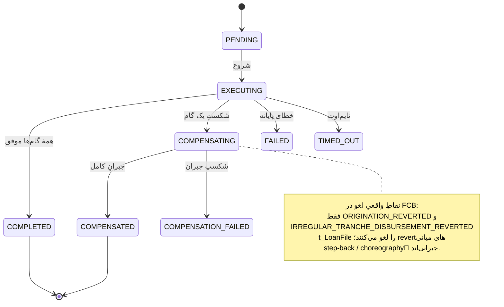

# RB-0011. بازیابی Saga گیرکرده و جبران (Compensation)

* **وضعیت**: فعال
* **تاریخ**: 2026-06-04
* **نویسندگان**: تیم معماری Nova
* **دسته‌بندی**: ساگا / عملیات (Saga / Operations)
* **تیکت‌های مرتبط**: [LN-59417](https://jira.dotin.ir/browse/LN-59417) (saga به‌صورت all-or-none + حذف facet مربوط به Flow/suspend)، [LN-59391](https://jira.dotin.ir/browse/LN-59391) (هندلرهای orchestration رویداد برنمی‌گردانند)

> این Runbook مکمل [RB-0010](RB-0010.outbox-inbox-drain-replay.md) است. هر دو از سطح `/v1/ops` استفاده می‌کنند؛
> این یکی روی saga و جبران تمرکز دارد. اگر یک saga روی انتشار یک رویداد outbox گیر کرده، RB-0010 را هم بخوانید.

## زمینه (Context)

ساگاهای Nova را ارکستراتور FSM-محور pangaea اجرا می‌کند. مدل فعلی **all-or-none** است (LN-59417): حالت
`SUSPENDED`، استراتژی `STOP_ON_STEP` و facet/headerهای Flow حذف شده‌اند. هر saga غیرپایانه یا به پایان می‌رسد یا
کاملاً جبران می‌شود — حالت «پارک‌شده روی یک گام» دیگر وجود ندارد. مهاجرت DB رکوردهای `SUSPENDED` باقی‌مانده را پاک کرده
(وگرنه load با `EnumType.STRING` به‌خاطر حذف مقدار enum می‌شکست).

حالت‌های مرتبط ماشین FSM:

- `PENDING` → `EXECUTING` → `COMPLETED` (مسیر موفق).
- اگر یک گام شکست بخورد: `EXECUTING` → `COMPENSATING` → `COMPENSATED` (یا `COMPENSATION_FAILED`).
- حالت‌های پایانه: `COMPLETED`, `COMPENSATED`. حالت‌هایی که می‌توانند گیر کنند (و بازیابی لازم دارند): `PENDING`,
  `EXECUTING`, `COMPENSATING` که از آستانهٔ گیر (`stuck-threshold`) گذشته‌اند، و `FAILED`/`TIMED_OUT`/`COMPENSATION_FAILED`.

نکتهٔ مهم دربارهٔ هندلرها (LN-59391): هندلرهای `NonTransactionalCommand` که orchestration/saga-starter را راه می‌اندازند
**باید `List.of()` برگردانند** — رویدادها per-step منتشر می‌شوند، نه از هندلر راه‌انداز. اگر کسی این را رعایت نکند
(رویداد را از یک هندلر orchestration برگرداند)، dispatcher بلافاصله fail-fast می‌کند.

<div dir="ltr">



</div>

## علائم / تشخیص (Symptoms / Diagnosis)

- **saga گیرکرده.** رکوردی در `saga_instance` که `current_state` آن غیرپایانه است و `updated_at` آن قدیمی‌تر از
  `stuck-threshold` است (پیش‌فرض ۵ دقیقه — `audit-saga.yml`).
- **جبران شکست‌خورده.** رکورد `COMPENSATION_FAILED`، یا ردیف‌های `saga_compensation` با `status` ناموفق.
- **پیشروی نکردن.** کاربر یا journey منتظر می‌ماند؛ در APM، trace مربوط به saga روی یک گام معلق مانده.

کوئری حالت saga (Postgres-MCP / `psql`):

<div dir="ltr">

```sql
-- ساگاهای غیرپایانهٔ قدیمی‌تر از آستانهٔ گیر
SELECT id, saga_type, current_state, updated_at, now() - updated_at AS age
FROM saga_instance
WHERE current_state NOT IN ('COMPLETED','COMPENSATED')
  AND updated_at < now() - interval '5 minutes'
ORDER BY updated_at;

-- وضعیتِ گام‌های جبرانِ یک ساگا
SELECT step_id, status, executed_at, completed_at, error_message
FROM saga_compensation
WHERE saga_id = :saga_id
ORDER BY executed_at;
```

</div>

سطح ops برای تشخیص بدون SQL:

<div dir="ltr">

```bash
curl -sH "Authorization: Bearer $OPS_TOKEN" "$NOVA/v1/ops/sagas?state=COMPENSATING&page=0&pageSize=50"
curl -sH "Authorization: Bearer $OPS_TOKEN" "$NOVA/v1/ops/sagas/$SAGA_ID"
curl -sH "Authorization: Bearer $OPS_TOKEN" "$NOVA/v1/ops/sagas/$SAGA_ID/retry-status"
```

</div>

> **نکته.** سطح ops هرگز نوع دادهٔ کاربری saga (`T`)، payload خام گام یا stacktrace را افشا نمی‌کند — فقط حالت،
> timestamp، نسخه و خلاصهٔ کلیدی metadata را برمی‌گرداند.

## رویّهٔ گام‌به‌گام (Step-by-step)

### ۱) اول بگذارید بازیابی خودکار تلاش کند

پیش از مداخلهٔ دستی، توجه کنید که یک سرویس بازیابی زمان‌بندی‌شده وجود دارد:
`SagaRecoveryService.recoverStuckSagas` هر `platform.saga.recovery.interval` (پیش‌فرض ۳۰s) ساگاهای `PENDING`/
`EXECUTING`/`COMPENSATING` که از `stuck-threshold` گذشته‌اند را دوباره به سمت پایان یا جبران می‌راند. اگر رکورد تازه
گیر کرده، یک دورهٔ بازیابی صبر کنید.

### ۲) مداخلهٔ دستی از طریق سطح ops

اگر بازیابی خودکار رکورد را آزاد نکرد، از سه عملیات نوشتنی استفاده کنید (فقط وقتی `read-only=false`). همهٔ مسیرها روی
`/v1/ops/sagas/{sagaId}/...` هستند و در موفقیت `204` و در حالت نامناسب `409` برمی‌گردانند:

<div dir="ltr">

```bash
# از سرگیریِ یک ساگای PENDING/EXECUTING/COMPENSATING
curl -sX POST -H "Authorization: Bearer $OPS_TOKEN" "$NOVA/v1/ops/sagas/$SAGA_ID/resume"

# باز-راندنِ FSM از روی حالتِ گام‌های persist‌شده برای ساگای FAILED/TIMED_OUT
curl -sX POST -H "Authorization: Bearer $OPS_TOKEN" "$NOVA/v1/ops/sagas/$SAGA_ID/force-resume"

# ورودِ مجدد به زنجیرهٔ جبران برای ساگایی که جبرانش شکست خورده
curl -sX POST -H "Authorization: Bearer $OPS_TOKEN" "$NOVA/v1/ops/sagas/$SAGA_ID/retry-compensation"
```

</div>

انتخاب عملیات:

- `resume` — saga هنوز در یک حالت زندهٔ غیرپایانه (`PENDING`/`EXECUTING`/`COMPENSATING`) است و فقط متوقف مانده.
- `force-resume` — saga به `FAILED`/`TIMED_OUT` رسیده؛ FSM از روی حالت گام‌های persist‌شده دوباره رانده می‌شود.
- `retry-compensation` — جبران شکست خورده (`COMPENSATION_FAILED`)؛ زنجیرهٔ جبران دوباره وارد می‌شود.

### ۳) choreography جبران و نقاط واقعی لغو در FCB

موقع جبران، تصویر ذهنی درستی از سمت FCB داشته باشید. FCB ردیف `t_LoanFile` را **فقط** در دو نقطه لغو می‌کند:
`ORIGINATION_REVERTED` و `IRREGULAR_TRANCHE_DISBURSEMENT_REVERTED`. بقیهٔ revertهای میانی **step-back** هستند —
یعنی choreography یک رویداد جبرانی که وضعیت را یک گام عقب می‌برد، نه لغو کامل پرونده. پس دیدن یک revert میانی به این
معنا نیست که پرونده در FCB حذف شده؛ اپراتور نباید فرض کند پرونده پاک شده است.

### ۴) کلیدهای idempotency (جلوگیری از saga phantom)

جدول `saga_idempotency` با `resume_key` (PK) جلوی ساخته‌شدن saga تکراری را در فراخوان‌های هم‌زمان `startSaga` با یک
کلید می‌گیرد. به همین خاطر تکرار `resume`/`force-resume` saga جدید نمی‌سازد — کلید idempotency همان رکورد موجود را
نگه می‌دارد.

### ۵) پاک‌سازی ساگاهای SUSPENDED (یک‌بار، تاریخی)

با حذف حالت `SUSPENDED` (LN-59417)، رکوردهای باقی‌مانده با مهاجرت `006-delete-suspended-sagas.xml` پاک شده‌اند
(اول `saga_compensation` با sub-select روی `saga_id`، بعد `saga_instance`). این یک حذف برگشت‌ناپذیر است (rollback
خالی) و نباید دستی تکرار شود؛ صرفاً برای اطلاع است که دیگر هیچ saga‌ای نباید در `SUSPENDED` باشد.

## محیط چندنمونه‌ای (Multi-instance)

Nova چند JVM دارد؛ ارکستراتور saga نباید double-execution کند:

- **بازیابی saga تک‌فعال است.** `SagaRecoveryService.recoverStuckSagas` پیش از اجرا lock با نام
  `pangaea-saga-recovery` را می‌گیرد؛ اگر نمونهٔ دیگری lock را دارد، آن دورهٔ بازیابی skip می‌شود
  («another node holds the recovery lock»). پس در هر لحظه فقط یک نمونه ساگاهای گیرکرده را پیش می‌برد.
- **استخر اجراکنندهٔ saga.** `platform.saga.execution.executor-core-pool-size: 4` (`audit-saga.yml`) سقف هم‌زمانی
  گام‌های saga در هر نمونه است؛ این عدد باید زیر `maximum-pool-size` استخر Hikari بماند (RB-0001).
- **مداخلهٔ دستی امن است.** عملیات ops را هر نمونه‌ای می‌پذیرد؛ کلید idempotency و lock بازیابی با هم تضمین می‌کنند
  که saga دوبار اجرا نشود.

## بازیابی / Rollback

- عملیات `resume`/`force-resume`/`retry-compensation` فقط FSM را از روی حالت persist‌شده دوباره می‌رانند و هیچ حالت
  جدیدی از صفر نمی‌سازند. اگر یکی از این عملیات در حالت نامناسب فراخوانده شود، 409 می‌گیرید و هیچ تغییری اعمال نمی‌شود.
- اگر سطح نوشتنی ops اشتباهاً باز مانده، با `platform.saga.management.read-only=true` در KV ببندیدش (مسیرهای نوشتنی
  404 می‌شوند؛ بازیابی خودکار مستقل کار می‌کند).
- اگر جبران ناقص ماند، **پیش از** هر اقدام سمت FCB، نقاط لغو بالا را مرور کنید تا یک پرونده را دوبار لغو نکنید.

## راستی‌آزمایی (Verification)

۱. **saga به حالت پایانه رسید.** کوئری بالا را تکرار کنید؛ saga باید به `COMPLETED` یا `COMPENSATED` رسیده باشد و
   دیگر در فهرست گیرکرده‌ها نباشد.

۲. **APM data streams (Kibana).**
   - `logs-apm.error-default` (`service.name=nova-service`) — در پنجرهٔ اقدام خطای جدید saga/جبران صفر باشد.
   - `traces-apm-default` — trace مربوط به saga تا گام پایانی پیش می‌رود؛ اسپن‌های جبران (اگر مسیر جبران طی شده) کامل می‌شوند.
   - `logs-apm.app.nova_service-default` — لاگ بازیابی/جبران موفق.

۳. **ردیف‌های جبران.** `saga_compensation` برای saga جبران‌شده وضعیت موفق نشان می‌دهد و `COMPENSATION_FAILED` باقی
   نمی‌ماند.

۴. **saga phantom ساخته نشده.** `saga_idempotency` برای `resume_key` فقط یک ردیف یکتا نگه داشته؛ شمارش
   `saga_instance` بعد از مداخله افزایش ناخواسته ندارد.

## مراجع (References)

- saga all-or-none + حذف Flow: [LN-59417](https://jira.dotin.ir/browse/LN-59417)؛ هندلرهای orchestration بدون
  رویداد: [LN-59391](https://jira.dotin.ir/browse/LN-59391).
- کنترلر ops: `pangaea » pangaea-saga/pangaea-saga-management/.../rest/SagaOperationsController.java`
  (`/v{version}/ops/sagas`؛ مسیرها `resume`/`force-resume`/`retry-compensation`). SPI: `SagaAdminPort`
  (`pangaea-saga-api`)، impl `DefaultSagaAdminPort` (`pangaea-saga-core`).
- گیت read-only: `platform.saga.management.read-only` (پیش‌فرض `true` ⇒ مسیرهای نوشتنی 404).
- بازیابی: `pangaea » pangaea-saga/pangaea-saga-starter/.../recovery/SagaRecoveryService.java`
  (lock `pangaea-saga-recovery`؛ حالات `PENDING`/`EXECUTING`/`COMPENSATING`).
- جدول‌های saga: `pangaea » .../db/changelog/framework/v2026.3.0/003-create-saga-tables.xml`،
  `004-create-saga-idempotency-table.xml`؛ پاک‌سازی SUSPENDED:
  `nova » container/.../db/changelog/framework/v2026.3.0/006-delete-suspended-sagas.xml`.
- استخر اجراکننده: `nova-config » kv/core/loan/nova/nova-service/audit-saga.yml`
  (`platform.saga.execution.executor-core-pool-size: 4`، `platform.saga.recovery.stuck-threshold: 5m`).
- نقاط لغو FCB: مدل rollback پرونده (`ORIGINATION_REVERTED` + `IRREGULAR_TRANCHE_DISBURSEMENT_REVERTED`).
- Runbook مرتبط: [RB-0010](RB-0010.outbox-inbox-drain-replay.md) (تخلیه و بازپخش Outbox/Inbox).
