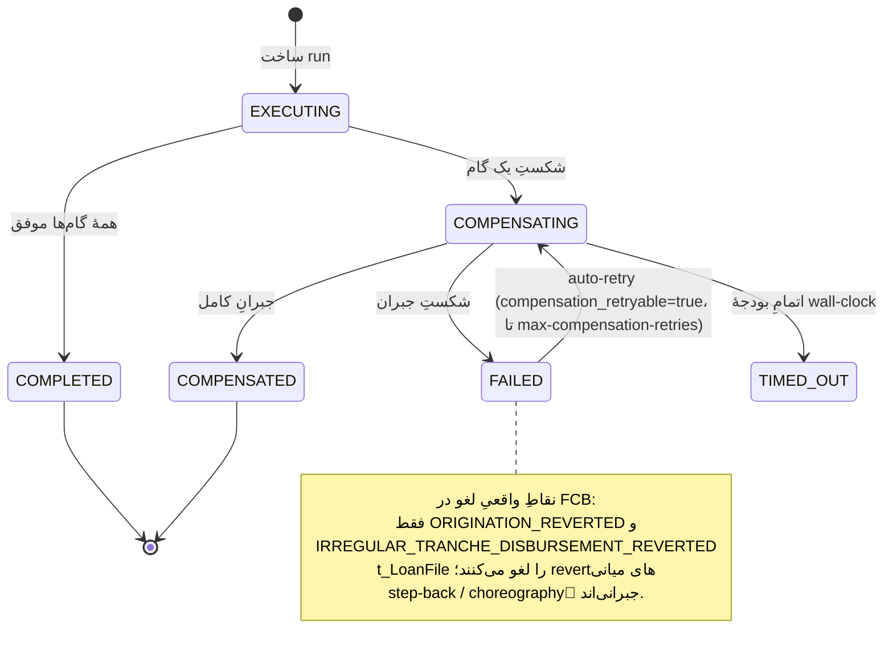

# RB-0011. بازیابی Workflow گیرکرده و جبران (Compensation)

* **وضعیت**: فعال
* **تاریخ**: 2026-06-11
* **نویسندگان**: تیم معماری Nova
* **دسته‌بندی**: Workflow / عملیات (Workflow / Operations)
* **تیکت‌های مرتبط**: [LN-59501](https://jira.dotin.ir/browse/LN-59501) (بازطراحی orchestration از Saga به Workflow؛ مدل engine-backed + بازیابی crash-safe)، [LN-59417](https://jira.dotin.ir/browse/LN-59417) (مدل all-or-none و حذف suspend-on-step، پیش‌زمینهٔ این بازطراحی)

> این Runbook مکمل [RB-0010](RB-0010.outbox-inbox-drain-replay.md) است. هر دو از سطح `/v1/ops` استفاده می‌کنند؛
> این یکی روی workflow run و جبران تمرکز دارد. اگر یک run روی انتشار یک رویداد outbox گیر کرده، RB-0010 را هم بخوانید.

## زمینه (Context)

orchestrationهای بلندمدت Nova را حالا engine-backed workflow runner ـ pangaea اجرا می‌کند (گروه `pangaea-workflow`،
نسخهٔ `2026.6.4`) — جایگزین orchestratorِ قدیمیِ FSM-محورِ saga. مدل all-or-none است: هر run یا کامل می‌شود یا کاملاً
جبران می‌شود. حالت «پارک‌شده روی یک گام» وجود ندارد و **هیچ حالت `PENDING` در مدل جدید نیست** — یک run با ساخته‌شدن
مستقیماً وارد `EXECUTING` می‌شود.

حالت‌های ماشینِ run (`RunState`):

- `EXECUTING` → `COMPLETED` (مسیر موفق؛ همهٔ گام‌ها اجرا شدند).
- اگر یک گام شکست بخورد: `EXECUTING` → `COMPENSATING` → `COMPENSATED` (جبرانِ کامل).
- اگر خودِ جبران شکست بخورد: `COMPENSATING` → `FAILED`.
- اگر بودجهٔ wall-clock تمام شود: run قطع و جبران اجرا می‌شود؛ نتیجهٔ پایانه `TIMED_OUT`.
- حالت‌های پایانهٔ سالم: `COMPLETED`, `COMPENSATED`. حالت‌های پایانهٔ نیازمندِ توجه (که بازیابی یا اقدام لازم دارند):
  `FAILED` (جبران شکست خورده) و `TIMED_OUT` (قطع بر اثر بودجه، جبران اجرا شده).

> **تفاوت کلیدی با saga قدیمی.** مدل قبلی حالت‌های `PENDING` و `COMPENSATION_FAILED` داشت؛ مدل جدید ندارد. شکستِ جبران
> حالا در همان `FAILED` جمع می‌شود و — برخلاف saga — اگر `compensation_retryable=true` باشد، **به‌صورت خودکار** تا
> سقفِ `platform.workflow.recovery.max-compensation-retries` (پیش‌فرض ۳) دوباره تلاش می‌شود؛ تنها پس از مصرفِ سقف،
> دخالت اپراتور لازم می‌شود.

<div dir="ltr">



</div>

## علائم / تشخیص (Symptoms / Diagnosis)

- **run گیرکرده.** رکوردی در `workflow_run` که `state` آن `EXECUTING` یا `COMPENSATING` است و `updated_at` آن قدیمی‌تر
  از `stuck-threshold` است (پیش‌فرض ۵ دقیقه — `platform.workflow.recovery.stuck-threshold`).
- **جبران شکست‌خورده.** رکورد `FAILED` با `compensation_failure_cause` پر؛ یا ردیف‌های `workflow_compensation` با
  `status` ناموفق. اگر `compensation_retryable=false` بود یا `compensation_retry_count` به سقف رسیده، auto-retry دیگر
  تلاش نمی‌کند و رکورد منتظر اپراتور می‌ماند.
- **قطعِ بودجه.** رکورد `TIMED_OUT` — run بر اثر اتمامِ بودجهٔ wall-clock قطع و جبران اجرا شده.
- **پیشروی نکردن.** کاربر یا journey منتظر می‌ماند؛ در APM، trace مربوط به run روی یک گام معلق مانده.

کوئری حالت run (Postgres-MCP / `psql`):

<div dir="ltr">

```sql
-- runهای غیرپایانهٔ قدیمی‌تر از آستانهٔ گیر
SELECT id, workflow_type, state, updated_at, now() - updated_at AS age
FROM workflow_run
WHERE state IN ('EXECUTING','COMPENSATING')
  AND updated_at < now() - interval '5 minutes'
ORDER BY updated_at;

-- runهای جبران‌شکست‌خورده و وضعیت auto-retry آن‌ها
SELECT id, workflow_type, state, compensation_retryable, compensation_retry_count,
       compensation_failure_cause, updated_at
FROM workflow_run
WHERE state IN ('FAILED','TIMED_OUT')
ORDER BY updated_at;

-- وضعیتِ گام‌های جبرانِ یک run
SELECT step_id, status, executed_at, completed_at, error_message
FROM workflow_compensation
WHERE run_id = :run_id
ORDER BY executed_at;
```

</div>

سطح ops برای تشخیص بدون SQL (مسیرها روی `/v{version}/ops/workflows`، path-variable نام `runId`):

<div dir="ltr">

```bash
curl -sH "Authorization: Bearer $OPS_TOKEN" "$NOVA/v1/ops/workflows?state=COMPENSATING&page=0&pageSize=50"
curl -sH "Authorization: Bearer $OPS_TOKEN" "$NOVA/v1/ops/workflows/$RUN_ID"
curl -sH "Authorization: Bearer $OPS_TOKEN" "$NOVA/v1/ops/workflows/$RUN_ID/retry-status"
curl -sH "Authorization: Bearer $OPS_TOKEN" "$NOVA/v1/ops/workflows/summary"
```

</div>

> **نکته.** سطح ops هرگز نوع دادهٔ کاربری run (`T`)، payload خام گام یا stacktrace را افشا نمی‌کند — فقط حالت،
> timestamp، نسخه، شمارندهٔ retry و خلاصهٔ کلیدی metadata را برمی‌گرداند.

## رویّهٔ گام‌به‌گام (Step-by-step)

### ۱) اول بگذارید بازیابی خودکار تلاش کند

پیش از مداخلهٔ دستی، توجه کنید که یک سرویس بازیابی زمان‌بندی‌شده وجود دارد:
`WorkflowRecoveryService.recoverStuckRuns` هر `platform.workflow.recovery.interval` (پیش‌فرض ۳۰s) اجرا می‌شود و در هر
دوره:

- runهای `EXECUTING` که از `stuck-threshold` گذشته‌اند را دوباره به سمت پایان redrive می‌کند.
- runهای `COMPENSATING`ِ گیرکرده را دوباره به سمت جبران redrive می‌کند.
- runهای `FAILED` که `compensation_retryable=true` دارند و هنوز به سقفِ `max-compensation-retries` نرسیده‌اند را
  دوباره وارد جبران می‌کند (auto-retry). وقتی `compensation_retry_count` به سقف رسید، رکورد رها و منتظر اپراتور
  می‌ماند.

اگر رکورد تازه گیر کرده یا تازه `FAILED` شده، یک تا چند دورهٔ بازیابی صبر کنید تا auto-retry سهم خودش را تمام کند.
`retry-status` (یا `ops_workflow_retry_status`) شمارندهٔ retry و باقی‌ماندهٔ تلاش‌ها را نشان می‌دهد.

### ۲) مداخلهٔ دستی از طریق سطح ops

اگر بازیابی خودکار (شامل auto-retryها) رکورد را آزاد نکرد، از سه عملیات نوشتنی استفاده کنید (فقط وقتی
`read-only=false`). همهٔ مسیرها روی `/v1/ops/workflows/{runId}/...` هستند و در موفقیت `204` و در حالت نامناسب `409`
برمی‌گردانند:

<div dir="ltr">

```bash
# از سرگیریِ یک run زندهٔ غیرپایانه (EXECUTING/COMPENSATING)
curl -sX POST -H "Authorization: Bearer $OPS_TOKEN" "$NOVA/v1/ops/workflows/$RUN_ID/resume"

# باز-راندنِ run از روی حالتِ گام‌های persist‌شده برای run با حالت FAILED/TIMED_OUT
curl -sX POST -H "Authorization: Bearer $OPS_TOKEN" "$NOVA/v1/ops/workflows/$RUN_ID/force-resume"

# ورودِ مجدد به زنجیرهٔ جبران برای run با حالت FAILED (پس از اتمام auto-retryها)
curl -sX POST -H "Authorization: Bearer $OPS_TOKEN" "$NOVA/v1/ops/workflows/$RUN_ID/retry-compensation"
```

</div>

انتخاب عملیات:

- `resume` — run هنوز در یک حالت زندهٔ غیرپایانه (`EXECUTING`/`COMPENSATING`) است و فقط متوقف مانده.
- `force-resume` — run به `FAILED`/`TIMED_OUT` رسیده؛ run از روی حالت گام‌های persist‌شده دوباره رانده می‌شود.
- `retry-compensation` — جبران شکست خورده (`FAILED`) و auto-retryها مصرف شده‌اند؛ زنجیرهٔ جبران دستی دوباره وارد می‌شود.

### ۳) choreography جبران و نقاط واقعی لغو در FCB

موقع جبران، تصویر ذهنی درستی از سمت FCB داشته باشید. FCB ردیف `t_LoanFile` را **فقط** در دو نقطه لغو می‌کند:
`ORIGINATION_REVERTED` و `IRREGULAR_TRANCHE_DISBURSEMENT_REVERTED`. بقیهٔ revertهای میانی **step-back** هستند —
یعنی choreography یک رویداد جبرانی که وضعیت را یک گام عقب می‌برد، نه لغو کامل پرونده. پس دیدن یک revert میانی به این
معنا نیست که پرونده در FCB حذف شده؛ اپراتور نباید فرض کند پرونده پاک شده است.

### ۴) کلیدهای resume (جلوگیری از run تکراری / phantom)

جدول `workflow_resume_key` با `resume_key` (PK) جلوی ساخته‌شدن run تکراری را در فراخوان‌های هم‌زمانِ ساخت با یک کلید
می‌گیرد و آن کلید را به همان `run_id` می‌بندد. به همین خاطر تکرار `resume`/`force-resume` run جدید نمی‌سازد — کلید
resume همان رکورد موجود را نگه می‌دارد.

## دروازهٔ Drain پیش از حذف جداول saga (Drain Gate)

با بازطراحی به workflow، جداول قدیمی saga (`saga_instance`, `saga_compensation`, `saga_idempotency`) دیگر استفاده
نمی‌شوند و در همین release با changeset ـ `framework/v2026.6.4/005-drop-saga-tables.xml` حذف می‌شوند. این changeset
forward-only است و با `preConditions onFail="MARK_RAN"` گِیت شده: روی DBِ تازه (که هرگز جدول saga نداشته) و وقتی
هیچ saga غیرپایانه‌ای باقی نمانده، تمیز MARK_RAN می‌شود. **پیش از ship شدن این drop، باید drain را تأیید کنید:**

1. **صفر ردیفِ saga در حالِ اجرا.** هیچ ردیفی در `saga_instance` با `current_state` در
   `('PENDING','EXECUTING','COMPENSATING')` نباشد. اگر هست، پیش از drop باید به پایان یا جبران برسد.
2. **صفر ردیفِ منتظرِ اپراتور.** هیچ ردیفِ `FAILED`/`TIMED_OUT`/`COMPENSATION_FAILED` باقی نمانده باشد؛ هر کدام یا با
   redrive حل شده یا به‌صورت دستی sign-off و بسته شده باشد.
3. **سازگاریِ ردیف‌های orphan ـ idempotency.** ردیف‌های `saga_idempotency` بدون saga متناظر بررسی، reconcile و در صورت
   نیاز export/آرشیو شوند (ردیف‌های databasechangelog تاریخی دست‌نخورده می‌مانند — مشکلی نیست).
4. **ثبتِ sign-off عملیات.** تأیید نهاییِ drain توسط عملیات با تاریخ و مسئول ثبت شود (در تیکت یا کانال عملیات).

کوئری راستی‌آزماییِ drain (باید همگی صفر برگردانند):

<div dir="ltr">

```sql
-- (۱) و (۲): هیچ saga غیرپایانه‌ای نباید بماند
SELECT current_state, count(*)
FROM saga_instance
WHERE current_state IN ('PENDING','EXECUTING','COMPENSATING','FAILED','TIMED_OUT','COMPENSATION_FAILED')
GROUP BY current_state;

-- (۳): ردیف‌های orphan ـ idempotency (بدون saga متناظر)
SELECT count(*)
FROM saga_idempotency si
LEFT JOIN saga_instance s ON s.id = si.saga_id
WHERE s.id IS NULL;
```

</div>

> changeset ـ drop دقیقاً همین گِیت را به‌صورت `sqlCheck expectedResult="0"` روی `saga_instance` تکرار می‌کند؛ اگر
> drain کامل نباشد، changeset به‌جای drop کردنِ جداول، MARK_RAN می‌شود و جداول دست‌نخورده می‌مانند تا در یک release
> بعدی پس از drainِ کامل حذف شوند. ترتیب حذف FK-safe است: `saga_compensation` → `saga_idempotency` →
> `saga_instance` (بین جداول saga هیچ FK سطح‌DB وجود ندارد؛ ارجاع `saga_id` فقط منطقی است).

### پاک‌سازی تاریخیِ SUSPENDED (یک‌بار)

با حذف حالت `SUSPENDED` (LN-59417)، رکوردهای باقی‌مانده پیش‌تر با مهاجرت `006-delete-suspended-sagas.xml` پاک شده‌اند
(اول `saga_compensation` با sub-select روی `saga_id`، بعد `saga_instance`). این یک حذف برگشت‌ناپذیر است (rollback
خالی) و بخشی از همان drain تاریخی است؛ نباید دستی تکرار شود.

## محیط چندنمونه‌ای (Multi-instance)

Nova چند JVM دارد؛ workflow runner نباید double-execution کند. هماهنگی با ShedLock (جدول `shedlock`) انجام می‌شود:

- **بازیابی تک‌فعال است.** `WorkflowRecoveryService.recoverStuckRuns` پیش از اجرا lock با نام `pangaea-workflow-recovery`
  را می‌گیرد؛ اگر نمونهٔ دیگری lock را دارد، آن دورهٔ بازیابی skip می‌شود («another node holds the recovery lock»). پس
  در هر لحظه فقط یک نمونه runهای گیرکرده را پیش می‌برد. lock با heartbeat (پیش‌فرض `platform.workflow.lock.at-most-for`
  = ۱۰ دقیقه) در طول دوره تمدید می‌شود.
- **سریال‌سازیِ per-run.** `RunLockManager` برای هر run یک lock با نام `workflow-{runId}` می‌گیرد؛ پس یک run هم‌زمان
  روی دو نمونه پیش نمی‌رود (هم در redriveِ بازیابی، هم در resumeِ دستی). اگر دو نمونه هم‌زمان یک run را redrive کنند،
  `RunOptimisticLockException` یکی را عقب می‌زند و log می‌دهد «Run already recovered by another node».
- **مداخلهٔ دستی امن است.** عملیات ops را هر نمونه‌ای می‌پذیرد؛ کلید resume و lockهای بالا با هم تضمین می‌کنند که run
  دوبار اجرا نشود.

## بازیابی / Rollback

- عملیات `resume`/`force-resume`/`retry-compensation` فقط run را از روی حالت persist‌شده دوباره می‌رانند و هیچ حالت
  جدیدی از صفر نمی‌سازند. اگر یکی از این عملیات در حالت نامناسب فراخوانده شود، 409 می‌گیرید و هیچ تغییری اعمال نمی‌شود.
- اگر سطح نوشتنی ops اشتباهاً باز مانده، با `platform.workflow.management.read-only=true` در KV ببندیدش (مسیرهای نوشتنی
  در دسترس نمی‌مانند؛ بازیابی خودکار مستقل و فعال می‌ماند).
- اگر جبران ناقص ماند، **پیش از** هر اقدام سمت FCB، نقاط لغو بالا را مرور کنید تا یک پرونده را دوبار لغو نکنید.
- changeset ـ `005-drop-saga-tables.xml` forward-only است (rollback خالی)؛ بازگرداندنِ جداول saga ممکن نیست. drain را
  حتماً پیش از ship تأیید کنید.

## راستی‌آزمایی (Verification)

۱. **run به حالت پایانه رسید.** کوئری بالا را تکرار کنید؛ run باید به `COMPLETED` یا `COMPENSATED` رسیده باشد و دیگر در
   فهرست گیرکرده‌ها نباشد.

۲. **APM data streams (Kibana).**
   - `logs-apm.error-default` (`service.name=nova-service`) — در پنجرهٔ اقدام خطای جدید workflow/جبران صفر باشد.
   - `traces-apm-default` — اسپن‌های `pangaea.workflow.execute` / `pangaea.workflow.step` تا گام پایانی پیش می‌روند؛
     اسپن‌های `pangaea.workflow.compensation` (اگر مسیر جبران طی شده) کامل می‌شوند.
   - `logs-apm.app.nova_service-default` — لاگ بازیابی/جبران موفق.

۳. **متریک‌ها.** متریک‌های `pangaea.workflow.*` (active run count به تفکیک `workflow_type` و `state`، شمارندهٔ
   compensation، retry count) را در Kibana/APM ببینید؛ تعداد runهای `FAILED`/`TIMED_OUT` نباید رشد کند.

۴. **ردیف‌های جبران.** `workflow_compensation` برای runِ جبران‌شده وضعیت موفق نشان می‌دهد و رکوردِ `FAILED` باقی نمی‌ماند.

۵. **run تکراری ساخته نشده.** `workflow_resume_key` برای `resume_key` فقط یک ردیف یکتا نگه داشته؛ شمارش `workflow_run`
   بعد از مداخله افزایش ناخواسته ندارد.

## ابزارهای MCP (ops)

برای اپراتور/agent، همان عملیات از طریق MCP در دسترس است (نام‌ها از `ops_saga_*` به `ops_workflow_*` تغییر کرده):

- خواندنی: `ops_workflow_search`, `ops_workflow_get`, `ops_workflow_retry_status`, `ops_workflow_summary`.
- نوشتنی (فقط با `read-only=false`): `ops_workflow_resume`, `ops_workflow_force_resume`, `ops_workflow_retry_compensation`.

## مراجع (References)

- بازطراحی saga→workflow: [LN-59501](https://jira.dotin.ir/browse/LN-59501)؛ پیش‌زمینهٔ all-or-none + حذف Flow:
  [LN-59417](https://jira.dotin.ir/browse/LN-59417).
- کنترلرهای ops: `pangaea » pangaea-workflow/pangaea-workflow-management/.../rest/WorkflowOperationsController.java`
  و `WorkflowQueryController.java` (`/v{version}/ops/workflows`؛ مسیرهای `resume`/`force-resume`/`retry-compensation`).
  SPI: `WorkflowAdminPort` (`pangaea-workflow-api`)، impl `DefaultWorkflowAdminPort` (`pangaea-workflow-core`).
- گیت read-only: `platform.workflow.management.read-only` (پیش‌فرض `true` ⇒ مسیرهای نوشتنی غیرفعال).
- بازیابی: `pangaea » pangaea-workflow/pangaea-workflow-starter/.../recovery/WorkflowRecoveryService.java`
  (lock `pangaea-workflow-recovery`؛ حالات `EXECUTING`/`COMPENSATING` redrive؛ `FAILED` با auto-retry).
- per-run lock: `pangaea » pangaea-workflow-core/.../engine/RunLockManager.java` (نام `workflow-{runId}`).
- کلیدهای config: `platform.workflow.recovery.{interval(30s), stuck-threshold(5m), max-compensation-retries(3),
  enabled}` و `platform.workflow.lock.at-most-for(10m)` و `platform.workflow.execution.{default-timeout(30s),
  wall-clock-budget(5m)}`.
- جدول‌های workflow: `pangaea » .../db/changelog/framework/v2026.6.4/{001-create-workflow-run, 002-create-workflow-compensation,
  003-create-workflow-resume-key, 004-create-shedlock-table}.xml`. حذف جداول saga (nova-owned، forward-only):
  `nova » container/.../db/changelog/framework/v2026.6.4/005-drop-saga-tables.xml`. پاک‌سازی SUSPENDED:
  `nova » container/.../db/changelog/framework/v2026.3.0/006-delete-suspended-sagas.xml`.
- متریک‌ها: instrumentation با namespace `pangaea.workflow` (`WorkflowTelemetry`, `CompensationEngine`).
- نقاط لغو FCB: مدل rollback پرونده (`ORIGINATION_REVERTED` + `IRREGULAR_TRANCHE_DISBURSEMENT_REVERTED`).
- Runbook مرتبط: [RB-0010](RB-0010.outbox-inbox-drain-replay.md) (تخلیه و بازپخش Outbox/Inbox).
