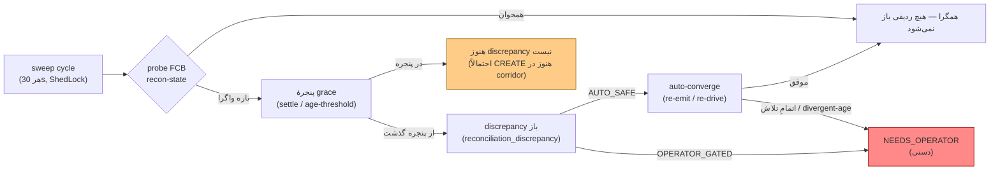

# RB-0012. عملیات تطبیق (Reconciliation)

* **وضعیت**: پیش‌نویس
* **تاریخ**: 2026-06-04
* **نویسندگان**: تیم معماری Nova
* **دسته‌بندی**: تطبیق / عملیات (Reconciliation / Operations)
* **تیکت‌های مرتبط**: [LN-59442](https://jira.dotin.ir/browse/LN-59442) (تطبیقِ دوسویهٔ Nova↔FCB)

> این Runbook مکملِ [RB-0010](RB-0010.outbox-inbox-drain-replay.md) و [RB-0011](RB-0011.saga-stuck-compensation-recovery.md)
> است. تطبیق آخرین خطِ دفاع است: وقتی inbox/outbox/saga در حالتِ پایدار همگرا نشده‌اند، sweepِ تطبیق واگراییِ
> باقی‌مانده را کشف و (در حدِ مجاز) همگرا می‌کند.

## زمینه (Context)

Nova و FCB یک پرونده را به‌صورتِ **dual-persist** نگه می‌دارند. تطبیق (LN-59442) دو سطح دارد:

- `platform.reconciliation.*` → موتورِ sweepِ عمومیِ pangaea (`ReconciliationSource`، ledgerِ discrepancy).
- `reconciliation.*` → کلاینتِ recon-state سمتِ nova (`FacilityReconStatePort`) که حالتِ پروندهٔ FCB را probe می‌کند.

**نکتهٔ مدلِ مصرفِ dual-persist:** FCB همهٔ رویدادهای forward + revertهای غیرِ create/disburse را مصرف می‌کند، اما
**نباید** `ORIGINATION_REVERTED`, `DISBURSEMENT_REVERTED`, `IRREGULAR_TRANCHE_DISBURSEMENT_REVERTED` را مصرف کند
(اپراتورِ FCB پرونده را آنجا revoke می‌کند و Nova رویدادِ cancel را مصرف می‌کند). تطبیق باید این عدم‌تقارن را
به‌عنوانِ واگراییِ موردِانتظار نشناسد، نه drift واقعی.

probeِ recon-state عمداً cache نمی‌شود: هر فراخوان `eventUid` تازه می‌سازد تا FCB کشِ idempotency را دور بزند و
حالتِ جاری را پاسخ دهد (INV-10) — caching یک probe کلِ هدفش را نقض می‌کند.

<div dir="ltr">



</div>

## علائم / تشخیص (Symptoms / Diagnosis)

- **رشدِ ردیف‌های باز.** افزایشِ `reconciliation_discrepancy` با `status='OPEN'`.
- **انباشتِ NEEDS_OPERATOR.** ردیف‌هایی که از budgetِ تلاشِ خودکار یا از `divergent-age-threshold` گذشته‌اند.
- **واگراییِ UNKNOWN ماندگار.** ردیف‌هایی که peer در دسترس نیست و از `unknown-age-threshold` (۶۰m) عبور کرده‌اند.

> **پنجرهٔ grace — چرا یک واگراییِ تازه هنوز discrepancy نیست.** سه سازوکارِ grace از باز شدنِ ردیفِ زودرس جلوگیری
> می‌کنند:
> - `reconciliation.detect-settle` (۳m): پرونده تا وقتی دستِ‌کم این مدت quiescent نباشد probe نمی‌شود — CREATE که
>   هنوز در corridorِ FCB است، به‌اشتباه ORPHAN/LAGGING باز نمی‌شود.
> - `platform.reconciliation.sweep.unknown-age-threshold` (۶۰m): مدتِ مجازِ ماندنِ پیوستهٔ UNKNOWN پیش از escalate
>   به NEEDS_OPERATOR (INV-13) — برای تحملِ outage/restart-deploy.
> - `platform.reconciliation.sweep.divergent-age-threshold` (۲h): مدتِ مجازِ ماندنِ پیوستهٔ واگرا (LAGGING/ORPHAN)
>   پیش از escalate (INV-11/INV-13).

کوئریِ ledgerِ discrepancy (Postgres-MCP / `psql`):

<div dir="ltr">

```sql
-- توزیعِ ردیف‌های تطبیق بر اساس وضعیت و tier خودمختاری
SELECT status, autonomy_tier, count(*)
FROM reconciliation_discrepancy
GROUP BY status, autonomy_tier
ORDER BY status, autonomy_tier;

-- ردیف‌های نیازمندِ اپراتور با سن
SELECT id, reconciliation_type, opaque_key, verdict, direction, autonomy_tier,
       attempt_count, first_seen, last_seen, reason_code
FROM reconciliation_discrepancy
WHERE status <> 'OPEN' OR attempt_count >= 2
ORDER BY last_seen;
```

</div>

سطحِ ops برای تشخیص:

<div dir="ltr">

```bash
curl -sH "Authorization: Bearer $OPS_TOKEN" \
  "$NOVA/v1/ops/reconciliation/$RECON_TYPE/$OPAQUE_KEY"   # detail یک discrepancy (در صورت وجود endpoint خواندنی)
```

</div>

## رویّهٔ گام‌به‌گام (Step-by-step)

### ۱) بگذارید sweep خودش همگرا کند

موتورِ sweep هر `interval` (۳۰s) ردیف‌های `AUTO_SAFE` را تا سقفِ `auto-drive-limit` (۱۰۰ در هر دوره) به‌صورتِ
خودکار re-drive می‌کند (re-emit رویداد / probe مجدد). یک ردیفِ deferred (retry-later/indeterminate) با `retry-backoff`
(۵m) دوباره تلاش می‌شود **بدونِ مصرفِ budgetِ تلاش** (INV-11). پس بسیاری از drifts بدونِ مداخله همگرا می‌شوند.

### ۲) money tiering / سطوحِ خودمختاری — چه چیزی خودکار، چه چیزی دستی

tierهای همگرایی (`AUTO_SAFE` در برابر `OPERATOR_GATED`) **در کد ثابت‌اند، نه در config**. قاعدهٔ هسته‌ای:

- **AUTO_SAFE.** واگرایی‌های امن/بازگشت‌پذیر (مثلاً LAGGING که با re-emit یک رویدادِ از‌دست‌رفته همگرا می‌شود). sweep
  این‌ها را تا budget خودکار می‌راند.
- **OPERATOR_GATED.** هر مسیرِ برگشت‌ناپذیر یا پول‌جابه‌جاکن — صرف‌نظر از config — operator-gated می‌ماند. تنها مسیرِ
  مجاز برای راندنِ ردیفِ `OPERATOR_GATED`، endpointِ مدیریتِ `converge` است.

### ۳) همگراییِ دستی (trigger اپراتور)

برای ردیف‌هایی که به اپراتور رسیده‌اند، دو عملیاتِ نوشتنی روی `/v1/ops/reconciliation/{reconciliationType}/{opaqueKey}/...`:

<div dir="ltr">

```bash
# تنها مسیرِ مجاز برای راندنِ یک ردیفِ OPERATOR_GATED به سمتِ همگرایی
# 200 = converged/requeued، 409 = حالتِ غیرقابلِ همگرایی، 404 = ردیف موجود نیست
curl -sX POST -H "Authorization: Bearer $OPS_TOKEN" \
  "$NOVA/v1/ops/reconciliation/$RECON_TYPE/$OPAQUE_KEY/converge"

# علامت‌گذاریِ resolved/suppressed بدونِ re-drive (وقتی out-of-band حل شده) — یادداشتِ اپراتور الزامی است
curl -sX POST -H "Authorization: Bearer $OPS_TOKEN" -H 'Content-Type: application/json' \
  "$NOVA/v1/ops/reconciliation/$RECON_TYPE/$OPAQUE_KEY/resolve?note=handled%20out-of-band"
```

</div>

  - `converge` — تنها مسیری است که اجازهٔ راندنِ `OPERATOR_GATED` را دارد؛ ردیف را از یک convergence عبور می‌دهد.
  - `resolve` — ردیف را resolved/suppressed می‌کند بدونِ re-drive؛ برای وقتی واگرایی خارج از سیستم حل شده.

### ۴) چه چیزی را اپراتور **نباید** auto-resolve کند

- ردیف‌هایی که از عدم‌تقارنِ موردِانتظارِ مدلِ مصرف ناشی می‌شوند (revertهای create/disburse که FCB عمداً مصرف نمی‌کند)
  — اگر sweep این‌ها را باز کرد، علتِ ریشه‌ای را بررسی کنید، نه `resolve` کورکورانه.
- هر ردیفِ پول‌جابه‌جاکنِ `OPERATOR_GATED` را بدونِ تأییدِ سمتِ FCB با `resolve` نبندید؛ ابتدا با probe/`converge`
  حالتِ واقعیِ FCB را روشن کنید.

### ۵) تطبیق در برابرِ مسابقاتِ inbox/outbox/saga

تطبیق نباید با یک عملیاتِ در‌حالِ‌انجامِ inbox/outbox/saga مسابقه دهد. به همین دلیل `detect-settle` و grace windows
وجود دارند: یک رویدادِ هنوز‌در‌corridor نباید discrepancy باز کند. اگر drift دیدید که هم‌زمان یک ردیفِ outbox
`PENDING`/`RETRYING` یا ساگای `EXECUTING` دارد، **اول RB-0010/RB-0011 را تخلیه/بازیابی کنید**؛ بسیاری از discrepancyها
پس از تخلیهٔ pipe خودبه‌خود همگرا می‌شوند.

## محیط چندنمونه‌ای (Multi-instance)

- **sweep تک‌فعالِ ناوگانی است.** یک اجرای واحد در کلِ ناوگان از طریقِ ShedLock با نامِ
  `pangaea-reconciliation-sweep` و سقفِ `lock-at-most-for` (۱۰m) تضمین می‌شود — نمونه‌های دیگر دورهٔ sweep را skip
  می‌کنند.
- **tunablesِ sweep در زمانِ راه‌اندازی خوانده می‌شوند.** interval/grace/caps/lock و `management.read-only`
  **`@RefreshScope` نیستند**؛ ارکستراتور/sweep آن‌ها را در زمانِ ساختِ bean capture می‌کند. تغییرِ این مقادیر در KV
  در **RESTARTِ بعدیِ NovaApplication** اعمال می‌شود، نه با refreshِ زندهٔ Consul.
- مداخلهٔ ops (`converge`/`resolve`) را هر نمونه‌ای می‌پذیرد؛ ledger روی Postgresِ مشترک با نسخه‌گذاریِ خوش‌بینانه
  (`version`) محافظت می‌شود.

## بازیابی / Rollback

- `converge` و `resolve` غیرمخرب‌اند: `converge` فقط یک convergence را می‌راند (در حالتِ نامناسب 409)، و `resolve`
  صرفاً ردیف را می‌بندد (با یادداشت). هیچ‌کدام دادهٔ پرونده را در FCB یا Nova مستقیماً تغییر نمی‌دهند.
- اگر سطحِ نوشتنی به‌اشتباه باز بود، `platform.reconciliation.management.read-only=true` در KV بگذارید (سپس RESTART،
  چون این flag در زمانِ راه‌اندازی خوانده می‌شود). توجه: مقدارِ فعلیِ پیش‌فرض `false` است — سطحِ recon ops عمداً
  always-on/mutating نگه داشته شده تا رفتارِ operator-driven حفظ شود.
- یک `resolve`ِ اشتباه را نمی‌توان undo کرد؛ اگر discrepancy واقعی بود، sweepِ بعدی آن را دوباره باز می‌کند (چون drift
  هنوز هست) — این self-healing است، نه نیاز به rollbackِ دستی.

## راستی‌آزمایی (Verification)

۱. **همگراییِ ledger.** کوئریِ توزیعِ بالا را تکرار کنید؛ ردیفِ هدف باید از `OPEN`/`NEEDS_OPERATOR` خارج شود و
   شمارشِ کلی نزولی باشد.

۲. **APM data streams (Kibana).**
   - `logs-apm.error-default` (`service.name=nova-service`) — صفرِ خطای جدیدِ probe/convergeِ تطبیق.
   - `traces-apm-default` — اسپن‌های `fcb.outbound` با تگِ `op=loadReconState`/`reemitOutbox` موفق برمی‌گردند.
   - `logs-apm.app.nova_service-default` — لاگِ همگراییِ موفقِ sweep / convergeِ دستی.

۳. **probeِ FCB.** پس از `converge`، یک probeِ recon-state تازه (sweepِ بعدی) باید حالتِ همخوان گزارش دهد؛ ردیف
   دوباره باز نمی‌شود.

۴. **عدمِ مسابقه.** بررسی کنید همان facility در outbox `PENDING`/`RETRYING` یا ساگای `EXECUTING` ندارد (RB-0010/0011)؛
   در غیر این صورت drift از pipe است، نه واگراییِ واقعی.

## مراجع (References)

- تطبیقِ دوسویه: [LN-59442](https://jira.dotin.ir/browse/LN-59442).
- کنترلرِ ops: `pangaea » pangaea-reconciliation/pangaea-reconciliation-management/.../rest/ReconciliationOperationsController.java`
  (`/v{version}/ops/reconciliation`؛ مسیرها `converge`/`resolve`). ابزارهای MCP نوشتنی:
  `pangaea » pangaea-ai/pangaea-ai-mcp-ops/.../reconciliation/ReconciliationOpsWriteTools.java`
  (`ops_recon_force_converge`, `ops_recon_mark_resolved`).
- کلاینتِ recon-state سمتِ nova: `nova » adapters/driven/fcb-messaging-contract/.../adapter/FcbReconStateKafkaAdapter.java`
  (`FcbReconStatePort`؛ probe بدونِ cache، INV-10).
- جدولِ discrepancy: `pangaea » pangaea-reconciliation/pangaea-reconciliation-data-jpa/.../db/changelog/changes/001-create-reconciliation-discrepancy.xml`
  (`reconciliation_discrepancy`؛ ستون‌های `status`, `autonomy_tier`, `attempt_count`, `first_seen`, `last_seen`,
  `version`, `detail` jsonb).
- پیکربندی: `nova-config » kv/core/loan/nova/nova-service/reconciliation.yml`
  (`platform.reconciliation.sweep.*` — interval/grace/caps؛ `reconciliation.detect-settle: 3m`،
  `reconciliation.recon-state-timeout: 10s`؛ `platform.reconciliation.management.read-only: false`).
- Runbookهای مرتبط: [RB-0010](RB-0010.outbox-inbox-drain-replay.md)، [RB-0011](RB-0011.saga-stuck-compensation-recovery.md).
