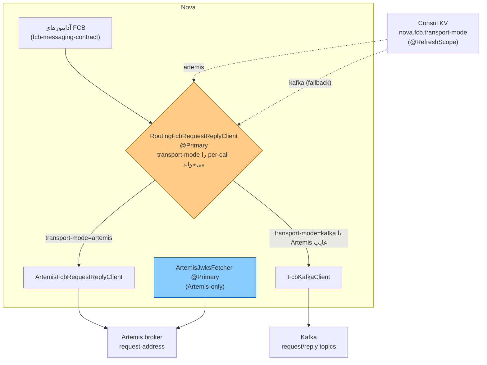

# RB-0013. جابه‌جایی انتقال Nova↔FCB (Artemis↔Kafka)

* **وضعیت**: فعال
* **تاریخ**: 2026-06-04
* **نویسندگان**: تیم معماری Nova
* **دسته‌بندی**: پیام‌رسانی / عملیات (Messaging / Operations)
* **تیکت‌های مرتبط**: «—»

> این Runbook مکملِ [RB-0008](RB-0008.artemis-broker.md) (بروکرِ Artemis) و [RB-0007](RB-0007.redis-sentinel-ha.md)
> (Redis Sentinel — پشتِ کشِ JWKS و trusted-key store) است. اینجا فقط **جابه‌جاییِ corridorِ request/reply** بینِ
> Artemis و Kafka مستند می‌شود؛ سلامتِ خودِ بروکرها در آن دو Runbook است.

## زمینه (Context)

corridorِ synchronous request/reply بینِ Nova و FCB **پلاگین‌پذیر** است. انتقالِ فعال در Consul KV انتخاب می‌شود
(نه با env): `nova.fcb.transport-mode: artemis|kafka` (`fcb.yml`). هر دو کلاینت هم‌زمان wired می‌مانند
(`artemis.enabled: true` و `kafka.enabled: true`) تا flip فوری باشد. مقدارِ پیش‌فرضِ فعلی `artemis` است؛ Kafka نقشِ
fallback را دارد.

- **نقطهٔ سوئیچِ واحد.** `RoutingFcbRequestReplyClient` تنها پیاده‌سازیِ `@Primary` از seamِ `FcbRequestReplyClient`
  است؛ آداپتورهای transport-neutralِ `fcb-messaging-contract` آن را inject می‌کنند. router هر دو delegate را با
  `ObjectProvider` می‌گیرد و `FcbTransportProperties` را **per call** می‌خواند، پس flipِ زندهٔ `transport-mode` در
  Consul corridor را بدونِ redeploy re-point می‌کند (`@RefreshScope`-rebound).
- **degrade به‌جای fail.** اگر `transport-mode=artemis` باشد ولی کلاینتِ Artemis wired نباشد
  (`nova.fcb.artemis.enabled=false`)، router به Kafka degrade می‌کند (و بالعکس). فقط اگر **هیچ** انتقالی wired نباشد،
  `IllegalStateException` پرتاب می‌شود.
- **محدودهٔ سوئیچ.** فقط corridorِ synchronous request/reply سوئیچ می‌شود. رویدادهای FCB→Nova و انتشارِ outbox
  صرف‌نظر از `transport-mode` روی **Kafka** می‌مانند.
- **JWKS فقط روی Artemis.** fetcherِ JWKS اکنون Artemis-only است: `ArtemisJwksFetcher` به‌صورتِ `@Primary` (gated بر
  `nova.fcb.artemis.enabled`) wired می‌شود؛ responder/fetcherِ Kafka حذف شده. اگر Artemis روشن باشد ولی trusted-key
  store روی `REDIS` نباشد، در زمانِ راه‌اندازی fail-fast می‌شود.

<div dir="ltr">



</div>

## علائم / تشخیص (Symptoms / Diagnosis)

دلایلِ معمولِ سوئیچ:

- بروکرِ Artemis ناسالم/در‌حالِ‌نگهداری (به [RB-0008](RB-0008.artemis-broker.md)) → سوئیچ به Kafka.
- گلوگاهِ throughput روی مسیرِ کافکا (به [RB-0002](RB-0002.nova-fcb-kafka-availability.md)) → سوئیچ به Artemis.

نشانه‌ای که انتقالِ فعلی در رنج است:

- در `traces-apm-default`، اسپن‌های request/reply به FCB روی انتقالِ موردِانتظار **دیده نمی‌شوند** (مثلاً انتظارِ
  Artemis ولی اسپن‌های Kafka request/reply می‌بینید) — نشانهٔ degrade یا flipِ ناکامل.
- لاگِ هشدارِ router در `logs-apm.app.nova_service-default`:
  `FCB-TRANSPORT: transport-mode=artemis but the Artemis client is not wired ... falling back to kafka` — یعنی
  Artemis درخواست‌شده ولی wired نیست.

تأییدِ مقدارِ فعالِ KV (پس از sync به Consul):

<div dir="ltr">

```bash
curl -s "$CONSUL/v1/kv/core/loan/nova/nova-service/nova.fcb.transport-mode?raw"   # باید artemis یا kafka بدهد
```

</div>

## رویّهٔ گام‌به‌گام (Step-by-step)

### ۱) چک‌لیستِ پیش از سوئیچ

پیش از flip، تأیید کنید مقصد آماده است:

- **بروکرِ مقصد در دسترس است.** برای Artemis: بروکر بالا و `request-address` (`nova.fcb.integration.request.v1`) موجود
  (RB-0008). برای Kafka: تاپیک‌های `request-topic`/`reply-topic` و leaseِ پارتیشنِ پاسخ سالم (RB-0002).
- **fetcherِ JWKS برای مقصد wired است.** چون JWKS فقط روی Artemis است، اگر می‌خواهید به Kafka سوئیچ کنید **باید
  `nova.fcb.artemis.enabled=true` بماند** تا `ArtemisJwksFetcher` همچنان کلیدهای FCB را تأمین کند؛ در غیر این صورت
  راستی‌آزماییِ پاکت (envelope) به مسیرِ کشِ stale می‌افتد. هرگز Artemis را صرفِ سوئیچ به Kafka خاموش نکنید.
- **trusted-key store روی REDIS است.** `platform.envelope.trusted.cache.backend: REDIS` لازمهٔ fetcherِ Artemis است؛
  در غیر این صورت bootِ بعدی fail-fast می‌شود (RB-0007 برای سلامتِ Redis).
- **اعتبارنامه‌ها موجودند.** برای Artemis: `ARTEMIS_USER`/`ARTEMIS_PASSWORD` و `ACTIVEMQ_HOST`/`ACTIVEMQ_PORT`. برای
  Kafka: `KAFKA_USER`/`KAFKA_PASSWORD`. این‌ها از env/secrets می‌آیند (نه KV).

### ۲) flipِ زنده از طریقِ Consul KV

`transport-mode` را در `nova-config` تغییر دهید و بگذارید پایپ‌لاینِ git→Consul آن را sync کند. چون router مقدار را
per-call می‌خواند، تغییر با refreshِ `@RefreshScope` بدونِ redeploy اعمال می‌شود:

<div dir="ltr">

```yaml
# nova-config » kv/core/loan/nova/nova-service/fcb.yml
nova:
  fcb:
    transport-mode: "kafka"   # از artemis ⇄ kafka
    artemis:
      enabled: "true"         # روشن بماند — fetcherِ JWKS به آن وابسته است
    kafka:
      enabled: "true"
```

</div>

پس از merge، کانتینرِ `platform-consul` (حلقهٔ git2consul-sync) KV را به‌روز می‌کند و Nova در watchِ بعدی مقدارِ تازه
را برمی‌دارد.

### ۳) رفتارِ درخواست‌های در‌پرواز در حینِ سوئیچ

flip فقط **انتخابِ corridorِ درخواست‌های جدید** را عوض می‌کند. درخواست‌هایی که از قبل روی انتقالِ پیشین صادر شده‌اند
تا پنجرهٔ reply-timeoutِ همان انتقال منتظر می‌مانند:

- Artemis: `nova.fcb.artemis.reply-timeout` (پیش‌فرض ۱۰s)، `transaction-timeout` (۶۰s).
- Kafka: `nova.fcb.kafka.default-timeout` (۳۰s)، `transaction-timeout` (۴۵s).

پس flip را در یک پنجرهٔ کم‌بار انجام دهید؛ منتظرِ زه‌کشیِ درخواست‌های در‌پرواز روی انتقالِ قبلی بمانید (حداکثر به
اندازهٔ reply/transaction-timeout). نیازی به drainِ صریح نیست — کلاینتِ قبلی future‌های باز را تا timeout کامل می‌کند.

### ۴) drillِ failover (سوئیچ اضطراری)

اگر بروکرِ فعال از کار افتاد و خواستید فوری به انتقالِ دیگر بروید: `transport-mode` را flip کنید (گام ۲). router
بلافاصله corridor را re-point می‌کند. اگر انتقالِ مقصد به‌هر دلیل wired نباشد، router به انتقالِ دیگرِ wired degrade
می‌کند و هشدار لاگ می‌کند — پس سرویس down نمی‌شود.

## محیط چندنمونه‌ای (Multi-instance)

- **هر نمونه مستقل refresh می‌کند.** `transport-mode` در KV است؛ هر JVMِ Nova در watchِ بعدیِ خود مقدارِ تازه را
  می‌گیرد. ممکن است برای چند ثانیه نمونه‌ها روی انتقالِ مختلط باشند — این بی‌خطر است، چون هر درخواست به‌صورتِ
  request/reply مستقل است و هر دو corridor به همان FCB می‌رسند.
- **leaseِ پارتیشنِ پاسخِ Kafka.** اگر به Kafka سوئیچ می‌کنید، هر نمونه یک پارتیشنِ پاسخ را از طریقِ sessionِ Consul
  lease می‌کند (`locks/core/loan/nova/reply-partition`)؛ leaseِ مرده با TTL آزاد می‌شود. سوئیچ به Artemis این lease را
  لازم ندارد.
- **fetcherِ JWKS مشترکِ ناوگانی است.** کلیدهای FCB در Redis (L2) نوشته می‌شوند؛ یک fetchِ Artemis همهٔ نمونه‌ها را
  گرم می‌کند (RB-0007).

## بازیابی / Rollback

- rollback ساده است: `transport-mode` را به مقدارِ قبلی برگردانید (یا `git revert` در `nova-config` + re-sync). چون
  flip زنده و per-call است، بازگشت هم بدونِ redeploy اعمال می‌شود.
- اگر پس از سوئیچ خطای راستی‌آزماییِ پاکت دیدید، احتمالاً `nova.fcb.artemis.enabled` به‌اشتباه خاموش شده — آن را
  دوباره `true` کنید (fetcherِ JWKS به آن وابسته است)، صرف‌نظر از اینکه corridorِ داده روی Kafka است.
- اگر router لاگِ `No FCB request/reply transport is wired` داد، یعنی هر دو `enabled` خاموش‌اند — دستِ‌کم یکی را روشن
  کنید.

## راستی‌آزمایی (Verification)

۱. **مقدارِ زندهٔ KV.** `curl …/nova.fcb.transport-mode?raw` مقدارِ موردِانتظار را بدهد؛ لاگِ refresh در
   `logs-apm.app.nova_service-default` رخدادِ rebind را نشان دهد.

۲. **corridorِ جدید واقعاً ترافیک می‌برد (APM).** در `traces-apm-default`:
   - سوئیچ به **Artemis** ⇒ اسپن‌های request/reply روی آدرسِ Artemis (`nova.fcb.integration.request.v1`) ظاهر شوند و
     اسپن‌های Kafka request/reply محو شوند.
   - سوئیچ به **Kafka** ⇒ اسپن‌های send/receive روی تاپیک‌های request/reply کافکا ظاهر شوند.

۳. **عدمِ degradeِ ناخواسته.** در `logs-apm.app.nova_service-default` هیچ هشدارِ
   `FCB-TRANSPORT: ... falling back` نباشد — حضورِ آن یعنی انتقالِ موردِنظر wired نیست.

۴. **سلامتِ خطا.** `logs-apm.error-default` (`service.name=nova-service`) — صفرِ خطای جدیدِ reply-timeout / پاکت
   پس از پنجرهٔ سوئیچ؛ journeyها به FCB پاسخ می‌گیرند.

## مراجع (References)

- پیکربندی: `nova-config » kv/core/loan/nova/nova-service/fcb.yml`
  (`nova.fcb.transport-mode`، `nova.fcb.artemis.*`، `nova.fcb.kafka.*`، `platform.envelope.trusted.cache.backend`).
- نقطهٔ سوئیچ: `nova » container/.../config/fcb/RoutingFcbRequestReplyClient.java`
  (`@Primary`؛ `transport-mode` per-call؛ degrade-not-fail). seam: `FcbRequestReplyClient`
  (`fcb-messaging-contract`). delegateها: `ArtemisFcbRequestReplyClient` (`fcb-messaging-artemis`)،
  `FcbKafkaClient` (`fcb-messaging-kafka`).
- fetcherِ JWKS: `nova » container/.../config/fcb/ArtemisJwksFetcherConfig.java`
  (`ArtemisJwksFetcher` `@Primary`؛ gated بر `nova.fcb.artemis.enabled`؛ نیازمندِ `RedisTrustedKeyStore`). SPI:
  `JwksFetcher` (`pangaea-envelope-api`).
- Runbookهای مرتبط: [RB-0007](RB-0007.redis-sentinel-ha.md) (Redis Sentinel — پشتِ کشِ JWKS)،
  [RB-0008](RB-0008.artemis-broker.md) (بروکرِ Artemis)، [RB-0002](RB-0002.nova-fcb-kafka-availability.md)
  (throughputِ مسیرِ Kafka).
